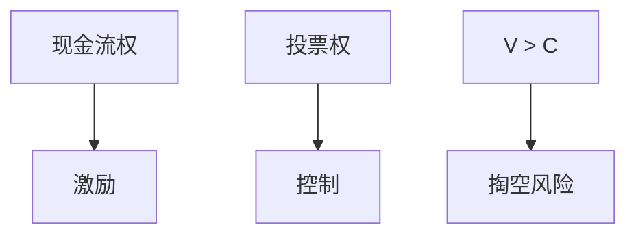

# 家族企业与金字塔

投票权与现金流权分离之后，控制人可以用少数资本指挥多数资产。这是所有权结构，不是企业文化小品。

<footer>—— La Porta, Lopez-de-Silanes, Shleifer and Vishny 的所有权与法律；Almeida and Wolfenzon 的金字塔</footer>

[上一课](/econ/esg-theory)问目标函数里有没有非金钱项。缺口是控制权：谁能决定目标。本课钉家族与金字塔，识别课收束本课程。不重写 [MM](/econ/modigliani-miller) 资本结构。

## 问题

LLSV：许多国家的典型企业不是 Berle–Means 的分散股东，而是家族或国家通过金字塔、交叉持股维持控制。Almeida–Wolfenzon：金字塔便于用内部资本市场配置，也便于掏空。若公司金融实证默认「股东价值最大化的公众公司」，外部有效性只覆盖一种所有权。缺口是把现金流权（C）与投票权（V）分开，隧道（tunneling）是 $V>C$ 时的代理。

Claessens, Djankov and Lang 的东亚金字塔。Johnson 等人的掏空。Burkart, Panunzi and Shleifer 的家族控制权权衡。

## 方法

度量：控制链上的投票乘积 vs 现金流乘积。后果：股利、关联交易、职业经理人聘任、危机时的支持（propping）与掏空。与双层股权：同是 $V\neq C$，但金字塔跨多家公司。法律：投资者保护弱则金字塔更有价值（LLSV）。与 ESG：控制人偏好可以是王朝、声誉或政治，不必是评级。

## 机制

内部资本市场在外部融资贵时有收益；控制权私人收益在保护弱时有成本。均衡所有权结构随法律与资本市场深度变。危机中，控制人可能用私产支持（propping），因为控制权期权还在——这不是利他，是期权价值。

## 边界

本课不把家族写成低效的代名词。下一课：这些结构使 IV 更难，识别要声明谁在最大化什么。不写某姓氏企业史。

## 小结

- 把投票权与现金流权分开，金字塔是分离的常见技术。
- 掏空与支持是同一控制权的两个状态。
- 出处：LLSV；Almeida and Wolfenzon；Johnson 等掏空。
