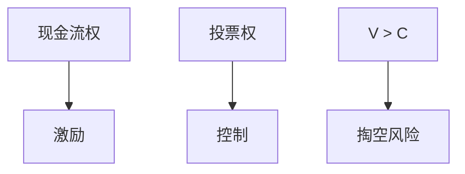
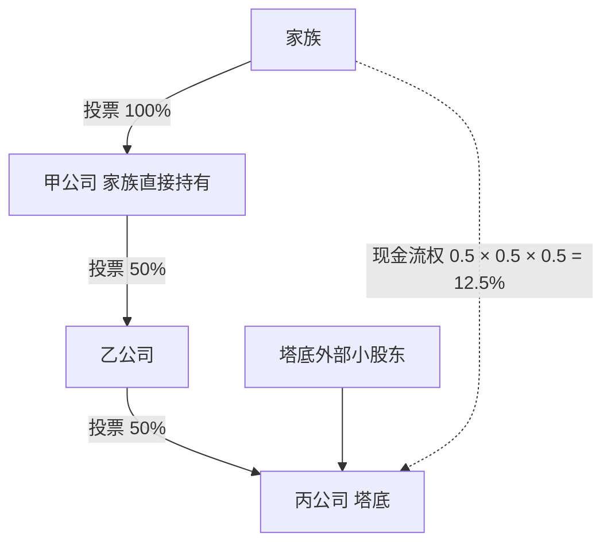

# 家族企业与金字塔

投票权与现金流权分离之后，控制人可以用少数资本指挥多数资产。这是所有权结构，不是企业文化小品。

<footer>—— La Porta, Lopez-de-Silanes, Shleifer and Vishny 的所有权与法律；Almeida and Wolfenzon 的金字塔</footer>

[上一课](/econ/esg-theory)问目标函数里有没有非金钱项。缺口是控制权：谁能决定目标。本课钉家族与金字塔，识别课收束本课程。不重写 [MM](/econ/modigliani-miller) 资本结构。

## 问题

LLSV：许多国家的典型企业不是 Berle–Means 的分散股东，而是家族或国家通过金字塔、交叉持股维持控制。Almeida–Wolfenzon：金字塔便于用内部资本市场配置，也便于掏空。若公司金融实证默认「股东价值最大化的公众公司」，外部有效性只覆盖一种所有权。缺口是把现金流权（C）与投票权（V）分开，隧道（tunneling）是 $V\gt C$ 时的代理。

分离靠乘法。控制链上投票权相乘，现金流权也相乘，缺口随层数放大：Johnson 等人的标准例子，三层各持 50%，控制人对底层公司的现金流权是 $0.5^3=12.5\%$，投票权仍是 100%——用八分之一的现金，指挥全部资产。数字在东亚样本里更细：Claessens, Djankov and Lang 看 9 个经济体、2,980 家公司，近三分之二有单一控制股东，家族平均现金流权约 15.7%，投票权约 19.8%，缺口靠金字塔与交叉持股放大。LLSV 跨 27 国的对照：好保护经济体外，多数国家的典型大企业有最终控制人，金字塔是常规工具而非奇观。

Claessens, Djankov and Lang 的东亚金字塔：现金流权均值 15.7%，投票权 19.8%。Johnson, La Porta, Lopez-de-Silanes and Shleifer 的掏空算术：$V\gt C$ 越大，转移一美元留给自己越多。Burkart, Panunzi and Shleifer 的家族控制权权衡：家族经理人能力弱但与控制人利益一致、监督强；职业经理人能力强但代理重。

术语翻译：现金流权是「赚了钱你能分几成」，投票权是「开董事会时你说了几分」。教科书里的分散持股公司两者基本重合；金字塔把二者拆开——投票权沿控制链一级级传下去，现金流权却被逐层乘法稀释。缺口 $V-C$ 就是「说话的份」超出「分钱的份」的部分。

## 方法

度量：控制链上的投票乘积 vs 现金流乘积。后果：股利、关联交易、职业经理人聘任、危机时的支持（propping）与掏空。与双层股权：同是 $V\neq C$，但[双层股权](/econ/dual-class-shares)在同一公司内做分离，金字塔把分离做到集团层面、跨多家公司。法律：投资者保护弱则金字塔更有价值（LLSV，见[法律与金融](/econ/law-and-finance)）。与 ESG：控制人偏好可以是王朝、声誉或政治，不必是评级。

```mermaid
flowchart TD
  C["现金流权"] --> ALIGN["激励"]
  V["投票权"] --> CTRL["控制"]
  GAP["V > C"] --> TUN["掏空风险"]
```

## 机制

内部资本市场在外部融资贵时有收益；控制权私人收益在保护弱时有成本。金字塔的融资逻辑（Almeida–Wolfenzon）：家族把成熟企业的现金流向上集中到直接持有的母公司，把新项目压在塔底，用塔底外部股东的钱分担创业风险——内部资本市场替不完善的外部市场干活。代理成本在同一构造里：$V\gt C$ 时，把价值从分离度低的公司搬到分离度高的公司有利可图，重排现金流本身就是私利。

```mermaid
flowchart TD
  FAM["家族"] -->|"投票 100%"| A["甲公司 家族直接持有"]
  A -->|"投票 50%"| B["乙公司"]
  B -->|"投票 50%"| C["丙公司 塔底"]
  EXT["塔底外部小股东"] --> C
  FAM -.->|"现金流权 0.5 × 0.5 × 0.5 = 12.5%"| C
```

数字实例：塔底的丙公司价值 100，控制人的现金流权只有 12.5%。把 10 元价值掏进自己腰包，按持股本该只分到 1.25 元，却实拿 10 元——损失的大头由塔底外部股东埋单。缺口 $V-C$ 越大，这笔账越划算，掏空不是道德失足，是激励几何。

掏空不需要盗。关联交易定价、给关联方放信用、薪资与咨询费、定向增发给控制人家族，都是隧道；意大利 Parmalat 在 2003 年被揭出近 40 亿欧元的伪造银行存款，多年盈利是账面戏法，资金沿关联路径漏出。支持是同一控制权的另一状态：1997–98 危机里，韩国财阀把私产注入濒危关联企业续命——前 30 大财阀的平均负债权益比在 1997 年底已近五倍，不救就集体穿仓——Friedman, Johnson and Mitton 把支持读成期权的执行：公司活着，控制权期权才在；公司死了，私人收益归零。事前看是掏空倾向的结构，危机里可以整体翻成支持：同一 $V-C$ 缺口，两个方向的现金流。

均衡所有权结构随法律与资本市场深度变：保护弱、市场浅，金字塔次优且普遍；保护强、市场深，分散化上市占优。危机中，控制人可能用私产支持（propping），因为控制权期权还在——这不是利他，是期权价值。

常见误区：把 1998 年财阀「自掏腰包救关联企业」读成良心发现。控制人不是在行善——公司活着，控制权带来的私人收益和期权才继续值钱；公司清算，一切归零。同一个结构，平时往里掏空、危机时往里输血，两个方向都不需要利他假设就能解释。

## 边界

本课不把家族写成低效的代名词：法律弱、市场浅时，金字塔是次优合同，不是人格缺陷。下一课：这些结构使 IV 更难，识别要声明谁在最大化什么。不写某姓氏企业史。

## 小结

- 把投票权与现金流权分开，金字塔是分离的常见技术。
- 东亚样本：现金流权约 15.7% 对投票权约 19.8%；三层各持半数即 12.5% 对 100%。
- 掏空与支持是同一控制权的两个状态：Parmalat 是隧道，1998 的财阀是期权执行。
- 出处：LLSV；Almeida and Wolfenzon；Claessens–Djankov–Lang；Johnson 等掏空。
