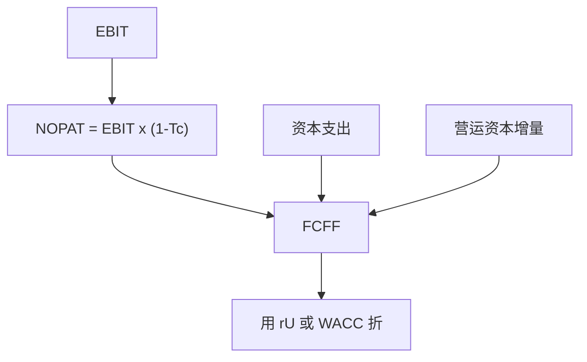

# 自由现金流预测

    
折现的对象是可以支付给所有资本提供者的现金，不是会计利润；利润可以靠应计做出来，自由现金流必须通过营运资本与再投资。

    <footer>—— 据 Brealey, Myers and Allen, Principles of Corporate Finance；Penman, Financial Statement Analysis and Security Valuation 整理</footer>

[上一课](/econ/apv)把分母与副作用写清，$V_U$ 仍缺分子：未杠杆自由现金流。本课缺口是预测口径——NOPAT、再投资、营运资本，以及与[Jensen 的 FCF](/econ/agency-free-cash-flow) 同名不同用。不重做 WACC 权重，不把终值提前写成增长公式的主体。

## 问题

会计利润扣了利息、折旧政策与应计，不能直接进 NPV。对全部资本提供者的自由现金流（FCFF）标准写法是：税后净经营利润（按无杠杆税）加回非现金费用，减资本支出与营运资本增量。漏掉营运资本：高速成长的报表利润好看，现金被应收和存货锁住，NPV 被高估。缺口不是「会不会做 Excel」，而是：资本预算的分子必须与分母的 $r_U$ 或 WACC 匹配，且增量——只记项目引起的现金流，沉没与已分摊的总部费用不进。

Jensen 的自由现金流是筛子已空后可被浪费的现金；估值的 FCFF 是项目或企业能产生的、尚未决定派不派的现金。同名：一个是代理对象，一个是折现对象。预测时不要用「尽量把 FCF 做成正」来回避再投资；再投资是正 NPV 的代价。

无杠杆税：用 $EBIT\times(1-\tau_c)$，即使企业实际付息。利息税盾不在 FCFF 里扣，留给 WACC 或 APV。股权自由现金流（FCFE）才扣税后利息与净借债。

## 方法

增量原则。比较「做项目」与「不做」：额外的收入、成本、税、垫付的营运资本、期末收回。已有土地的机会成本按市价进流出，账面沉没不进。通货膨胀：名义现金流配名义 $r$，下一课专讲；本课只禁止混用。

预测要有资产负债表约束：净经营资产增长 = 再投资；FCFF = NOPAT − 净经营资产增量（在干净盈余、无非经营项时）。Penman 把这写成剩余收益与现金流的桥梁，后课 EVA 再用。没有这层约束，收入增长与资本支出可以互相打架，终值会爆炸。

情景，不是单一的「管理当局计划」。上行不要偷偷提高利润率又降低再投资；竞争会吃掉超额利润，后课终值会把这一点写成竞争均衡 ROIC。本课先要求：利润率、周转、再投资三件套内部一致。

## 机制

机制是权责发生制与现金间隔。收入可以在货没收回时确认；NPV 只认现金。营运资本是间隔的存量。折旧影响税，从而影响现金，但折旧本身不是现金——所以加回。资本预算若用「EBITDA 倍数」当现金流，等于忽略税与再投资，只在后课乘数里作为粗糙可比，不能替代本课的分子。

与优序、代理的衔接：预测里「管理当局不愿吐出现金」会表现为过度再投资（负 NPV 的 capex）。估值应把再投资拆成维持性与增长性，增长性部分用增量 ROIC 对 WACC 判断是否创造价值，而不是把所有 capex 都当好。这是 Jensen 筛子在预测表上的落地，不是再写一遍债务纪律。

### 总部费用与协同

分摊到项目的固定总部费用，若项目不改变总部现金，不进增量 FCFF。协同若改变其他部门现金，要进增量，并防止在并购课里再加一遍。Tirole：可验证的现金比不可验证的「战略」优先进入合同；估值同样。

干净盈余：本期账面增值来自盈余而非直接进权益的调整。脏项（某些公允价值、外币）会让 NOPAT 与 FCFF 对不上。预测用经营口径，把金融资产负债分开。

## 边界

不要把本课写成会计课的完整调整清单。对象是口径与增量。也不要把 FCFF 预测当成已经解决了终值：显式期之后的增长与再投资是下一课。宏观课序里的总量消费不是企业 FCFF；不要把 DSGE 的校准参数直接塞进一家公司的利润率。

后课默认：显式期 FCFF 与 NOPAT、净经营资产一致；税盾不在 FCFF 里重复；增量、机会成本、沉没已分开。下一课：显式期之后的价值往往占 DCF 的大部分。

Jensen 的 FCF 与估值 FCFF 同名：筛子空时的浪费对估值是负的再投资或低 ROIC，不是另加一项「代理折现率」了事。

## 小结

- FCFF = 无杠杆税后经营利润 − 净经营资产增量；与 WACC/APV 口径匹配。
- 增量、机会成本、营运资本缺一则 NPV 歪；会计利润不是折现对象。
- 估值 FCF 与 Jensen 的 FCF 同名不同用：一个是分子，一个是代理弹药。
- 出处：Brealey, Myers and Allen；Penman, *Financial Statement Analysis*。
