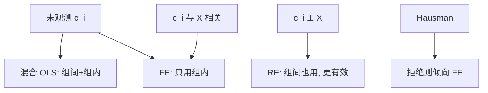

# 固定效应与随机效应

面板里不随时间变的异质 $c_i$ 可以与回归元相关；固定效应把它吸掉，斜率来自组内；随机效应更有效，但要求 $c_i$ 与 $X$ 不相关——这通常正是我们不相信的。

<footer>—— Mundlak 组内组间；Hausman, Specification Tests in Econometrics, Econometrica 1978；对照 Wooldridge 面板章节</footer>

[上一课](/econ/mle-bayesian-econ)把似然与后验收成估计原则。本课缺口是：选择来自**看不见、但不随时间变**的 $c_i$（能力、文化、地理）。固定效应（FE）用组内变异识别；随机效应（RE）把 $c_i$ 当随机、与 $X$ 正交。动态滞后下一课会让 FE 自己产生偏误。

## 问题

$Y_{it}=X_{it}\beta+c_i+u_{it}$。混合 OLS 把组间与组内搅在一起，$c_i$ 与 $X$ 相关则 OVB。一阶差分或去均值（within）消去 $c_i$，留下 $\beta$ 对 $\Delta X$ 或 $X_{it}-\bar X_i$。缺口是：时不变的回归元（性别、制度的长期水平）也被消去，不能估；测量误差在组内往往更严重，衰减更重。RE 用 GLS 把组间信息也用上，有效率，可估时不变 $X$，但要求 $\mathbb{E}[c_i\mid X_{i1},\ldots,X_{iT}]=0$。Hausman 检验比较 FE 与 RE：拒绝则像是 $c_i$ 与 $X$ 相关，用 FE。不拒绝不是 RE 为真的证明（功效、异方差都会搅）。

Mundlak：把组均值 $\bar X_i$ 放进相关随机效应，RE 可以复制 FE 的斜率。这是折中：明确组间信息用来估什么。

## 方法

FE：within 回归 + 聚类到 $i$（或双向聚类）。时间 FE 吸共同冲击。双向 FE 即 TWFE，交错处理时回到两课之前的负权重，不是本课能洗掉的。RE：FGLS。一阶差分在 $T=2$ 与 FE 等价；$T$ 大且 $u$ 有单位根时差分更自然。

量化栏的[面板 FE](/quant/panel-fe-finance)把同一装置用到公司与资产定价；本课写识别，不重做那些回归，也不进限价簿。

## 机制

机制是用单位自己当对照：同一 $i$ 不同 $t$。CIA 换成「给定 $c_i$ 后时变冲击外生」。严格外生 $\mathbb{E}[u_{it}\mid X_{i1},\ldots,X_{iT},c_i]=0$ 排除反馈（今天的 $u$ 进明天的 $X$）。一旦有滞后 $Y$，严格外生失败，Nickell 偏误出现——下一课。

组内变异小，则 FE 方差大，且测量误差主导。经验上「加了 FE 系数消失」可能是真的 $c_i$ 混淆，也可能是信号被洗掉。要报告组内 $R^2$ 与 $X$ 的组内标准差。

相关随机效应（Mundlak–Chamberlain）把 $\mathbb{E}[c_i\mid X_i]$ 参数化成分组均值，避免「RE 或 FE」的宗教选择，改成声明组间通道。

## 边界

本课不把 Hausman 的 $p$ 值写成模型选择的唯一标准。不处理异质 $\beta_i$（那是随机系数，后课异质效应）。交错 DiD 的 TWFE 病不是「再加一个 RE」能好的。下一课动态面板：滞后因变量 + FE。

后课默认：与 $c_i$ 相关的时变 $X$ 用 FE；时不变 $X$ 的效应 FE 估不出。RE 的正交要求必须单独辩护。动态滞后不要默默用 FE。

## 小结

- FE 消去时不变 $c_i$，识别来自组内；时不变 $X$ 一起消失。
- RE 更有效，但要 $c_i$ 与 $X$ 不相关。
- Hausman 是比较，不是证明；Mundlak 把组间写进方程。
- 严格外生排除反馈；滞后 $Y$ 下一课。
- 出处：Hausman, *Econometrica* 1978；Mundlak；Wooldridge 面板。
