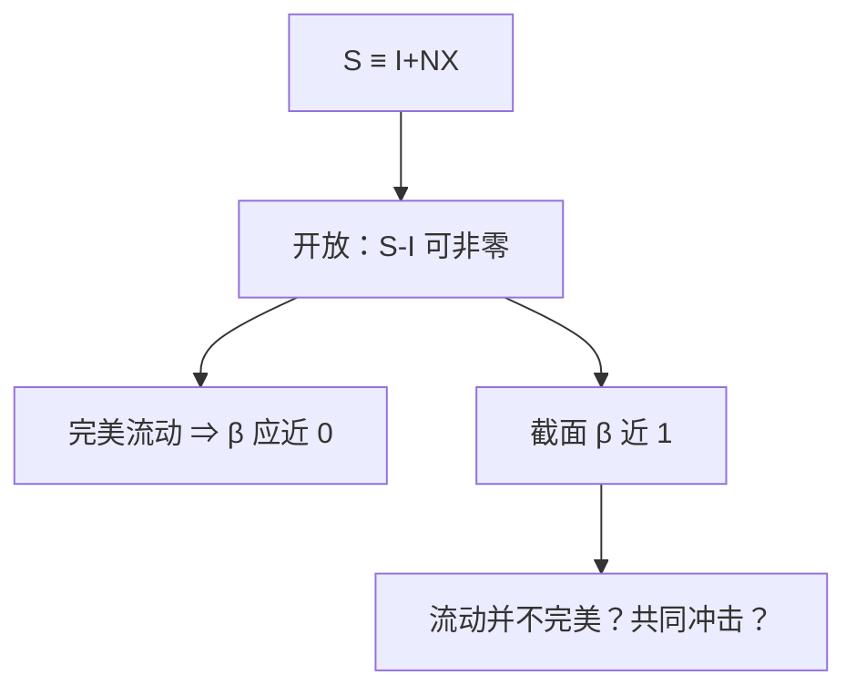

# Feldstein–Horioka

若资本在国界上可以自由流动，国内储蓄率不必钉住国内投资率；截面上二者几乎一对一，才叫谜。

<footer>—— Feldstein and Horioka, Domestic Saving and International Capital Flows, Economic Journal 1980</footer>

[上一课](/econ/saving-investment-id)已经把 $S\equiv I+NX$ 写成国民账户恒等，并禁止把事后等号读成可贷资金斜率。本课的缺口不是再拆部门，而是：开放之后 $S-I$ 本应被经常账户吸收，为何跨国回归里储蓄率与投资率仍高度相关。Feldstein 与 Horioka（1980）把这条相关叫做对完美资本流动的拒绝。价格指数下一课才给实际变量；本课仍在比率的名义账上。

## 问题

恒等只说一国之内 $S-I=NX$，不限制**各国**的 $S/Y$ 与 $I/Y$ 可以差多远。完美资本流动下，投资跟着世界利率与国内边际产出走，储蓄跟着人口与偏好走，二者在截面上不必齐步。Feldstein–Horioka 估的是

$$
\Bigl(\frac{I}{Y}\Bigr)_i = \alpha + \beta\Bigl(\frac{S}{Y}\Bigr)_i+\varepsilon_i,
$$

OECD 样本里 $\beta$ 接近 1。缺口是解释这条斜率，而不是把恒等再排一次。$\beta=1$ 不是会计必然：会计在**每个** $i$ 上都成立，回归问的是跨国变异是否共用。

$\beta$ 接近 1 被读成「储蓄留在本国」。它也可以是共同冲击：生产率同时抬 $S$ 与 $I$。相关不是流动成本的充分统计。

## 方法

把上一课的 $S-I=NX$ 改写成比率，跨国差分。若世界利率给定、资本完全流动，国内 $I/Y$ 应对齐资本边际产出，与国内 $S/Y$ 脱钩，$\beta$ 应近 0。观测到的高 $\beta$ 有三组读法：边境上的摩擦（税、管制、信息）；跨期预算迫使长期 $CA$ 不能乱走，于是长期比率仍相关；内生性——同一冲击进入两边。本课钉住「相关之谜」的陈述，不选唯一因果。

抛补利率平价是另一套「资本是否可套利」的句子。CIP 与交叉货币基差的实证在[量化栏](/quant/irp)，本课不把 $\beta$ 写成远期基差，也不重写限价簿。

### 恒等解释不了斜率

每个国家每一年 $S-I=NX$ 都真。回归用的是各国长期平均的 $S/Y$、$I/Y$。大国、封闭、经常账户不能无限逆差，都会把 $\beta$ 往 1 推——这是规模与跨期约束，不是账户写错。把 FH 当成「储蓄决定投资」的因果，是又一次把恒等读成理论。

## 机制

若资本不能跨境，多出来的储蓄只能变成国内 $I$，$\beta\to 1$，回到封闭课的事后 $S=I$。若资本能跨境但居民有本国偏好，或投资带不可贸易的安装成本，相关仍高。Obstfeld 与 Rogoff 后来把运输成本、贸易摩擦放进同一家族：货物都不好跨境，要求权也难完全脱钩。本课不把某一组摩擦升格为唯一微观。

时间维上，一国储蓄率上升可以伴随暂时的 $CA$ 顺差，$I$ 不必同步；截面长期平均抹掉这笔动态，于是谜更像「长期净外资产不能任意漂」，而不是「当年账户不平」。后课经常账户与双赤字会把 $S-I$ 再拆成财政与私人缺口；本课只要求：看到高 $\beta$ 时先问样本是截面还是短窗。

金融开放度用法定资本管制、总量 $CA$ 或总量资本流动来量，与 FH 的 $\beta$ 不必同向：总量可以很大而净额仍小，$S$ 与 $I$ 继续齐步。把「金融全球化」写成 $\beta$ 必须掉到零，是把总量流动当成净额套利已经完成。上一课的恒等约束的是净额 $NX$，不是总流入加总流出。

大国的 $S$ 冲击会移动世界利率，于是 $I$ 跟着动，$\beta$ 在大国样本里更高——这是一般均衡，不是「美国尤其封闭」。

## 边界

本课不估计新的 $\beta$，不把谜写成「全球化失败」的口号。公司金融的优序、FDI 与证券投资的分解，不是这条回归的识别。也不要把 CIP 偏离当 FH 的点估计；市场层平价见 `/quant/irp`。蒙代尔课用的 $i=i^*$ 是 UIP 退化，与本课的数量相关不是同一句。

时间序列上 $\beta$ 可以低于截面：一国暂时用 $CA$ 吸收储蓄冲击，跨年相关弱于各国长期平均。因此「谜已经消失」要声明是哪一种样本。主权风险、原罪会让净外资产不能任意漂，高 $\beta$ 可以来自跨期预算而不是法定资本管制。把 FH 当开放度指数，会与法定金融开放表打架。

后课默认：开放会计允许 $S\neq I$；经验上长期比率仍高度相关，流动完美不能当默认。下一课把名义账换成实际变量：没有价格指数，$I/Y$ 还只是比率。

## 小结

- 恒等允许 $S-I=NX$；FH 问的是跨国 $S/Y$ 与 $I/Y$ 为何齐步。
- 完美流动预示 $\beta$ 近 0；OECD 截面 $\beta$ 近 1。
- 摩擦、跨期约束与共同冲击都是候选，相关不是因果。
- CIP 实证不在本栏，见[利率平价](/quant/irp)。
- 出处：Feldstein and Horioka, *Economic Journal* 1980。
