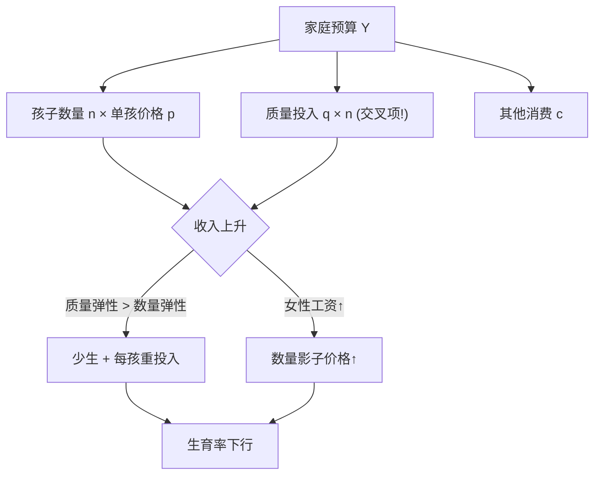
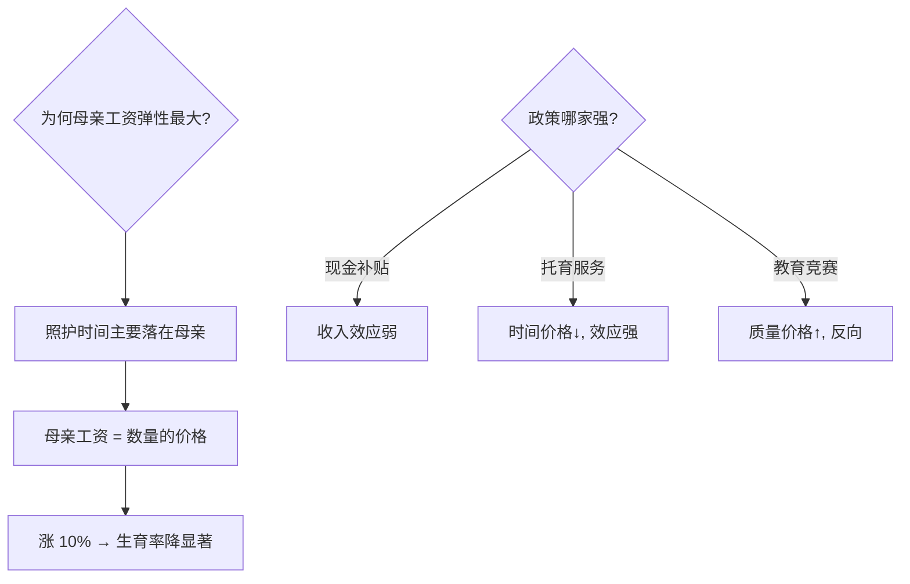

# fertility-econ

孩子是耐用品还是投资品？收入涨了生育反降——贝克尔的质量-数量替代是人口经济学那把万能钥匙。

<footer>—— 据 Becker「A Treatise on the Family」(1981)；Becker–Lewis 数量-质量模型 (1973)</footer>

[内部人-外部人模型](/econ/insider-outsider-labor)解释年轻人为何难进职场，本课接着问：难进职场之后为何也难成家生子。缺口是**生育的微观经济学**——把「生几个、投多少」写成父母的效用最大化问题。本课不进宏观人口增长的跨代模型。

## 问题

经典谜题：马尔萨斯预言收入升则人口升，现代数据却是收入越高的国家生育率越低（收入弹性为负）。缺口在于孩子的「价格」与「质量」都随发展变化——把「多生」与「养好」拆开，负相关迎刃而解。要回答：数量-质量替代如何生成，女性工资在里面扮演什么角色。

术语翻译：数量-质量替代（quantity-quality trade-off）= 孩子个数与每个孩子的投入（教育、健康）在家庭预算里此消彼长；孩子的影子价格 = 养育占用的时间按母亲工资计价的机会成本。

数字实例：养育到 18 岁需母亲 5 年主要照护时间。母亲时薪 30 元时孩子影子价格约 26 万元；时薪涨到 100 元则约 87 万元——价格翻三倍，生育意愿自然下行。而「质量」侧的教育投入从补课到留学几乎无上限，预算约束掐住数量。

## 方法

Becker–Lewis 模型三要素：预算约束 $p_n n + p_q q n + c = Y$（数量 $n$、每孩质量 $q$、其他消费 $c$）；效用 $U(n, q, c)$；关键在 $p_q q n$ 这一交叉项——质量投入随数量**成倍放大**。推论：收入升时若质量弹性大于数量弹性，家庭用「少生优育」替代「多生」；女性工资上升抬高数量价格，数量再降。

直觉类比：预算固定时的「买手机」选择——价格涨十倍（女性工资升），你会从「买三部」改为「买一部旗舰」；孩子从「劳动力的数量储备」变成「全家的旗舰项目」，正是历史上从农场经济到城市经济的切换。

## 机制

两条机制接住历史事实。**价格机制**：农业社会孩子 7 岁即产工，数量便宜；城市中教育年限拉长，孩子从投资品变成耐用品，数量需求崩塌。**机会成本机制**：生育率对女性工资的弹性显著大于对男性工资——生儿育女的时间主要落在母亲头上，母亲工资是数量的价格、父亲工资只是收入。政策含义分化：现金补贴抬高收入（效应弱）、托育服务压低时间价格（效应强）、教育军备竞赛推高质量价格（反向效应，东亚低生育率陷阱的候选解释）。

常见误区：用「文化偏好不变」解释生育率差异——同源族群跨国比较显示收入与托育政策解释了大部分方差；另一误区是把低生育率归因于「补贴不够多」，忽视了影子价格机制里「时间」比「钱」更贵。

## 边界

模型假设父母自主决策， ignores 制度约束（计划生育、移民政策）与不确定性与婚姻市场匹配；质量-数量替代在死亡率高的社会失灵（需多生对冲夭折）。数据上生育意愿与实际生育的缺口（南欧、东亚「生育gap」）指向制度而非偏好。与[家庭生产](/econ/household-production)共享时间套利地基，与[内部人-外部人](/econ/insider-outsider-labor)拼成「就业不稳 → 成家推迟 → 生育下降」的传导链。

直觉类比：孩子像一辆养起来越来越贵的车——工资涨了，买车位（住房）、考驾照（教育）都变贵，你会从「家里三辆车」换成「一辆好车」；补课费就是那笔没有上限的「改装预算」。

## 小结

- 数量-质量替代：质量投入乘数量放大，收入升 → 少生优育。
- 母亲工资是孩子数量的价格，其弹性远大于父亲工资。
- 政策排序：压时间价格（托育）> 现金补贴 > 无作为；教育竞赛反向。
- 出处：Becker–Lewis 1973；《A Treatise on the Family》1981；Doepke 2004 综述。
