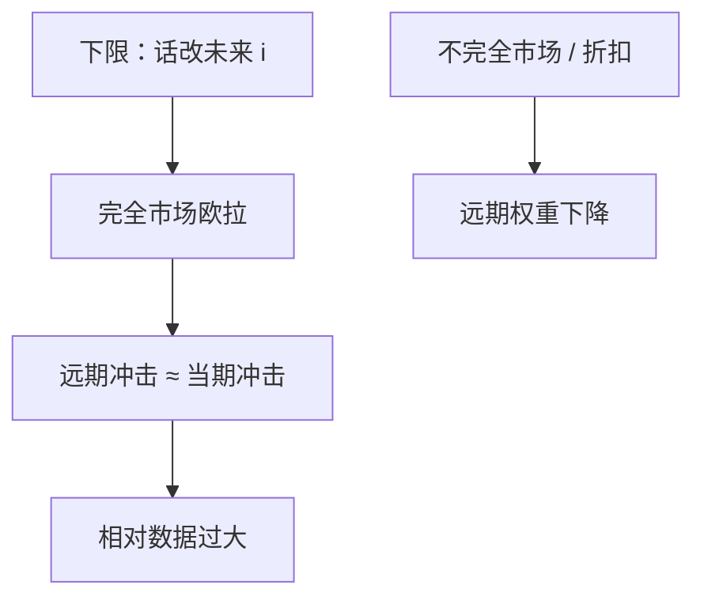

# 前瞻指引之谜

标准新凯恩斯里，对很远未来的利率许诺会通过欧拉几乎不贴现地冲进今天的缺口；数据里没有这么大的魔力。

<footer>—— Del Negro, Giannoni and Patterson 对前瞻指引之谜的定量对照；McKay, Nakamura and Steinsson, AER 2016</footer>

[上一课](/econ/zlb-unconventional)把下限上的工具写成路径承诺：更低更久的 $i$ 进入欧拉。QE 与话的分工是后课。本课的缺口是定量：同一套动态 IS，把未来第 $T$ 期的 $i$ 下调，当前 $\tilde{y}$、$\pi$ 的反应随 $T$ 衰减得**太慢**，甚至可以随 $T$ 变大——前瞻指引之谜。Del Negro、Giannoni 与 Patterson 把标准 NK 与 DSGE 的放大对照数据；McKay–Nakamura–Steinsson 用不完全市场压贴现。本课不发明某一次记者会的基点。

## 问题

动态 IS 向前迭代，$\tilde{y}_t$ 含一整串未来实际利率。若无折现摩擦，第 $T$ 期的 $r$ 与第 1 期几乎同等进入今天的消费。NKPC 再把未来缺口贴现进当前 $\pi$，于是「十年后才降息」也可以大幅移动今天。这与直觉和估计的政策乘数不符。缺口不是再解释下限为何存在，而是：欧拉加完全市场把远期指引变得过强。谜是模型相对数据的夸大，不是「指引完全无效」。

日历指引（「到某年某月」）最容易触发谜：承诺的是远日期，不是状态。状态依存指引与价格水平目标在理论上仍强，但谜迫使你检查贴现。

## 方法

在线性 NK 里对未来某一期的政策利率做预期冲击，画出当前缺口对 $T$ 的反应：标准校准下衰减过慢。Del Negro–Giannoni–Patterson 用估计 DSGE 说明远期冲击的效应过大，并提出对预期或对远期利率反应的折扣作为修补。McKay、Nakamura 与 Steinsson（2016）：不完全市场与借贷约束使收入风险进入贴现，远期利率对当前消费的权重下降，谜减弱。习惯、有限信息、有限计划区间是平行修补。

话与表下一课再拆。本课只要求：用标准三方程宣传「远期承诺效力无限」时，必须声明谜。CIP 与期限溢价的市场层证据在[量化栏](/quant/irp)与期限结构课，不在本课估指引的基点。

### 不是否定承诺

Eggertsson–Woodford 的最优仍是路径与价格水平。谜说的是**定量放大**，不是符号。修补之后，指引仍可以动 $\mathbb{E}r$，只是弹性不再随 $T$ 保持荒谬。卢卡斯批判：若公众不信远期许诺，效应本来就小——那是可信度，与不完全市场是两句。

### 谜在正利率区同样成立

任何「预先宣布很久以后才动 $i$」都会被标准欧拉放大。下限只是使这种宣布变成常用工具，不是谜的定义域。

因此修补必须改贴现结构，不能指望「离开下限后谜自动消失」。

## 机制

完全保险下，家庭只在乎整条实际利率路径的积分，日期不重要。有未保险冲击时，今天的紧约束家庭对「十年后更低的 $i$」几乎无反应，当前 MPC 主导，远期欧拉链条断开。于是同样的下限承诺，当前乘数变小、更合理。混合 NKPC 的惯性会再改通胀侧的放大，但不单独解开消费欧拉的谜。

可信度折扣与市场不完全可以一起出现：不信则远期 $\mathbb{E}i$ 不动；信但不完全市场，则 $\mathbb{E}i$ 动了也传不进当前 $c$。政策评估必须声明是哪一层。

价格水平目标把远期许诺改成对价格路径的积分约束，理论上仍强，但若公众用有限计划或不完全市场贴现，当前效应同样被压。谜因此不只打击日历日期，也打击「任何很远的名义路径」。修补之后仍应说话，只是不要用教科书欧拉当效应表。

谜在正利率区同样存在：任何「预先宣布很久以后的 $i$」都会被标准欧拉放大。下限只是使这种宣布变成常规工具。

## 边界

本课不估计某次 FOMC 声明的产出弹性，不把谜写成「因此不要说话」。QE 渠道（久期、信号）下一课才与话并列。量化栏没有宏观欧拉折扣。也不要把谜当成财政乘数的替代。

有限信息与粘性信息（Mankiw–Reis 一类）同样衰减远期冲击：没注意到的远期许诺进不了当前欧拉。这与不完全市场并列，不要焊成一个参数。经验上指引仍能动利率路径与预期，只是远小于标准 NK 的脉冲。政策含义是把话写短、写状态依存，并配表当可见抵押——下一课。

后课默认：下限上路径承诺在符号上仍成立，定量要用能衰减远期权重的装置，不能拿教科书欧拉当乘数表。下一课：把话与资产负债表拆开。

## 小结

- 下限课给出指引的符号；本课指出标准 NK 把远期冲击放得过大。
- 完全市场欧拉几乎不贴现远期 $r$。
- 不完全市场、折扣预期、有限计划是修补。
- 谜是定量，不是否定承诺的方向。
- 出处：Del Negro, Giannoni and Patterson 的对照；McKay, Nakamura and Steinsson, *AER* 2016。
