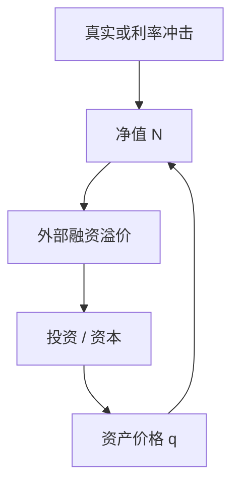

# 金融加速器

净值一薄，外部融资溢价就升，投资与生产再收缩，净值更薄——信用摩擦把真实冲击放大，不是另写一条 IS 斜率。

<footer>—— Bernanke, Gertler and Gilchrist, The Financial Accelerator in a Quantitative Business Cycle Framework, Handbook of Macroeconomics 1999</footer>

[上一课](/econ/dynamic-is)把需求收成前瞻 IS：$\tilde{y}$ 对 $i-\mathbb{E}\pi-r^n$ 的反应，并声明金融摩擦不在方程里。本课的缺口是把摩擦接上：代理成本使外部资金比内部资金贵，溢价随净值反向变。Bernanke–Gertler–Gilchrist（BGG）把这条溢价写进资本需求，形成加速器。RBC 对照下一课才问灵活价格还剩什么；本课仍在名义刚性可并存的周期装置里。

## 问题

动态 IS 的 $\sigma$ 把家庭欧拉当投资也当消费。厂商投资若可按无风险利率无限借，净值不进入 $I$。观测上小企业、抵押紧的部门在衰退中投资多掉一块。缺口不是再对数线性欧拉，而是：不对称信息下，外部融资溢价 $\chi$ 随净值 $N$ 下降而上升，有效资本成本变成 $r+\chi(N)$，$N$ 又被资产价格与现金流推。负向冲击于是自我放大。BGG 用成本状态验证（CSV）一类契约作为微观；宏观用法是加速器，不是银行监管课。

加速器放大**已有**冲击（技术、需求、利率），不是自己发明周期源。没有第一冲击，净值不会无故塌。

## 方法

企业家用净值加借款买资本。最优契约使违约与监督成本反映为 $\chi(N/qK)$：杠杆越高、净值相对资产越小，溢价越高。$q$ 仍是托宾影子价格；调整成本上一单元已有。净值运动：利润、资本利得、折旧。线性化后，IS 或投资方程多一条溢价状态，NKPC 仍把 $\pi$ 接到边际成本——金融摩擦主要通过需求与资本，不必改定价抽签。

货币紧缩提高 $r$，并经 $q$ 资本损失再提高 $\chi$，于是同样的政策利率对应更大的 $\tilde{y}$ 下降。这与泰勒规则不冲突：规则仍定 $i$，加速器改乘数。下限上净值通道同样工作，非常规政策若抬 $q$，可以反过来压 $\chi$。

### 不是把 MM 否证写成周期

MM 在无摩擦下成立。加速器是摩擦：外部资金有代理成本。公司金融的优序、债务积压是堂兄弟，对象是企业资本结构；BGG 要的是宏观加总的净值状态。不要用一条投资对现金流的回归代替契约。

### 溢价不是期限溢价

$\chi$ 是外部资金相对内部资金的代理成本，随净值变。期限溢价是久期与风险在债券市场上的价格，非常规课才拆。

把加速器写成「利差都是金融摩擦」，会把 Habit、CIP 基差与 CSV 焊在一起。本课的利差有明确的净值状态。

## 机制

资产价格下跌 → 抵押与净值下降 → $\chi$ 上升 → 投资更少 → 未来资本更少、资产价格更弱。正向对称。劳动需求随资本与生产下降，就业可以掉，即使工资装置不变。效率工资或 DMP 会再放大，本课不叠校准。长期 $N$ 恢复、$\chi$ 回稳态，中性仍在；加速器是过渡放大。

调整成本让 $q$ 离开 1 已经使 $I$ 缓慢；加速器让同样的 $q$ 波动对应更陡的有效资本成本。两套摩擦同向时，小的净值冲击可以变成大的投资崩溃——这是定量放大，不是取消 Hayashi 的 $q$。把现金流回归的系数当成加速器识别，会把利润会计当成契约。微观仍是外部资金的代理成本。

开放经济下，汇率与外币债可以使净值以本币计更脆（原罪）。CIP 基差是市场层平价，实证见[利率平价](/quant/irp)，不要把加速器的 $\chi$ 写成交叉货币基差。

银行资本也可以当「净值」：中介自己的加速器。BGG 原文以企业家净值为主。对象要声明，免得把准备金走廊和 CSV 焊在一起。

## 边界

本课不估计危机中的溢价基点，不把加速器写成「因此要救市」的口号。量化栏的微观结构不是宏观净值。RBC 对照：灵活价格下加速器仍可放大真实冲击，名义刚性不是前提；有粘性时利率规则与 $q$ 的互动更强。

净值可以用企业家净资产，也可以用银行资本；对象一变，政策含义从「借款人抵押」变成「中介资本」。本课取 BGG 的企业家侧，以免把准备金走廊写成 CSV。债务通缩（Fisher）是名义债加通缩侵蚀净值，与加速器同族，但需要名义债——NK 粘性使之更尖，灵活价格下真实债仍可工作。

后课默认：无摩擦 IS 是基准；需要信用放大时加入随净值变的外部融资溢价。下一课：若价格灵活，周期还剩自然产出与这类真实摩擦自己的波动。

## 小结

- 动态 IS 默认无摩擦融资；BGG 让溢价随净值变。
- 净值与 $q$ 的反馈放大冲击，是加速器。
- $q$ 理论仍在；摩擦乘在资本成本上，不是取消边际 $q$。
- 放大已有冲击，不是独立的周期源。
- 出处：Bernanke, Gertler and Gilchrist, *Handbook of Macroeconomics* 1999。
