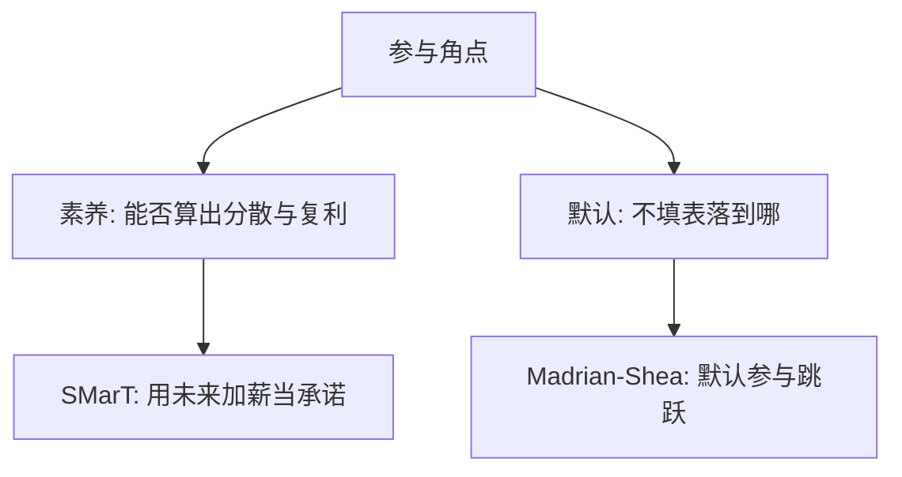

# 金融素养与默认选项

复利、风险分散和通胀，不是偏好参数；大量家庭答不对这三问。默认选项则在不改变菜单的情况下改写参与。

<footer>—— Lusardi and Mitchell 的素养测量；Madrian and Shea, QJE 2001；Thaler and Benartzi, JPE 2004</footer>

[上一课](/econ/household-portfolio-participation)把零持有写成成本与背景风险。本课缺口是：同样的菜单，理解力与**默认**仍移动角点。不重估固定成本，也不把助推课序提前写完——本课只落在家庭储蓄制度。

## 问题

Lusardi 与 Mitchell 用三问（复利、通胀、分散）刻画素养：答对与股票参与、退休准备正相关。这不是新的 $\gamma$，是预算与欧拉在头脑里没有被算出来。Madrian 与 Shea（2001）在 401(k) 里把默认从「不参加」改成「参加」，参与率跳跃——菜单没变，现状变了。Thaler 与 Benartzi（2004）的 Save More Tomorrow：承诺未来加薪时提高缴存，绕开现时偏差。Choi、Laibson、Madrian 与 Metrick 把默认、惯性与 Diversification 启发式写成同一组事实。

缺口是在参与之谜上叠加认知与选择架构，而不是重写 LCH。

惯性可以是理性的（计算成本）也可以是偏差（现状）。识别靠默认切换：成本几乎没变，选择变了，就不是单纯的固定参与成本。

## 方法

把「理解欧拉」与「填写表格」分成两层。素养影响能否从菜单映射到最优；默认影响不填写时落到哪一点。经验设计：雇主默认的自然实验；素养与教育、课程干预。本课不估计干预的长期回报。

与[承诺装置](/econ/commitment-devices)的接缝：默认和 SMarT 是制度版金蛋。与后课助推的接缝：这里对象是退休账户，一般选择架构留到行为单元。

## 机制

机制有两条。一条是信息：不懂分散的人把股票当赌博，零持有来自信念而非 $\gamma=\infty$。一条是惰性：填写成本或现时偏差使现状成为实质菜单。默认把现状从「现金」换成「目标日期基金」，参与与股票暴露同时上升。这不证明人的偏好变了，只证明揭示偏好依赖架构——显示偏好课已经警告过菜单依赖，本课给出现场。

不进入限价簿。默认选项是人力资源与计划文件，不是报价档。主干在簿的交接处停；缴存默认改的是家庭菜单的现状，不是 tick。

三问素养测的是能否执行已有欧拉与分散，不是新的偏好公理。答错的人可能仍有完备传递的 $\succsim$，只是没把复利映射到数字。默认实验的识别力在于菜单法律上不变：若选择仍跳，显示偏好就不能把「不参与」读成对股票的真实厌恶。SMarT 把加薪当未来菜单的自动收紧，是承诺装置的工资版。

## 边界

素养与财富互为因果：有钱才学、会的人才积累。默认也可能给错误风险暴露（过高股票或过高收费基金）。本课不把「提高素养」写成充分政策。行为单元的框架效应会解释为何同一缴存率用「匹配」或「税」包装结果不同。

跨期选择单元到此收束。下一单元从[期望效用](/econ/expected-utility)的缺口起：现场选择系统地偏离 vNM，前景理论接棒，仍不重推导独立性公理。

菜单法律上不变而选择跳，说明「不参与」不能直接读成对股票的厌恶。

跨期单元到此收束：下一单元从 vNM 的现场失败起，不重推独立性。

## 小结

- 素养不足使欧拉与分散无法被执行；默认在菜单不变时改参与。
- Madrian–Shea 与 SMarT 把承诺和惰性写成制度。
- 本单元不重写簿；家庭金融停在参与与缴存，下一单元改风险偏好的表示。
- 三问素养测执行，不测新的偏好公理。
- SMarT 是承诺装置的加薪版。
- 出处：Lusardi and Mitchell；Madrian and Shea, *QJE* 2001；Thaler and Benartzi, *JPE* 2004。
