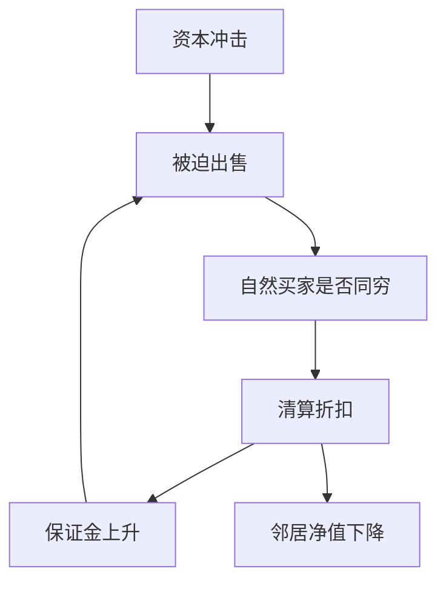

# 火线出售

当自然买家自己也缺资本时，被迫出售不再发现基本面价格，而是把流动性折扣写成系统冲击。

<footer>—— Shleifer and Vishny, Liquidation Values and Debt Capacity, Journal of Finance, 1992；对照 Brunnermeier and Pedersen, Review of Financial Studies, 2009</footer>

[上一课](/econ/bank-contagion)给出银行间网络如何把一家的清算折扣导入邻居。折扣在那里是外生的「提前卖掉拿不到持有到期值」。本课缺口是把折扣做成均衡：谁是买家、为何他们恰好也穷。Shleifer–Vishny 的火线出售，Brunnermeier 的保证金螺旋。不重画 Allen–Gale 的环形互存。

## 问题

Allen–Gale 已经需要一项清算折扣，否则邻居的资产不会减值。若行业内的专家才是资产的自然买家，而专家与卖方一同被同一冲击打到资本约束，则买家缺席，价格掉到局外人的估值——那是使用价值更低的人在定价。Shleifer 与 Vishny（1992）把这句话写成债务容量：清算值取决于潜在买家的财富，杠杆因此内生地脆弱。

缺口不是再指认一条银行间边，而是：即便没有直接互存，共同持有的资产在被迫出售时可以经由**价格**传染。Brunnermeier 与 Pedersen（2009）补上保证金：价格跌 → 保证金升 → 再卖 → 再跌。下一课存款保险删的是挤兑均衡，不自动删这条价格通道。

火线出售：被迫交易，对手方不是估值最高的使用者。折扣来自谁能买，不是来自「市场无效」的口头。基本面可以透明，价格仍可以远离持有到期值。

## 方法

把资产写成在专家手中产出更高。专家用债务融资。坏状态下专家净值下降，债务容量收缩，被迫把资产卖给非专家，价格等于非专家的较低估值。预期到这一点，事前杠杆已经更保守——或者在忽略外部性时仍然过高。价格渠道与债权渠道分开写：没有银行间存款，也可以有火线出售。

不要把每一笔下跌都叫火线出售：还要有被迫与买家资本约束。共同冲击可以同时打卖家与买家，那是放大，仍要与「谣言」分开。

### 网络边与价格边

上一课的不完全网络是债权导管。本课的价格是市场导管。两者可以叠：邻居被抽干后火灾出售，压低共同资产，第三家并未互存也被打折。系统性定义仍要求可指认的传递；价格传递的边是市场，不是电话。

## 机制

机制是专用性加融资约束。资产的最高估值依赖专家知识或协同，专家的购买力依赖自己的净值与抵押。冲击使最高估值者缺席，价格由次优使用者决定，折扣反馈进抵押品，约束再收紧。这与柠檬不同：质量可以已知。也与 Diamond–Dybvig 的序贯服务不同：这里不必有太阳黑子排队，只要有必须满足的保证金或赎回。

宏观含义：私人清算值低于社会持有到期值，因为买家的约束不被卖方内部化。资本监管与后课的最后贷款人，针对的就是把购买力还给自然买家，而不是「禁止价格下跌」。

Brunnermeier–Pedersen：市场流动性（价差、冲击成本）与融资流动性（保证金、短期债）互相喂。本课只取螺旋，不把限价簿深度写成定理。

## 边界

不要在此估计折扣百分比，不要把股票因子里的非流动性溢价搬进来——那是量化栏。也不要把火线出售写成做市商存货模型。下一课 [存款保险](/econ/deposit-insurance)针对活期合同的坏均衡；未保险的批发融资与共同资产价格通道可以还在。

后课默认：清算折扣可以是均衡，来自自然买家的资本约束；价格渠道足以传染。共同冲击与火线出售仍须分开写。

限价簿上的冲击成本是协议层，见量化栏；本课停在净值与抵押。

监管若在同一时刻要求多家机构按市值补资本，会把自然买家一起变成卖方，折扣内生放大。那是约束同步，不是新的太阳黑子。私人最优杠杆仍可能高于社会，因为买方约束不被内部化。

存款保险下一课针对活期面值。批发融资、共同基金赎回，走的是本课的价格与保证金通道，保单不必自动覆盖。

## 小结

- 火线出售：被迫卖给非自然买家，折扣由买家资本决定。
- 价格通道可在没有银行间债权时传染；保证金螺旋把折扣放大。
- 与柠檬、与太阳黑子挤兑分层：质量可透明，也不必有排队谣言。
- 下一课存款保险删挤兑均衡，不自动删价格与保证金通道。
- 冲击成本的协议层在量化栏；本课停在净值与抵押。
- 出处：Shleifer and Vishny, *JF* 1992；Brunnermeier and Pedersen, *RFS* 2009。
