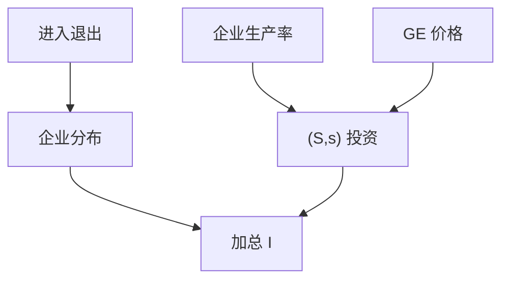

# 企业异质性与投资

固定成本与不可逆使投资变成 $(S,s)$；加总 $I$ 的平滑来自企业分布在阈值上的积分，不是代表性凸调整成本那么干净。

<footer>—— Hopenhayn, Entry, Exit and Firm Dynamics, Econometrica 1992；Khan and Thomas, Idiosyncratic Shocks and the Role of Nonconvexities, Econometrica 2008</footer>

[上一课](/econ/household-debt-cycles)把家庭杠杆接到需求。供给与资本积累仍常被写成代表性 $q$。本课缺口是**企业异质**：生产率分布、进入退出、非凸投资。异质单元在此收束。不重写按揭 MPC，不把托宾 $q$ 的定义再推一遍。

## 问题

[托宾 q](/econ/tobin-q) 给了边际影子价格。凸调整成本让代表性 $I(q)$ 光滑。微观：投资 lumpy（Doms–Dunne、Cooper–Haltiwanger）。Caballero–Engel 的 $(S,s)$：加总来自多少企业越过阈值。Khan–Thomas：一般均衡价格反馈可以削弱非凸对加总的影响。Hopenhayn：进入退出与平稳的企业规模分布。缺口是：加总投资脉冲不必等于代表性 $q$ 回归，即使每家企业盯着自己的 $q$。

Hopenhayn, *Econometrica* 1992。Khan and Thomas, *Econometrica* 2008。Winberry 把 lumpy 投资接到 NK。Gabaix 的颗粒度：大企业冲击可进总量。

## 方法

企业状态：生产率、资本、可能还有债务约束。决策：投资、进入、退出。出清：工资与利率（或需求）由分布决定。求解：与 KS 类似的预报定律，或序列空间。校准：企业层面投资率的分布、进入率、就业再配置。金融摩擦：外部融资溢价对企业规模异质（Gomes；Bernanke–Gertler–Gilchrist 的加速器是代表性或代表性「企业家」），后单元再接到中介。

颗粒度（Gabaix）：尾部企业足够大时，特异冲击不抵消。这与家庭帕累托尾是姐妹，对象换成企业销售。

## 机制

机制是阈值加分布。总量冲击移动阈值或移动分布质量，加总 $I$ 可以出现急促或延迟。GE：利率与工资吸收部分特异需求，Khan–Thomas 强调这一点，避免从微观 lumpy 直接推出宏观 lumpy。误配（Hsieh–Klenow）是另一条：摩擦使 $MRPK$ 分散，TFP 下降——增长课已有接口，本课只点名周期与投资。

与 HANK：家庭 MPC 分布 × 企业投资分布 = 需求冲击的供给响应。两套分布都不是代表性弹性。

本课不把产业组织的全部进入模型搬进来。也不估计股票横截面的投资因子——那是资产定价课。

## 边界

本课不写最优产业政策。不把信贷周期的抵押约束当主方程（下一单元 KM）。预期如何形成仍用理性预期；下一单元才改预期算子。异质单元结束：后课默认家庭与企业都可以是分布，加总矩不够识别微观弹性。

## 小结

- 非凸投资与进入退出使加总 $I$ 成为分布的积分。
- GE 价格可削弱微观 lumpy 向宏观的传递。
- 颗粒度让大企业冲击进入总量。
- 出处：Hopenhayn, *Econometrica* 1992；Khan and Thomas, *Econometrica* 2008。
