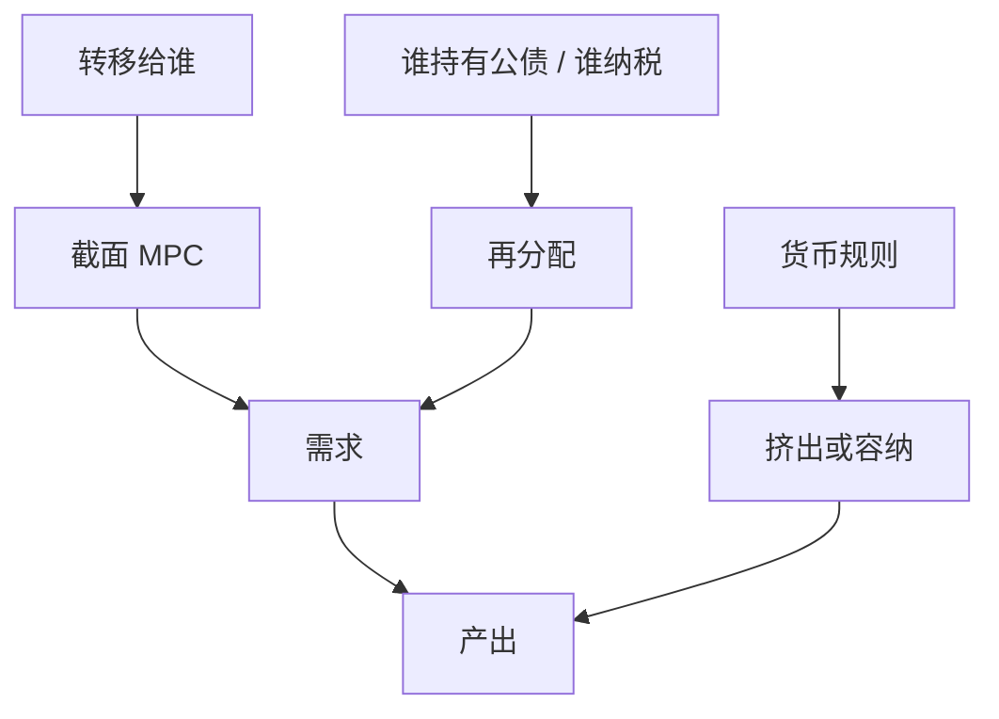

# 财政刺激与 HANK

一次总付的乘数取决于给谁、债由谁持有、以及收入循环碰到多高的 MPC——李嘉图在不完全市场里不是默认。

<footer>—— Oh and Reis, Targeted Transfers and the Macroeconomic Effects of Fiscal Stimulus, JME 2012；Kaplan and Violante 刺激支付；McKay and Reis 自动稳定器</footer>

[上一课](/econ/heterogeneous-mpc)给出加权 MPC。财政课在代表性主干里已有乘数与李嘉图。本课缺口是 **HANK 里的刺激**：转移的指向与赤字融资改变一般均衡。不重估叙事军费，不重写 MPC 分箱。

## 问题

RANK 李嘉图：减税被未来税抵消，欧拉不动。HANK：今天的支票进高 MPC 口袋，未来税若落在低 MPC 或尚未出生的人身上，当期 $C$ 升。Oh–Reis：指向性转移可以有可观的产出效应。政府购买仍走劳动需求与收入循环，但挤出经利率的强度取决于谁是储蓄者。缺口是把「乘数」从单一数字改成**工具 × 分配 × 规则**的函数。

Oh and Reis, *JME* 59(6), 2012。McKay and Reis, *JPE* 2016 自动稳定器。Hagedorn, Manovskii and Mitman 对 HANK 乘数的定量争论。Auclert, Rognlie and Straub 的序列空间财政。

## 方法

实验：同样规模的赤字，比较（i）给约束家庭的转移，（ii）给平均家庭，（iii）政府消费。融资：短期债、长期债、通胀税、延迟的累进税。货币规则：利率是否对产出缺口反应，决定挤出。ZLB 下 RANK 已有大乘数；HANK 在正利率下也可以因 MPC 而不小。与叙事/LP 对照：加总 IRF 是混合处理，模型用来拆指向。

自动稳定器（失业救济、累进税）是状态依存的指向性转移，不必等新立法——与后课 UI 接口。

## 机制

机制是再分配加收入循环。公债是某些家庭的流动性资产：发债可以放松贫流动性约束（政府债供给），同时提高未来税负担。符号取决于校准。货币紧缩若伴随财政扩张，间接效应可能打架。开放经济漏出、进口边际，本课只点名。

与识别课：Ramey 军费冲击不是一次总付，HANK 的转移实验不能直接套军费 IRF 当校准靶而不改工具。

主干[财政乘数](/econ/fiscal-multiplier)已有代表性叙述。本课只补异质缺口，不重写 IS 会计。

## 边界

本课不写最优公共债务水平（可持续性在金融摩擦单元）。不把产业政策当刺激。主权利差、违约是 Eaton–Gersovitz 以后的课。也不做量化交易策略。

后课默认：HANK 财政乘数依赖指向与融资；李嘉图不是默认。下一课：把分配的长期运动接到 $r$ 与 $g$，而不只是一次支票。

## 小结

- 刺激的乘数是指向 × MPC × 融资 × 货币规则。
- 不完全市场打破默认李嘉图。
- 加总财政 IRF 混合了工具，模型负责拆解。
- 出处：Oh and Reis, *JME* 2012；Kaplan–Violante；McKay and Reis, *JPE* 2016。
