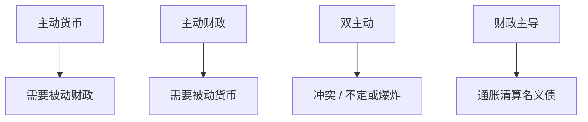

# 财政-货币主导

价格水平由谁的规则钉住：货币主导下财政必须最终适应；财政主导下货币适应债，通胀成为清算工具。

<footer>—— Sargent and Wallace, Some Unpleasant Monetarist Arithmetic, 1981；Leeper, Equilibria under Active and Passive Monetary and Fiscal Policies, JME 1991</footer>

[上一课](/econ/debt-sustainability)的 $s$ 反应函数被当成给定。本课缺口是 **谁适应谁**：Sargent–Wallace 的算术与 Leeper 的主动/被动。不重写 $r-g$ 公式，不把 CBDC 提前当主工具。

## 问题

货币数量或泰勒规则要钉住价格，政府跨期预算必须在某个未来用税收或支出闭合——否则债爆炸或靠铸币税。Sargent–Wallace：若财政不适应，紧货币今天可以意味着更高的未来通胀。Leeper：主动货币+被动财政，或被动货币+主动财政，才能有唯一（局部）均衡；两个都主动则冲突。缺口是给锚定课的「财政可以解钉」一条规则语言。

Sargent and Wallace, FRB Minneapolis *Quarterly Review* 1981。Leeper, *JME* 1991。Woodford 的财政理论讨论。Cochrane 的 FTPL 是有争议的延伸，本课用 Leeper 的主动被动，不把争论写成已决。

## 方法

线性 NK 加政府预算。货币规则：对通胀的反应 $\phi_\pi$。财政：盈余对债的反应 $\gamma$。BK 式计数：一对一的主动被动组合给出决定性。财政主导：盈余不跟债走，价格水平跳升以稀释名义债，使预算闭合（财政价格理论的核心机制）。再谈判、指数化债、外币债削弱稀释通道，把经济推向 Arellano 违约。

与沟通：Delphic 若揭示「财政不会适应」，锚定失败。与 HANK：稀释的分配取决于谁持有名义债（Doepke–Schneider）。

## 机制

机制是跨期预算必须在均衡成立。不是规范上「应该违约或应该征税」，而是价格、违约、或盈余三者必居其一（或组合）。非常规货币扩张央行持有的政府债，把利息风险移到公共部门，主导问题更显性——后课资产负债表。独立央行是承诺装置，不能单独取消算术。

不快的算术：今天的反通胀若提高实际利率、加重债，而财政不跟，人会预期未来的货币投降。

时间不一致课的通胀偏误是另一条线（Barro–Gordon）。本课是预算闭合，不是菲利普斯欺骗。

## 边界

本课不主张「任意债都可以靠物价一次跳清」。流动性陷阱、ZLB、长期债的估值效应使定量复杂。下一课用历史看银行危机，不是同一条会计。不把黄金作为货币规则重写。

后课默认：决定性要声明货币与财政谁主动；财政主导是通胀清算名义债。下一课：银行危机的历史模式。

## 小结

- 不愉快算术：财政不适应时，紧货币可预示未来通胀。
- Leeper：主动/被动配对才能局部决定。
- 稀释、违约、增税是预算闭合的三个出口。
- 出处：Sargent and Wallace 1981；Leeper, *JME* 1991。
