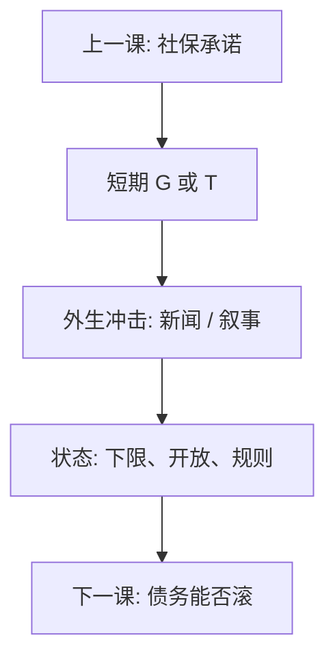

# 财政乘数争议

乘数是给定货币政策规则、资源闲置与开放程度时，$Y$ 对 $G$ 或 $T$ 的均衡导数，不是恒等式里的一个数。识别靠外生的支出冲击，不靠把会计重排。

<footer>—— Barro, Are Government Bonds Net Wealth?, JPE 1974；Ramey 财政乘数综述；Blanchard and Leigh 对预测修正的讨论；对照主干课财政乘数与李嘉图；Woodford</footer>

[上一课](/econ/social-security-annuity)把支出写成生命周期承诺。本课缺口是短期：多修一座桥、减一笔税，当年 $Y$ 动多少。主干[财政乘数与李嘉图](/econ/fiscal-multiplier)已给出等价与 NK 下限。公共财政续课补**争议的识别**：军费新闻、预测误差、叙事法，以及为何文献里乘数可以从接近 0 到大于 1。后课把一次性 $G$ 换成债务存量能否滚下去。

## 问题

恒等 $Y=C+I+G+NX$ 不能给出 $\mathrm{d}Y/\mathrm{d}G$：右边会挤出。李嘉图：减税发债不改变财富，$C$ 不动。打破它：流动性约束、有限寿命、扭曲税、价格粘性、利率规则不把 $G$ 完全对冲。下限上 $i$ 钉住，乘数往往更大。缺口不是再写一遍欧拉，而是：**观测到的 $G$ 大多是内生的**（自动稳定器、$Y$ 低时支出高），OLS 把乘数和逆因果混在一起。Ramey 用军事新闻把预期识别出来；Blanchard–Leigh 看预测修订。争议来自冲击定义、样本是否在下限、开放漏出，不是来自「凯恩斯对古典」的口号。

### 乘数不是一个数

同一经济，扩张期与萧条期、浮动与钉住、货币对冲与否，导数不同。报告「乘数等于 1.5」而不写规则与状态，等于没报告。开放经济：$M$ 漏到进口，小国乘数更小。地方财政的转移乘数还要问钱是否飞纸效应——那是最后一课。

Ramey 强调预期：立法通过到支出落地有时滞，新闻已经改变 $C$ 与 $I$。用实际 $G_t$ 而不用新闻，会把乘数估错时点。

## 方法

识别：叙事军费、战争、外生政治、预测误差。估计：结构 VAR、局部投影、或准实验（州级转移，但那已接近下一课）。报告时声明：是购买性 $G$ 还是转移；$T$ 是一次总付还是扭曲；货币政策反应函数。NK：泰勒规则下乘数常小于 1；ZLB 上可大于 1。李嘉图基准是对照，不是经验先验。

不要用乘数大于 1 当公共品萨缪尔森条件的替代：乘数是短期 $Y$，公共品是 $\sum\mathrm{MRS}$。两套目标。军费识别的外部有效也有限：战争新闻伴随其他冲击，外推到和平时期的基础设施要另做假设。状态依赖是这句话的计量形式：同一识别策略，样本是否在下限，点估计可以差一倍。

## 机制

机制是哪条漏被堵住。完全市场加一次总付加利率对冲：私人储蓄对冲公共，乘数近 0。流动性约束者 MPC 高，转移打在他们身上乘数大。粘性价格下 $G$ 提高需求，$\pi$ 与 $\tilde y$ 动，利率规则决定挤出多少 $C$、$I$。预期：若家庭认为 $G$ 持久且未来税更重，李嘉图成分上升；若认为只在下限维持一期，NK 成分上升。这与卢卡斯批判一致：乘数是规则的函数。

与社保：给付承诺改变财富预期，短期乘数与长期挤出可以反号。不要用衰退年的乘数去论证养老金永远该扩张。开放漏出：小国 $G$ 打在进口上，乘数更接近 0；汇率若升值再挤出净出口。钉住或同盟里没有这道阀门，乘数与欧债课的内部贬值连在一起。

Blanchard and Leigh 用 IMF 预测误差：增长意外与财政巩固幅度相关，暗示当时乘数被低估。这是一段样本、一种识别，不是宇宙常数。

## 边界

本课不给「现在该刺激多少」的数字，不重写 IS–LM 全图。量化宽松与前瞻指引在宏观主干，这里只把利率规则当状态。主权利差上升时乘数更小甚至为负——下一课债务可持续。后课默认：谈乘数先写识别与状态；禁止把恒等或单一估计当政策充分统计。转移支付对流动性约束家庭的乘数，通常大于给李嘉图家庭减税——对象比「G 还是 T」四个字母更要紧。

## 小结

- 乘数是均衡导数，依赖货币规则、闲置与开放，不是一个数。
- $G$ 内生，要用新闻、叙事或预测误差识别。
- 李嘉图与 ZLB 是两端对照，样本状态决定落点。
- 短期 $Y$ 不等于公共品的萨缪尔森条件。
- 识别对象是谁收到钱，往往比 G 与 T 的字母更要紧。
- 出处：Barro 1974；Ramey；Blanchard and Leigh；Woodford；主干财政乘数课。
