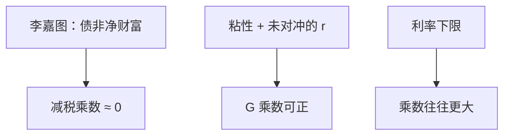

# 财政乘数与李嘉图

减税若只是税收的时间平移，欧拉与跨期预算可以把私人储蓄对冲掉；乘数要有缺口、约束或名义刚性，才不是恒等上的零。

<footer>—— Barro, Are Government Bonds Net Wealth?, JPE 1974；对照 Keynes 有效需求与 Woodford 在利率规则下的财政讨论</footer>

[上一课](/econ/zlb-unconventional)让利率工具在下限卡住。常见的下一句是「所以要财政」。本课的缺口是：财政支出或减税对 $Y$ 的乘数，在欧拉与政府跨期预算下可以是零、可以是正、在下限上可以更大。Barro（1974）把李嘉图等价钉成：债券不是净财富。开放经济会计从下一课起把 $S-I$ 接到经常账户，乘数还要再分漏出。

## 问题

IS–LM 用 $C=c(Y-T)$，$G$ 的乘数是 $1/(1-c)$ 一类。欧拉课已经警告：完全市场、一次总付税、无限寿命（或利他遗产）时，减税加发债不改变财富，$C$ 不动——李嘉图等价。政府预算

$$
G_t+iB_{t-1}=T_t+\dot{B}_t+\frac{\dot{H}_t}{P_t}
$$

把铸币税、债、税连在一起。缺口是声明哪一条假设被打破，乘数才不是会计上的 redistribution。

Keynes 的缺口是价格粘性或未出清：资源闲置时，$G$ 直接进 $Y$。NK 把这句话写成：若货币政策不把实际利率完全对冲，$G$ 提高自然利率或需求，$\tilde{y}$ 与 $\pi$ 上升。下限上泰勒规则无法提高 $i$ 来对冲，乘数往往更大——这是 Woodford 与后续 NK 财政的接头，不是把恒等 $Y=C+I+G$ 读成因果。

事后 $S=I+NX$ 永远成立。乘数是均衡中 $Y$ 对政策的导数，不是恒等的再排列。把「谁先储蓄」当乘数，是又一次把会计读成理论。

## 方法

李嘉图基准：$\Delta T=-\Delta B$，现值税不变，$C$ 路径不变，$r$ 若由实物定也不变。打破基准的通道：有限寿命且无遗产、流动性约束、扭曲税、政府购买直接进效用或生产、$G$ 改变未来 $y^*$。

NK：泰勒规则下，$G$ 升 → $\pi$ 升 → $i$ 升，实际利率可能上升并挤出 $C$、$I$，乘数小于 1。下限上 $i$ 不动，$\mathbb{E}\pi$ 上升反而降低实际利率，乘数可以大于 1。这与卢卡斯批判一致：乘数是规则 $g$ 的函数，用 1960 年代的 $c$ 去乘 2009 年的 $G$ 无效。

政府购买与转移支付不同：一次总付转移在李嘉图下更接近零；有约束的家庭则接近当期 MPC。本课不编造某个国家的点估计。

### 融资方式

同样 $G$，用税、债或铸币税，短期名义效应不同。铸币税接通胀税课；在下限上增发 $H$ 可能被 $V$ 吸收。时间不一致：宣布的未来紧缩（为给今天的 $G$ 腾空间）必须可信，否则只剩债与 $\pi^e$ 的跳跃。

## 机制

完全市场把税收现值从私人财富里扣掉。债券只是对未来税的标记，不是多出来的资源。闲置资源加上名义刚性，使 $G$ 能动员本来不会被欧拉花掉的劳动与产能。利率规则决定挤出多少：常规规则挤出多，下限挤出少甚至挤入（经由 $\pi^e$）。这与 RBC 对照：灵活价格且充分就业时，$G$ 主要挤出 $C$ 或 $I$，实际乘数接近资源约束的会计，而不是 Keynes 菜单。

Haavelmo 平衡预算乘数在静态消费函数下可以是 1。欧拉下不再机械。转移支付不是 $G$：只有受约束家庭的 MPC 不同才有总需求效应。SNA 已把 $G$ 钉在政府对货物服务的购买。

李嘉图比较的是融资：税现在还是税以后。它不说政府购买对产出无用——$G$ 直接进 $Y$，即使 $C$ 一对一下降，构成仍变。

## 边界

本课不把乘数写成政治口号，不估计「基础设施永远 1.5」。开放漏出（进口）和下课经常账户会缩小封闭乘数。也不要把公司投资的 $q$ 理论或 MM 资本结构写进 $G$。量化栏没有财政。扭曲税有供给面：劳动税会移动 $y^*$，与需求乘数可能异号并存。

后课默认：谈财政时先声明规则（含是否在下限）与李嘉图假设是否成立。下一课打开国境：国民储蓄与投资的差是经常账户。

## 小结

- 李嘉图：一次总付的税债互换不改变 $C$（在所列假设下）。
- 乘数是均衡导数，依赖粘性、约束与利率规则。
- 下限上货币难对冲，财政乘数往往更大。
- $G$ 是购买，转移支付走另一条 MPC 渠道。
- 简化式 MPC 不能跨规则使用。
- 出处：Barro, JPE 1974；Keynes 有效需求；Woodford 利率规则下的财政。
