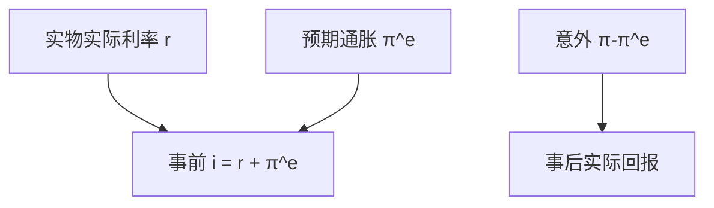

# 费雪方程

名义利率是实际利率与预期通胀之和；把事后实现的通胀代进去，得到的是定义，不是事前的套利条件。

<footer>—— Fisher, The Theory of Interest, 1930；对照《货币的购买力》中的利率与物价</footer>

[上一课](/econ/quantity-theory)在 $MV=Py$ 上钉了长期中性，并预告费雪成分 $i\approx r+\pi^e$ 里 $r$ 由实物决定。本课的缺口就是把这句写成独立的利率分解：**事前**与**事后**、定义与均衡。铸币税下一课问谁从 $M$ 增长里抽税；本课不把通胀税写完。开放经济的抛补平价实证不在本栏，见[利率平价](/quant/irp)。

## 问题

数量论给出 $P$ 的长期水平（或通胀趋势与 $M$ 增长），没有单独写出债券的名义报价如何含通胀补偿。若合同以货币计价，贷出者关心的是能买到的货物。缺口不是再论证中性，而是：

$$
i_t = r_t + \pi_t^e,
$$

其中 $r$ 是实际利率（或事先约定的实际回报），$\pi^e$ 是预期通胀。事前等式才是行为关系；事后 $i=r^{\mathrm{ex\ post}}+\pi$ 只是把实现通胀从名义里拆开的会计。把 1970 年代高 $i$ 当成「实际资金很贵」，可能只是 $\pi^e$ 很高。

线性近似忽略 $i r$ 交叉项；精确的是 $1+i=(1+r)(1+\pi^e)$。宏观主干常用加总形式。实际利率还依赖用哪一个 $P$：CPI 与 PCE 不同，$\pi^e$ 跟着不同。

## 方法

事前：债务合同谈判时，$\pi^e$ 进入名义利率。实际利率 $r$ 在灵活价格、充分就业下由时间偏好、资本边际产出与净出口等实物因素决定——RCK 的 $r$ 与索洛的 $f'(k)-\delta$。货币长期中性意味着 $M$ 的水平不改这个 $r$；通胀趋势进入 $i$，一对一（费雪效应）。事后：$\pi$ 实现后，$i-\pi$ 是实现的实际回报，可以因意外通胀而与 $r$ 不同——正是债务再分配。

CIA/MIU 已经给出 $i$ 是持币机会成本。费雪方程把这个 $i$ 再拆成 $r$ 与 $\pi^e$。数量方程管 $P$ 的趋势；费雪管名义利率如何吸收趋势。短期粘性使 $i$ 动而 $\pi^e$ 未一对一跟上，实际利率变动——新凯恩斯的入口，本课只划界。

### 费雪效应不是 CIP

国内费雪：$i$ 与 $\pi^e$ 同向。两国费雪加无套利会通向未抛补利率平价，那是开放宏观。**抛补**利率平价用远期覆盖汇率风险，是外汇市场报价关系，实证与基差在量化栏的 IRP，本课不写回归、不写基差交易。

## 机制

若 $\pi^e$ 上升而 $r$ 不变，$i$ 上升，名义债务的票息补偿购买力损失。意外通胀使事后实际回报低于事前 $r$，财富从债权人转到债务人——包括政府实际债务。这与中性不冲突：中性谈的是未预期到的一次性 $M$ 在长期不改 $y^*$；费雪谈的是预期到的通胀进入 $i$。超中性失败时（通胀税扭曲 $k$），$r$ 本身随 $\pi$ 而动，费雪一对一不再干净——下一课铸币税。

适应性与理性预期改变 $\pi^e$ 的形成，从而改变 $i$ 的路径。费雪方程本身不指定预期；菲利普斯课把 $\pi^e$ 接进工资。本课只要求：写 $i$ 时声明事前还是事后。

指数选择进入 $r$ 的测量：用 CPI 还是 PCE，$i-\pi$ 可以差一截，实际利率的故事跟着变——回到[CPI 与 PCE](/econ/cpi-vs-pce)。短期名义利率由政策或货币需求决定时，费雪方程是对 $r$ 与 $\pi^e$ 的分解，不是对 $i$ 的独立决定。粘性价格下 $i$ 动而 $\pi^e$ 未跟上，$r$ 成为需求通道；灵活价格下 $r$ 由实物钉住，$i$ 跟着 $\pi^e$ 走。两种因果方向不要写进同一句「费雪决定利率」。

税收楔子（名义利息课税）使税后费雪更乱：$i$ 需要补偿的不只是 $\pi^e$，还有对名义利息的税。本课主干用税前分解，以免把公司金融的税盾提前搬进来。

实际利率为负，在事前需要 $i<\pi^e$，在零下限附近更常见的是事后 $i<\pi$。不要把两种负利率混成「费雪失效」。

## 边界

费雪方程不是期限结构：长债还含期限溢价，[预期假说](/econ/eh-term-structure)另写。也不要把股票预期回报写成 $r+\pi^e$。公司金融的名义合同与通胀指数债，是同一分解在证券上的应用，本课不展开税盾。量化栏的微观报价不是宏观 $i$。

开放经济里，两国费雪加资本流动会通向利率平价。抛补平价是远期报价的微观关系，实证与基差一律放到 `/quant/irp`，本课只钉国内事前分解。铸币税下一课会让超中性失败时 $r$ 随 $\pi$ 而动，费雪一对一不再干净——那是对「$r$ 永远由实物钉死」的修正，不是否定事前等式的定义。

后课默认：名义利率先拆成事前 $r+\pi^e$；意外通胀再分配。下一课问政府能否靠印钞对实际余额征税。

## 小结

- 事前 $i=r+\pi^e$ 是均衡分解；事后 $i-\pi$ 是实现回报的会计。
- 费雪效应：预期通胀进入名义利率；长期 $r$ 由实物决定。
- 意外通胀再分配名义债权。
- CIP 实证不在本课，见 `/quant/irp`。
- 指数选 CPI 或 PCE，$i-\pi$ 跟着变。
- 出处：Fisher, *The Theory of Interest*；对照数量方程课的中性。
