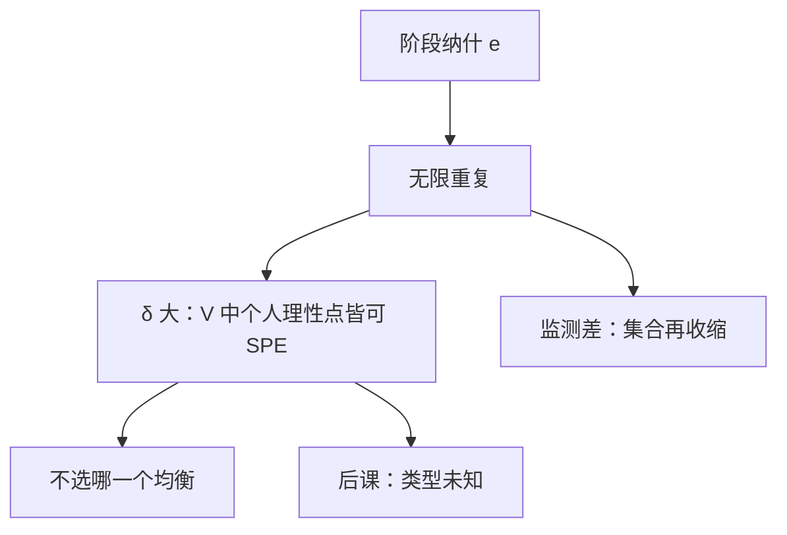

# 重复博弈与无名氏定理

贴现足够耐心时，任何可行且个人理性的支付，都可以由子博弈完美均衡支撑。

<footer>—— 据 Friedman, Review of Economic Studies, 1971；Fudenberg and Maskin, Econometrica, 1986 整理</footer>

[上一课](/econ/backward-induction-limits)（逆向归纳的限度）。用 SPE 删掉一次性树上的空威胁。把同一阶段博弈重复下去，惩罚变成「以后改玩另一条路径」，而路径本身可以是均衡。缺口是：SPE 在重复结构里不再瘦，反而极肥。无名氏定理给出肥到什么程度。本课钉可支撑支付的集合，不引入类型与贝叶斯。

## 问题

阶段博弈的纳什支付记为 $e$，可行支付集 $V$ 是阶段支付的凸组合（可公随机化）。个人理性水平 $v_i$ 是别人能把 $i$ 压到的最低（minimax）。一次性囚徒困境里，SPE（也是纳什）只有招供；合作支付在 $V$ 里，但高于 $e$，一次性不可信。

重复之后，偏离的人可以被转到 minimax 或转到「惩罚纳什」。若贴现因子 $\delta$ 够大，未来损失压过当期偏离增益，合作路径可以是 SPE。Friedman 的纳什回归已经能撑住严格优于 $e$ 的点；Fudenberg–Maskin 在有限行动、可观察混合的条件下，把集合扩到几乎整个可行且个人理性的集合。

### 无名氏不是「合作必然出现」

定理是可能性：许多支付都有某个 SPE 去实现。它不选哪一个。贴现、监测、是否公开随机化，决定能撑住多大一块。把无名氏读成「重复就能卡特尔」，漏掉了均衡选择与监测。

触发策略：路径上合作，一旦观测到偏离，永远回到阶段纳什。这是 SPE，因为惩罚子博弈本身是纳什的重复，惩罚者愿意执行。minimax 惩罚更狠，但惩罚者可能需要自己也受苦，可信性要靠互罚或统计触发。

## 方法

对象：完全信息、完美监测、同一阶段无限重复，共同贴现 $\delta$。结论（教科书版）：存在 $\underline{\delta}\lt 1$，对一切 $\delta\gt \underline{\delta}$，任何可行且严格个人理性的支付向量，是某个 SPE 的平均支付。有限重复若阶段纳什唯一，逆向归纳仍钉在 $e$ 上；阶段有多个纳什时，有限次也能用「最后几期的纳什奖励」撑住前期合作。

公开监测是关键。若只能看见噪声信号，绿光–红光（Green–Porter）一类均衡用统计触发，效率有损耗。本课主钉完美监测，作为上界。

## 机制

贴现把未来折成当期可比较的损失。SPE 要求惩罚子博弈里人人仍最优：所以惩罚必须本身是均衡路径，不能是「对自己也更糟且到达后不愿做」的一次性疯价。重复提供了这类均衡路径的库存——至少阶段纳什的重复永远可用。这正是上一课「空威胁删掉」之后，结构本身又把可信惩罚生产出来。

人数与可观察性决定联盟能否维持。公共品重复提供，仍要看见谁没出钱。秘密削价使监测变成统计推断，无名氏的肥集合变瘦。这与[科斯](/econ/coase-theorem)小数目、Olson 小集团是同一经验：重复帮得上忙，但不是无限忙。均衡选择仍空着：合作是一个 SPE，永远玩阶段纳什也是 SPE。定理不帮你挑。要靠类型、声誉把集合再切一刀，必须进入不完全信息。

### 有限重复从尾部拆掉

阶段纳什唯一时，最后一期没有未来可罚，逆向归纳钉在 $e$ 上，合作从尾部解开。未知结束日期、或每期以正概率继续，才接近无限重复。阶段有多个纳什时，有限次也能用「最后几期选好的那个纳什」当奖励。 $\delta$ 低只剩阶段纳什； $\delta$ 高则几乎任何不低于 minimax 的分赃都能被撑住。

粗算：一期投机所得 $\Delta$ 必须小于 $\frac{\delta}{1-\delta}$ 乘上惩罚造成的每期损失。 $\delta$ 的下限由 $\Delta$ 与惩罚深度决定。

## 边界

不完全监测、私人监测、重新谈判（punishment 被再谈掉）都会改写定理。有限重复加唯一阶段纳什，合作崩回 $e$。不完全信息（声誉）可以在有限次里撑住合作，那是类型，下一课。

也不要把无名氏写成宏观政策的承诺技术；承诺与时间不一致是后课程的另套结构。本课只说：SPE 在重复下失去「几乎唯一」的筛选力。

可公随机化把阶段支付集做成凸集；没有它，能撑住的点少一块，定理的陈述要改成「凸包里的点」。

后课默认：完全信息重复博弈的 SPE 支付，在耐心与完美监测下接近可行个人理性集；要缩小，需信息不完全或精炼。

阶段纳什唯一时，有限重复从最后一期往前拆掉合作。无限次才把「还有下一期」写进贴现和。有限次里要看见合作，必须多个阶段纳什，或进入类型。Green–Porter 一类不完美监测用统计触发，均衡路径上也会惩罚，效率有损耗；完美监测是本课给出的上界。重新谈判若能在惩罚时把惩罚再谈掉，无名氏集合再切一刀。

可公随机化把阶段支付集做成凸集；没有它，能撑住的点少一块。不要把无名氏写成限价簿上用未来订单「惩罚」对手的微观结构。

## 小结

- 一次性 SPE 可能很瘦；重复后 SPE 支付集可以几乎填满可行且个人理性集。
- 惩罚必须自身是均衡，贴现要压过偏离增益。
- 定理给可能性，不给选择。
- 监测与有限地平线会把集合切回去。
- 出处：Friedman, *RES* 1971；Fudenberg and Maskin, *Econometrica* 1986。
