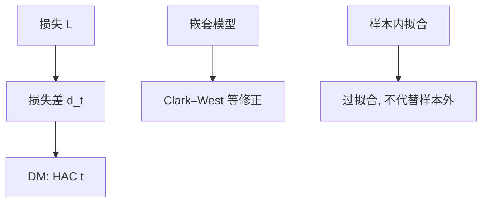

# 预测评估 Diebold–Mariano

两个预报哪个更准，不是看谁的 $R^2$ 更大，而是对损失差做检验；样本内拟合优不能代替样本外，嵌套模型还要把参数不确定性算进去。

<footer>—— Diebold and Mariano, Comparing Predictive Accuracy, JBES 1995；West, Asymptotic Inference about Predictive Ability, Econometrica 1996</footer>

[上一课](/econ/auction-structural-estimation)用结构反演做反事实。本课换目标：预报。结构单元里预测评估是另一类「对」——对损失，不对因果。极大似然下一课收束估计原则；本课钉 Diebold–Mariano（DM）与样本外。

## 问题

宏观、汇率、通胀：两个模型给出预报 $\hat y_{t|t-1}^{(1)}$、$\hat y_{t|t-1}^{(2)}$，损失 $L$（平方、绝对、不对称）。损失差 $d_t=L_t^{(1)}-L_t^{(2)}$。DM：对 $\bar d$ 做（HAC）$t$ 检验，$\mathbb{E}[d_t]=0$ 为等精度。缺口不是再讲汇率之谜的经济学，而是：样本内 $R^2$ 可以把过参数模型判赢；样本外才是预报。嵌套模型（小模型是大模型的特例）下 $d_t$ 的渐近退化，Clark–West 一类修正，不能直接套标准 DM。

Meese–Rogoff 把随机游走当汇率预报的基准，后课开放宏观会回到「脱节」。本课只要求：比较必须相对一个损失与一个基准，而不是「我们的结构 $R^2$ 高」。

## 方法

滚动或扩展窗口出样本外预报。DM 统计量用 $d_t$ 的长期方差（Newey–West）。损失与决策匹配：点预报用平方；区间用覆盖；密度用 log score。Giacomini–White 条件检验问的是「给定当前信息，哪个方法更好」，允许预报方法含估计误差，更贴实务。数据窥探：许多模型赛跑后最小的 DM $p$ 要多重检验修正——接[推断课](/econ/inference-robust-cluster)。

与因果：预报可以故意用「坏」的相关（如果相关稳定）。Lucas 仍然说规则一变相关可以垮；预报评估不宣称结构弹性。

## 机制

机制是损失差的均值是否为零。平方损失下这接近 MSE 比较。序列相关（重叠的多步预报）必须进 HAC，否则 $t$ 膨胀。嵌套时大模型在原假设下只多噪声，MSE 差的期望是 $O(1/P)$ 的负项（参数不确定性），朴素 DM 会偏向拒绝小模型——Clark–West 把这项加回来。

与结构估计：拍卖或 BLP 的样本内 GMM 目标小，不表示样本外份额预报赢。若目标是政策反事实，DM 不是主检验；若目标是央行短预报，DM 是主检验。两种「好」不要混。

West 1996 把估计参数的不确定性送进预测检验的渐近。窗口方案（滚动 / 扩展 / 固定）改变方差公式。报 DM 时要写窗口。

## 边界

本课不重做 Meese–Rogoff 的表。不把 DM 用于截面因果的安慰剂（那是另一套随机化推断）。下一课 MLE 与贝叶斯：估计原则，可以服务结构也可以服务预报，但本课的损失是决策，不是似然本身（除非 log score）。量化栏的高频预报不在此写限价簿。

后课默认：比较预报用样本外损失差 + 合适的 DM / Clark–West / Giacomini–White；样本内 $R^2$ 不够。嵌套与重叠多步要改方差。因果识别成功不等于预报赢，反过来也不等于。

## 小结

- DM 检验损失差均值为零；HAC 管重叠与相关。
- 样本外才是预报；样本内拟合会偏袒大模型。
- 嵌套模型用 Clark–West 一类，勿直接 DM。
- 损失要与决策匹配；规则改变仍可让精度垮。
- 出处：Diebold and Mariano, *JBES* 1995；West, *Econometrica* 1996；Clark and West；Giacomini and White。
