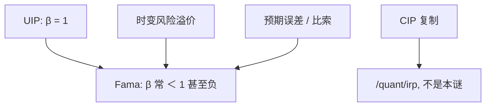

# 远期溢价之谜

高利率货币倾向升值而不是按 UIP 贬值；Fama 回归的斜率常为负。这是风险溢价、还是预期误差，要分开写，不要把 CIP 复制失败误读成这一句。

<footer>—— Fama, Forward and Spot Exchange Rates, JME 1984；对照 Engel 综述</footer>

[上一课](/econ/exchange-rate-disconnect)给出汇率与宏观脱节。本课把资产平价的偏差写细：远期溢价之谜。国际风险分担下一课换数量（消费）。主干[UIP 与 CIP](/econ/uip-and-cip) 已拆两句；本课只补 UIP 的回归斜率，实证细节与基差仍见 `/quant/irp`。

## 问题

UIP：$\mathbb{E}[\Delta e]=i-i^*$。Fama：把 $\Delta e$ 对远期溢价（或利差）回归，斜率 $\beta=1$ 为 UIP。估计常显著小于 1，甚至为负：高息货币随后升值，套息有平均利润。缺口不是再写 CIP 公式——CIP 是覆盖套利，谜是无抛补。分解：$\beta\neq 1$ 来自时变风险溢价（与利差相关）或预期系统性错误（学习、比索）。两者观测上纠缠。

比索问题：小概率大贬值未在样本实现，利率含这笔溢价，样本内高息货币「不贬」。这是小样本，不是偏好。

## 方法

宏观主干只保留：UIP 是期望假说，失败改变蒙代尔装置里 $i=i^*+\mathbb{E}\Delta e$ 的定量，不取消三角的逻辑。风险溢价：$m$ 与 $\Delta e$ 的条件协方差。套息作为策略的夏普在量化栏；本课不写交易规则、不写杠杆、不进簿。Habit、长期风险、稀有灾难可以把溢价做大，定量是否匹配 Fama 斜率仍争。

与脱节：预报失败与 UIP 失败相关但不是同一检验。游走赢宏观模型，不等于套息一定赢（还有波动与崩断）。

## 机制

机制是补偿或误预期。风险：投资高息货币的坏状态与随机折现因子同向，要求超额回报，利差高时溢价更高，可以把 $\beta$ 拉到负。误预期：投资者对均值回归过慢。政策：利率规则若对汇率反应，利差与未来 $\Delta e$ 的联合分布改，Lucas 批判适用。

危机后 CIP 破裂是中介约束，把抛补都打开；与经典 Fama 谜分层。不要用 2008 年后的基差「解释」1980 年代的负斜率。

Engel：难题是风险溢价必须既大又与利差强相关，标准模型的 $m$ 往往不够。这与股权溢价之谜同族，对象换成货币。

## 边界

本课不报套息的历史夏普。不把负斜率写成套利机会无风险——崩断与利差收窄会吃掉。下一课风险分担：完全市场下相对消费与 $q$ 应锁；那是数量谜，本课是价格谜。不要重写 CIP。不要用本课去给交易员写手册。

后课默认：Fama $\beta\neq 1$ 是 UIP 失败，候选是风险溢价与预期误差；CIP 是另一句。蒙代尔用 $i=i^*$ 是退化，定量上要加溢价。风险分担下一课。

## 小结

- Fama 回归检验 UIP；斜率常小于 1 甚至为负。
- 高息货币平均升值 = 套息利润，含崩断风险。
- 风险溢价与比索 / 学习纠缠。
- CIP 偏离不是本谜；见量化栏。
- 出处：Fama, *JME* 1984；Engel 综述；比索问题传统。
