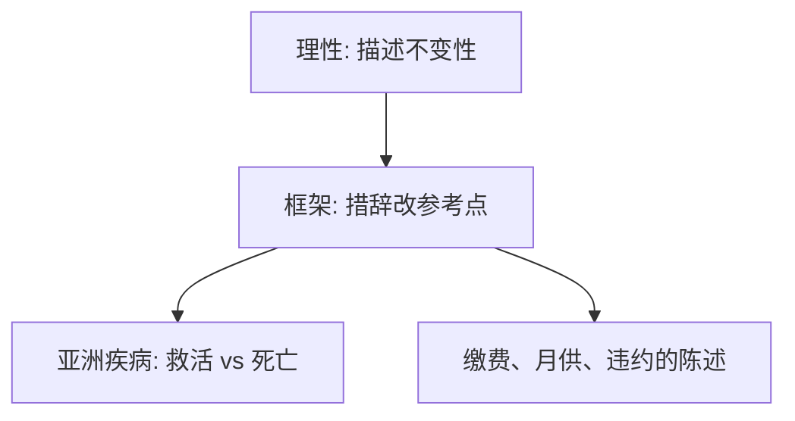

# 框架效应

同一统计，说成「救活 200 人」或「400 人死」，选择翻转——描述本身进入偏好。

<footer>—— Tversky and Kahneman, The Framing of Decisions and the Psychology of Choice, Science, 1981</footer>

[上一课](/econ/mental-accounting)把结果归入账户。本课缺口是陈述：客观菜单不变，措辞改变参考点与账户，选择翻转。不重写 $\lambda$。

## 问题

显示偏好假定菜单是客观集合。亚洲疾病问题：600 人受威胁，方案 A 确定救 200 人，方案 B 以 1/3 概率全救、2/3 概率无人获救；换成「死亡」框架后，确定方案变成厌恶对象。Tversky 与 Kahneman（1981）称之为框架效应。这不是新信息，概率相同。缺口是：前景理论的编辑阶段把描述编成不同的 $(x,p)$，评价随后分叉。

家庭金融：缴费写成「匹配」或「税前扣除」、贷款写成「月供」或「总额」，默认与框架叠在一起。本课只钉描述依赖性。

不变性（invariance）是理性选择的隐含公理：同一选项的不同描述应给出同一选择。框架效应是对不变性的拒绝，比拒绝独立性更早：连菜单的同一性都没保住。

## 方法

把一项政策写成收益框架与损失框架，保持概率与期望人数不变，比较选择。若翻转，则参考点被措辞移动：救活框架的参考点是「无人获救」，死亡框架的参考点是「无人死亡」。CPT 的四重模式预测：收益–确定被偏好，损失–确定被拒绝。

## 机制

机制是编辑。决策者并不先把句子翻译成唯一的客观彩票，再调用 $v$。句子里的「救」「死」「损失」「收益」直接当编码。因此偏好不是备选集上的关系，而是**被描述的备选集**上的关系。这比[偏好课](/econ/preference-choice)的完备传递更靠前：若描述变了，比较的根本不是同一个 $X$。

与助推的接口：选择架构包括默认，也包括框架。本课不把政策评价写成「应该用哪一种框架」，只标明预测会变。

不变性失败比独立性失败更底层：[偏好](/econ/preference-choice)的 $X$ 被假定为客观集合。若描述改变 $X$ 的编码，完备传递可以在每个编码上成立，跨编码却不可比。亚洲疾病的概率与人数相同，变的只是「救」与「死」谁当参考点——收益框架走凹段，损失框架走凸段，确定方案的地位翻转。缴费与月供的陈述是同一逻辑的家庭金融版。

## 边界

并非所有措辞效应都是框架：有的陈述其实改变了信息（强调不同风险）。识别要求概率与结果可验证地相同。专业交易、经验反馈会减弱部分效应，与禀赋效应的经验文献平行。本课不估计效应量。

后课默认：禀赋效应是框架的一种——把「放弃」编成损失、「得到」编成收益。

不变性比独立性更底层：描述改变编码，完备传递可以在每个编码上成立、跨编码却不可比。

亚洲疾病的概率相同，变的是谁当参考点；缴费与月供是家庭金融版。

## 小结

- 框架效应拒绝描述不变性：同一统计，措辞翻转选择。
- 编辑把句子编进不同参考点，再调用已有的 $v$。
- 不重推斯勒茨基；需求理论的菜单被假定为客观，这里客观性先失败。
- 助推同时使用框架与默认。
- 识别要求结果与概率可验证地相同。
- 出处：Tversky and Kahneman, *Science* 1981。
