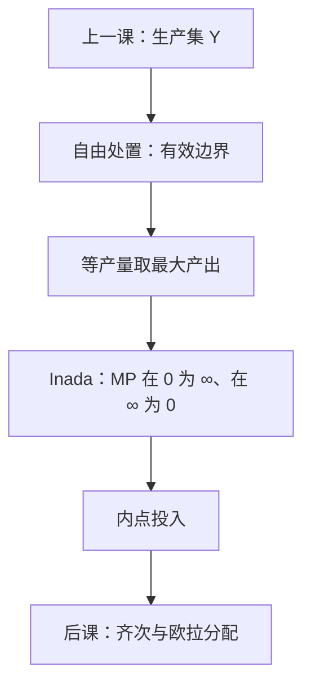

# 自由处置与 Inada

    
浪费仍可行，最优却不会去浪费；Inada 则保证最优不会把某种要素用到零——两刀一起，把分析钉在有效内点上。

    <footer>—— 据 Mas-Colell, Whinston and Green 第 5 章；Inada, On a Two-Sector Model of Economic Growth, Review of Economic Studies, 1963 整理</footer>

[上一课](/econ/production-technology)给出了生产集 $Y$、规模报酬与 TRS，并把免费处置列为常用限制之一。本课不重写锥与等产量，也不把替代弹性再定义一遍。缺口是：后课成本最小化要内点投入与可微一阶条件，必须把「免费处置」从清单上的一句话，升级成有效点的几何，并用 Inada 条件挡住角点。

## 问题

$Y$ 上可以有浪费：多用投入、少产，物质上仍做得到。若分析对象是整块 $Y$，最优问题的解可能躺在内部的无效点上，一阶条件对不上 TRS。缺口是把自由处置写成：若 $y\in Y$ 且 $y'\le y$（净产出更差），则 $y'\in Y$。于是有效边界 $\{y\in Y:\text{不存在 }y'>y,\,y'\in Y\}$ 成为唯一值得选的点——价格为正时，利润或成本不会挑浪费。

单产出 $q=f(z)$、$z\ge 0$ 时，自由处置体现为 $f$ 非降：多投入可以扔掉，产出不会被迫下降。仍不够挡住 $z_j=0$。Inada 条件在光滑凹的 $f$ 上要求

$$
\lim_{z_j\to 0^+}\frac{\partial f}{\partial z_j}=+\infty,\qquad \lim_{z_j\to+\infty}\frac{\partial f}{\partial z_j}=0,
$$

常再加 $f(0)=0$。边际产出在原点炸掉，要素价格有限时内点最优；在无穷远处熄灭，挡住无限投入。后课 $w_j=\lambda\,\mathrm{MP}_j$ 才有解。

### 自由处置不是免费午餐

处置的是已经可行的计划，不是凭空变出正净产出。$0\in Y$ 是歇业，与「把产出扔掉」不是同一句。IRS 仍然可以与自由处置共存；自由处置不蕴含凸。上一课的锥性质本课不重写。

没有自由处置时，污染、不可弃的副产品会成为联合产出的硬约束。那是外部性课。主干先假定多余的东西可以扔掉。

## 方法

把可行计划投影到有效边界：给定投入 $z$，产出取 $f(z)$ 而不是更小。成本最小化在等产量 $\{f(z)=q\}$ 上做，已经默认自由处置把「$f(z)>q$」的浪费排除出最优。Inada 再保证切点不落在坐标轴上：若 $z_j=0$ 而 $\mathrm{MP}_j=+\infty$，用一点点 $j$ 去替代别的要素，成本无限下降，角点站不住。

Cobb–Douglas 满足 Inada；线性技术、里昂惕夫不满足——后者角点或折拐是正常的，后课要用超微分，不能假装有内点 TRS。本课标明工作假设落在哪一边。

本课仍不引入 $w$、$p$。Inada 是 $f$ 的形状，不是要素市场。也不把 $Y$ 写成限价簿可成交量。

## 机制

自由处置让正价格下的浪费严格次优：扔掉产出少收钱，多用投入多付钱。于是包络、Shephard 后课可以对着边界写。Inada 的机制是边际：原点处一点点要素值无穷，有限的 $w_j$ 买得起「第一滴」；无穷远处边际贡献为零，有限的 $w_j$ 买不起无限堆。两刀合在一起，正则情形是 $z\gg 0$、$q=f(z)$、TRS 存在。

与规模报酬正交：CRS 的 Cobb–Douglas 可以 Inada；DRS 的 $f$ 也可以。Inada 不管锥，只管轴上的导数。

增长理论里 Inada 用来保证正的稳态资本。微观生产课借用同一形状，目的是内点要素需求，不是索洛图。不要把本课写成增长附录。

## 边界

整数机器、最小开工规模，Inada 失败，角点是本质。不可自由处置的有害产出，有效边界要改成「少排」也是一种产出坐标。后课若用内点一阶条件，默认已经站在本课这一边。

$f$ 在零处无定义或不可微，极限改成一侧超微分「足够陡」。本课不展开。也不处理状态依存生产：收成随天气只需给 $f$ 加下标 $s$，自由处置与 Inada 逐状态陈述即可。

后课默认：分析在有效边界上进行；需要内点投入时，$f$ 满足 Inada。

## 小结

- 自由处置把浪费标成可行但非有效；正价格下最优在边界。
- Inada 让边际产出在原点无穷、在无穷远处为零，从而内点。
- 两刀不蕴含凸或 CRS；角点技术（里昂惕夫）不走这条正则。
- 下一课在齐次技术上写欧拉分配。
- 出处：Mas-Colell, Whinston and Green 第 5 章；Inada, *Review of Economic Studies*, 1963。
