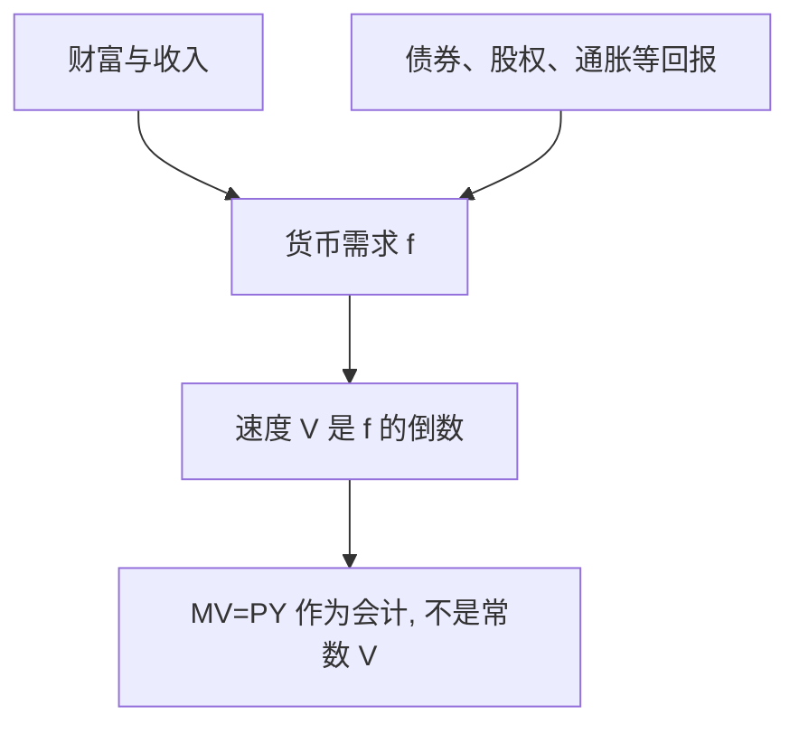

# Friedman 货币数量重述

数量理论首先是货币需求理论；流通速度不是常数，而是少数变量的稳定函数。

<footer>—— Friedman, The Quantity Theory of Money: A Restatement, in Studies in the Quantity Theory of Money, 1956</footer>

附录对照。主干[数量方程与货币中性](/econ/quantity-theory)已用 $MV=PY$ 当会计，并讨论长期中性。本篇对照 **1956 年原文**：把数量理论从机械的速度常数，重写成资产组合里的货币需求，以对抗当时把数量论当成过时身份的说法。不重讲[凯恩斯](/econ/keynes-general-theory)的有效需求章。

## 问题

费雪交易方程把 $V$ 写成制度常数，凯恩斯传统把货币需求写成利率极敏感、危机时可以无底（流动性陷阱）。Friedman 的缺口是第三条路：货币是众多资产之一，需求取决于财富、相对回报、以及把债券、股权、实物、人力资本换成货币的激励。若这组自变量稳定，则 $V$ 可预测，数量理论作为**经验的货币需求**复活，而不需要 $V$ 字面不变。

1956 文是芝加哥讨论班的纲领，不是一篇回归。经验工作在 Friedman 与 Schwartz 的货币史里另做。附录对照的是问题重述本身。

货币需求写成 $M=P\cdot f(y,w,r_b,r_e,\dot p/p,\ldots)$：实际余额对实际收入/财富与各资产回报。这与剑桥 $k$ 是亲戚，但 $k$ 不再是制度常数。1968 年 AER 演说把自然率接进来，是后一篇，不是 1956 的本文。

## 方法

把持有货币的机会成本展开：债券利率、股权预期回报、实物的预期升值（通胀）、人力资本与非人力财富之比。价格水平进入是因为需求是实际余额。稳定的 $f(\cdot)$ 意味着：名义货币的外生变动，长期主要打在 $P$ 上，短期可以打在 $y$ 上——这为后来的短期非中性、长期中性提供了需求侧语言，而不接受流动性陷阱作为常态。

与《通论》的对照焦点是投机动机。Keynes 让债券利率几乎单独决定货币需求的波动；Friedman 把利率只当作 $f$ 的一个自变量，并主张其弹性不足以让政策在流动性里消失。这是经验主张，1956 年并未完成检验。

## 机制

机制是资产替代，不是交易技术。货币提供非货币服务（便利、安全），其边际服务在存量上升时递减，于是有一条向下的实际余额需求。外生的 $M$ 增加，若 $f$ 暂时不动，只能 $P$ 或 $y$ 动；待相对回报与预期调完，$y$ 回到由实物因素决定的路径，$P$ 按比例动。主干数量课的中性，在这里是需求函数稳定时的长期推论，不是恒等式。

## 边界

不要把 1956 说成已经证明规则优于权变——那是 [Kydland–Prescott 1977](/econ/kydland-prescott)。也不要把恒定货币增长率规则安在这篇名下：规则是后来政策文的主张。经验上 1970–80 年代货币需求「失踪」，正是对「$f$ 稳定」的打击；附录对照问题设定，不在这里重做 M1 回归。

铸币税与通胀税是主干[铸币税](/econ/seigniorage)的缺口，1956 文只间接涉及机会成本里的 $\dot p$。下一篇附录把政策从需求函数换成时间一致：最优计划可以事后不想执行。

## 小结

- 附录对照 Friedman 1956：数量论是稳定的货币需求，不是恒定 $V$。
- 货币进入资产组合；长期中性是 $f$ 稳定时的推论。
- 对抗的是机械数量论与流动性陷阱常态，不是 IS–LM 的画法本身。
- 出处：Friedman, in *Studies in the Quantity Theory of Money*, 1956。
