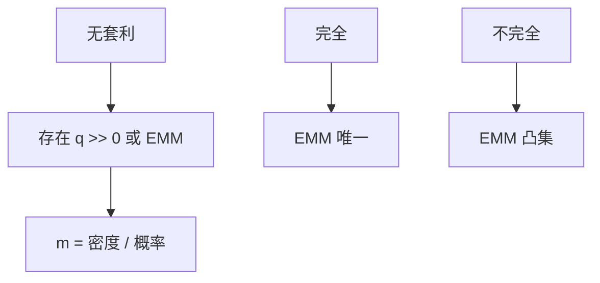

# 资产定价基本定理

无套利当且仅当存在严格正的状态价格（有限市场）；在更一般的空间里，当且仅当存在等价鞅测度。

<footer>—— 据 Harrison and Kreps, Martingales and Arbitrage in Multiperiod Securities Markets, JET 1979；Dalang, Morton and Willinger 1990；Delbaen and Schachermayer 1994</footer>

[上一课](/econ/law-of-one-price)拆开了 LOP 与 NA。本课缺口是把 NA 收成一条定理，并标明有限与无穷的差别。不重做 Stiemke 的线性代数，不估计任何 $m$。主干 [SDF](/econ/stochastic-discount-factor) 已经把结论当会计用；本课补的是「定理」本身。

## 问题

有限状态、一期：NA ⇔ 存在 $q\gg 0$ 使 $p=A^\top q$。这是 FTAP 的教室版。多期有限树：NA ⇔ 存在等价概率 $\mathbb{Q}\sim\mathbb{P}$，使折现价格是 $\mathbb{Q}$–鞅。连续交易、无界损失：无套利要升级成无免费午餐（NFLVR），FTAP 才恢复「⇔ 存在等价局部鞅测度」（Delbaen–Schachermayer）。缺口是承认：口头「无套利即有定价核」在有限世界是定理，在连续时间是一串越来越强的定义。

本栏用教室版做主干，连续时间课序再碰到局部鞅。不要把 1994 年的泛函分析写进每一课后文。

第一基本定理：NA（或 NFLVR）⇔ 存在等价鞅测度。第二基本定理：市场完全 ⇔ 该测度唯一。Kreps、Harrison–Pliska 把多期有限与布朗模型写清。

## 方法

有限情形：分离超平面把「套利锥」与价格向量分开，法向量即 $q$。归一化 $\sum q=1$ 得风险中性概率；除以 $\pi$ 得 $m$。多期：每个节点一个局部 $q$，串成密度过程 $Z_t=\mathrm{d}\mathbb{Q}/\mathrm{d}\mathbb{P}|_{\mathcal{F}_t}$，折现价格 $S/B$ 在 $\mathbb{Q}$ 下是鞅。完全：每个或有支付可复制，测度唯一，未定权益有唯一无套利价格。不完全：测度一个凸集，未定权益一个价格区间——后课定价界。

与 [状态价格](/econ/state-prices) 的关系：教室版 FTAP 就是「NA 给出 Arrow 价格为正」；状态价格课从完全市场的商品语言入手，本课从套利语言入手，同一 $q$。

不要把 FTAP 写成「市场有效」。有效是相对信息集无经济利润，必须联合一个 $m$；FTAP 只说若 NA 则 $m$ 存在。有 $m$ 仍可对某个信息集无效——那是联合假说的另一半。

## 机制

机制是对偶。套利是原空间里的方向；正定价核是对偶空间里的严格正泛函。有限维两者干净地互推。无穷维需要闭包：有的「近似套利」序列在极限才变成午餐，NFLVR 把这些序列也禁止掉，对偶才重新出现。经济含义不变：禁止免费午餐，才能给每一种可交易支付标一个线性价格。

信息课序的 NA 更脆：买卖两点、卖空限制，可行集不是线性空间，对偶变成不等式，价格变成区间。FTAP 的工作假设是摩擦先关掉——上一课接口已经预告。

Harrison–Kreps 1979 还允许「免费处置」等弱套利概念，并为投机给出鞅价格。后课 Harrison–Kreps 鞅定价专写动态与信念。

## 边界

本课不证明 Delbaen–Schachermayer。后文连续时间组合用到布朗与伊藤时，默认教室版的精神：无套利 ⇒ 有等价测度；完全 ⇒ 唯一。也不要把「存在 EMM」说成代表性主体存在——代表性主体是均衡加总，FTAP 只是无套利。Lucas 树会给出一个具体的 $m$，那是均衡，不是定理的全部解。

下一课把 EMM 单独钉：何谓等价、何谓鞅、折现用哪一个账户。

后课默认：有限市场 NA ⇔ 正状态价格 ⇔ 存在 SDF $m\gt 0$。完全则唯一。连续时间用 NFLVR 替换 NA。有效市场假说不是 FTAP。

## 小结

- 教室版 FTAP：无套利 ⇔ 存在 $q\gg 0$（或 $m\gt 0$）。
- 第二定理：完全 ⇔ 等价鞅测度唯一。
- 连续时间把 NA 升级为 NFLVR，精神仍是对偶。
- 出处：Harrison and Kreps, *JET* 1979；Dalang–Morton–Willinger；Delbaen and Schachermayer, 1994。
