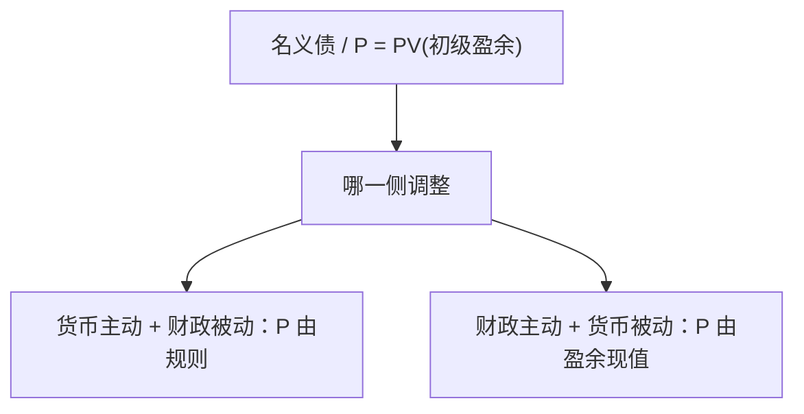

# 物价水平的财政理论

若名义债要有人自愿持有，其实际价值必须等于未来初级盈余的现值；盈余规则不调整时，调整的是物价水平。

<footer>—— Leeper, Equilibria under Active and Passive Monetary and Fiscal Policies, JME 1991；Cochrane 的 FTPL 表述</footer>

[上一课](/econ/tax-smoothing-barro)（Barro 税收平滑）。问的是 $G$ 或减税如何移动 $Y$，以及李嘉图下债券是否净财富。本课的缺口换成**价格水平**：跨期政府预算在什么制度下决定 $P$，而不是再估一个乘数。自动稳定器是下一课：盈余如何无需新立法就对周期作出反馈。

## 问题

政府的跨期约束把现有名义负债（含货币）的实际值接到初级盈余与铸币税的现值。货币主义操作把 $P$ 交给 $M$ 或利率规则，并要求财政「被动」——盈余随债务调整，使预算在任意 $P$ 下都成立。Leeper 的缺口是另一角：财政主动（盈余不随债务充分调整）、货币被动（利率不按泰勒原理对通胀反应）时，均衡 $P$ 必须跳到使实际负债等于盈余现值。Cochrane 把这句话写成物价水平的财政理论：不是「财政很大所以通胀」，而是估值方程。

乘数课已经声明哪条假设被打破 $Y$ 才动。本课即使 $Y$ 不动，$P$ 仍可以因估值方程而动。没有这一层，下限上的 QE 与「财政扩张」容易被并成一句印钞。自动稳定器下一课才把盈余对 $Y$ 的弹性写进税法；本课先分清主动与被动。

李嘉图等价比较的是税现在还是税以后，$C$ 可不动。FTPL 比较的是：若未来盈余的现值不够，今天的 $P$ 必须更高，才能让名义债被持有。乘数课的 $Y$ 与本课的 $P$ 不是同一导数。

## 方法

Leeper 用主动/被动的 $2\times 2$。泰勒原理成立且财政被动：标准 NK，价格由利率规则钉住，盈余内生保证偿债。财政主动且货币被动：利率规则不够激进，盈余过程外生或对债务反应不足，$P$ 成为使预算成立的跳变量。两个都主动往往没有稳定均衡；两个都被动则不确定。

数量方程仍可以在后台描述 $M$ 需求；FTPL 争的是：**哪一个名义锚先定 $P$**。Sargent–Wallace 的难堪算术是亲戚：若盈余不够，晚一点的铸币税必须补上，预期通胀提前跳。FTPL 把「补」写成 $P$ 的跳，而不必先经过 $M$ 的外生路径。

### 不是把债务当净财富请回来

Barro（1974）在一次总付、完全市场下让债与税抵消。FTPL 不依赖家庭把债当成净财富去多消费；它依赖名义债的计价单位。即使李嘉图在 $C$ 上成立，名义债的实际值仍要等于盈余现值——否则没人持有这笔债。乘数可以近零，$P$ 仍可以跳。

## 机制

宣布永久减税且未来盈余不补，市场若相信，则现有名义债的实际索取超过现值，均衡要求 $P$ 上升（或未来通胀上升）来稀释。利率若按泰勒原理猛升，会提高债务服务、可能反过来要求更大的盈余——于是「货币主动」与「财政主动」冲突。时间不一致：承诺将来增税以支撑今天的债，必须可信，否则只剩 $P$ 的跳。下限上 $i$ 卡住，货币被动更容易出现，财政名义锚的相对地位上升——这与乘数课「下限上 $G$ 更有效」是不同句子，可以同时真。

QE 若被读成「将来用铸币税或通胀稀释名义债」，通道已经是 FTPL，而不是期限溢价那一条。上一课把表与话分开；本课加一句：话也可以是财政的——「盈余路径不会为了护债而调整」。Woodford 的利率主义假定财政被动；把这条假设拿掉，三方程不再单独钉住 $P$。

铸币税是盈余的一项。恶性通胀可以是 FTPL 的极端：盈余现值崩了，$P$ 飙。那不是 Phillips 诱惑，上一课的时间不一致已经把两条高通胀分开过。

## 边界

本课不估计某个国家的盈余现值，不把 FTPL 写成「赤字必通胀」的口号——要看规则哪一侧主动。公司资本结构、MM 不是政府名义债：家庭很难自制主权的名义计价单位。量化栏没有财政估值。也不要把限价簿读进国债拍卖。

也不要把每一场高通胀都写成 Phillips 诱惑或铸币税拉弗区：财政主动可以单独给出 $P$ 的跳。Sargent–Wallace 是时间路径上的亲戚，不是另一套恒等。开放经济下外币债把稀释通道换成净值，那是原罪课，本课先封闭、本币债。自动稳定器提供对 $Y$ 的弹性，有助于被动，但立法仍可以同时规定债务不调——下一课把这两句拆开。

后课默认：谈 $P$ 的名义锚时，必须声明财政是被动还是主动。下一课：无需新立法的财政反馈，如何让盈余对周期（从而对债务）作出反应。

## 小结

- 名义债的实际值等于初级盈余（含铸币税）的现值。
- Leeper：货币主动+财政被动，或反过来，才能钉住系统。
- FTPL 定的是 $P$，乘数课定的是 $Y$，不要并成一句。
- 李嘉图下 $C$ 可不动，$P$ 仍可因估值方程而跳。
- 两个都主动往往无稳定均衡；两个都被动则不确定。
- 出处：Leeper, *JME* 1991；Cochrane 的 FTPL。
