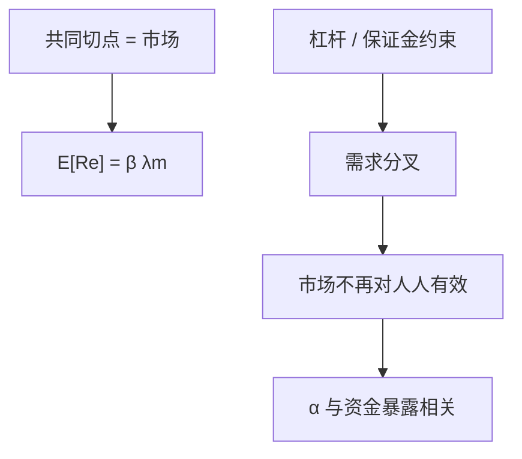

# 资金约束与 CAPM 偏离

切点加总要求人人能按同一利率自由持有市场；杠杆与保证金一绑紧，受约束者的有效风险厌恶改，beta 定价出现截距与斜率扭曲。

<footer>—— 据 Black, Capital Market Equilibrium with Restricted Borrowing, Journal of Business 1972；对照 Brunnermeier–Pedersen；Frazzini and Pedersen, Betting Against Beta, JFE 2014 的理论部分</footer>

[上一课](/econ/leverage-cycle)给出内生杠杆谁在约束上。[CAPM 作为均衡](/econ/capm-theory) 给出无约束时 $m$ 对 $R_m$ 线性。本课缺口是两者相减：资金约束如何让市场组合不再对所有人有效，截面上出现「低 beta 溢价过高、高 beta 溢价不足」一类**理论**偏离。不跑 Betting Against Beta 的组合表——实证在 [/quant/capm](/quant/capm)。

## 问题

Sharpe–Lintner：自由借贷，每人同一切点。Black（1972）已经关掉无风险借贷，切点换成零 beta，线性仍在。更紧的约束是：一部分人不能加杠杆（或保证金把有效借贷利率推高）。他们用高 beta 资产当杠杆替代，把高 beta 价格抬高、预期回报压低；受约束的中介若必须持有高 beta 库存，方向可以再变。Frazzini–Pedersen 的理论节：杠杆约束使证券的 alpha 与 beta 负相关——这是均衡陈述，不是排序组合。

缺口是：CAPM 的失败可以来自加总假设被资金约束破坏，而不必来自偏好不是均值方差，也不必来自无效。本栏只写这一许可，不宣布数据选择了它。

Black 1972 是借款限制。Gârleanu–Pedersen 把保证金差写成跨资产的资金溢价。本课用「约束破坏共同切点」一句话收束，不展开所有变体。

## 方法

无约束者仍沿有效前沿；约束者的需求扭曲。出清的市场组合是两类需求之和，因而不再对约束者有效，对无约束者也不必等于切点。$m$ 不再只是 $a-b R_m$，还含约束乘子对哪些资产占用资金的暴露。资金密集（高保证金、高 beta）的资产，乘子进入定价，期望超额偏离 $\beta\lambda_m$。

与中介定价：He–Krishnamurthy 改的是风险价格水平（所有风险一起变贵）；本课改的是**相对**定价（哪些资产更占资金）。BP 螺旋让约束时变，于是偏离时变。不要把这些写成三个因子模型——因子是量化栏的投影。

## 机制

机制是替代。不能借钱的人买高 beta，等于自制杠杆；高 beta 被买贵。能借钱的人若资本充足，会做反向（买低 beta、做空高 beta）把偏离压回去——但他们自己也可能受保证金约束，套利限制接住这条反向。Shleifer–Vishny 的套利限制在行为课序；这里的限制是资金，不必非理性。信息对称、信念同质，只要约束在，偏离就可以均衡存在。

Roll 批评仍在：真正市场不可观测。约束下「市场指数是否有效」更不是 CAPM 的终审。本课不审指数。

低 beta 的理论溢价高于 CAPM 线，是约束均衡的可能形状。是否出现在平均收益表上，换栏。本课禁止贴出 BAB 的 t 统计量。

## 边界

下一课离开「谁受约束」转到被追逐的对象：安全资产为什么能以低于 FTAP 无风险的收益率交易——便利收益。资金约束解释风险资产的相对价格；便利解释最安全、最可抵押的那一层为什么有负的携带。

后课默认：杠杆与保证金约束破坏共同切点，CAPM 的线性是无约束加总的结论。偏离的截面形状是理论许可，实证换 [/quant/capm](/quant/capm)。不重写限价簿。

## 小结

- 共同切点依赖自由借贷；资金约束让市场组合不再人人有效。
- 约束乘子进入 $m$，高资金占用资产的期望超额偏离 $\beta\lambda_m$。
- 这是均衡扭曲，不是本栏的横截面检验。
- 出处：Black, *Journal of Business* 1972；Brunnermeier–Pedersen；Frazzini and Pedersen, *JFE* 2014（理论节）。
