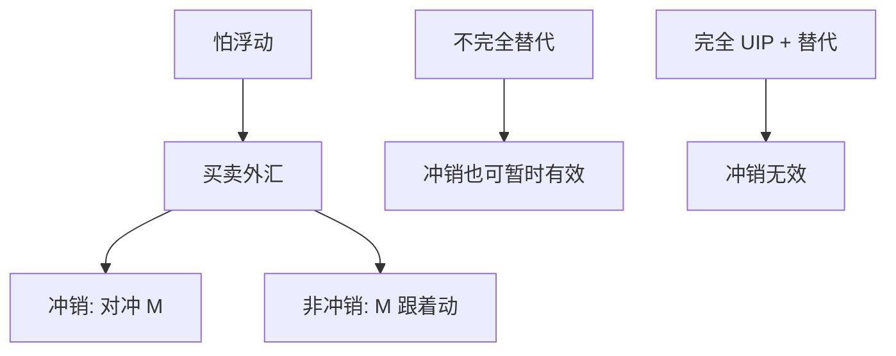

# 外汇干预与储备

怕浮动的央行用储备买下私人不愿持有的外汇暴露；冲销决定干预是改净外币供给还是只改央行资产负债表的币种。

<footer>—— Calvo and Reinhart, Fear of Floating, QJE 2002；Sarno and Taylor 官方干预综述</footer>

[上一课](/econ/global-imbalances)把上流写成储蓄与安全资产。本课缺口是官方层：外汇储备积累与外汇干预。汇率脱节下一课问私人价格为何仍不跟宏观走。本课钉怕浮动、冲销、储备需求，不重写[汇率制度](/econ/exchange-regimes)邮票。

## 问题

三角说：开放资本 + 独立货币 ⇒ $E$ 应浮动。Calvo–Reinhart：许多宣布浮动的国家，$E$ 波动远小于教科书，利率与储备大幅动——怕浮动。动机：原罪下贬值打净值、通胀传递、政治。手段：卖出外汇护汇率、买入外汇压升值并积累储备。缺口是：干预在冲销时如何仍能有效（资产组合、信号、微观结构），以及储备是自我保险还是重商主义。

冲销：买外汇的同时卖本币债，对冲基础货币。非冲销：货币随储备变，近于固定汇率的货币局逻辑。冲销成本是本币债利息对上外汇资产收益（往往倒挂）。

## 方法

储备需求：Guidotti–Greenspan 规则（短期外债）、Aizenman–Lee 自我保险 vs 重商。干预有效性：资产组合余额（本外币债不完全替代）给出短暂楔子；UIP 若因风险溢价而松，干预改净供给可改 $E$。完全替代 + UIP 时冲销干预无效（Backus–Gallant 一类）。实证混杂，本课不报点估计。报价层 CIP 偏离见 `/quant/irp`，本课不编基差。

与失衡：亚洲储备积累是全球失衡的官方腿。与突然停止：储备是对付停止的缓冲，也是「能干预」的库存。

## 机制

机制是官方替代私人做外汇做市。私人因原罪、监管、风险厌恶不愿持有本币暴露时，央行成为剩余买家。储备上升等于官方对外净资产上升，对应经常账户顺差或资本流入的官方吸收。重商解读：压 $q$ 促进出口；保险解读：预防停止。两者可并存，识别要用是否超过保险基准（Aizenman）。

货币当局的准财政：储备收益低于冲销债成本时，干预有预算成本，接到[铸币税](/econ/seigniorage)与财政。长期用干预维持被高估或低估的 $E$，等于与三角作战，储备或通胀终会说话。

协调干预（广场、卢浮宫）是多国资产组合同时动。单边小国干预在深度外汇市场上更弱。不要把新闻里的「进场」当成一定改变了均衡 $E$。

## 边界

本课不评估某次央行进场的基点。不写外汇交易商的限价簿。下一课脱节：宏观变量解释不了 $E$ 的波动，干预只是波动的一小块。资本管制后课是另一条怕浮动的腿（三角的第三角）。不要用储备存量当发展成功的充分统计。

后课默认：怕浮动使储备与利率承担本该由 $E$ 承担的调整；冲销干预在不完全替代下可有短暂效果；储备是保险与重商的混合物。全球失衡的官方腿在此。价格之谜下一课。

## 小结

- 怕浮动：宣布浮动仍用储备与利率钉住 $E$。
- 冲销改变币种供给；完全 UIP 下无效，不完全替代下可暂有效。
- 储备：自我保险与重商两条解读。
- 准财政成本来自利差倒挂。
- 出处：Calvo and Reinhart, *QJE* 2002；Sarno and Taylor；Aizenman and Lee。
