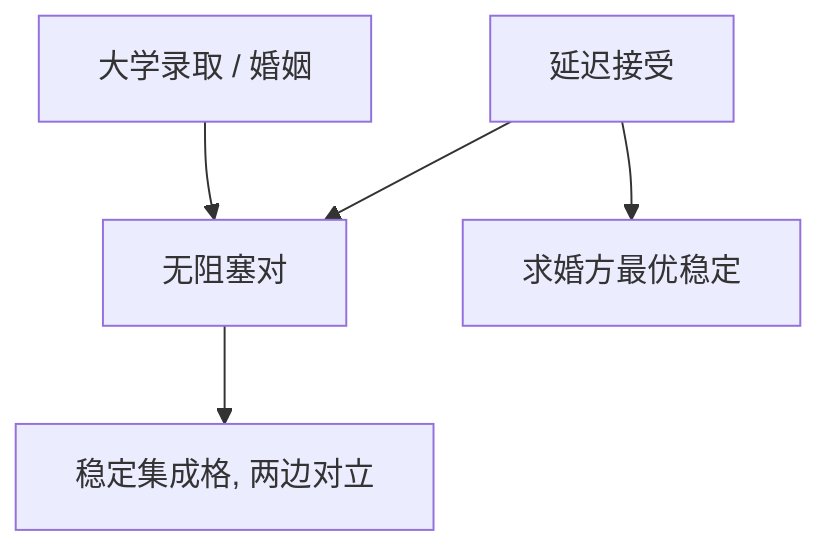

# Gale–Shapley 原文

    
稳定匹配存在，且可由延迟接受得到：一方按名单求婚，另一方暂持当前最好、拒绝其余，直到没有新的求婚。

    <footer>—— Gale and Shapley, College Admissions and the Stability of Marriage, American Mathematical Monthly 1962</footer>

附录对照，不插入主干。[上一课](/econ/myerson-1981-paper)对照的是卖方抽租的最优拍卖。本篇对照 **Gale–Shapley 1962 原文的问题设定**：双边都有偏好、没有一件拍品、也不必有货币时，什么样的配对不会被一对人私下拆掉。主干[Gale–Shapley 稳定匹配](/econ/gale-shapley)已取稳定与 DA；这里对照原文为什么把大学录取与婚姻写成同一篇文章，以及「稳定」相对「对某一方最优」的分界。

## 问题

大学按分数线或名额规则录取，学生按偏好填志愿：分散补录里，一对「互相更想对方」的学生–学校会破坏现行配对。婚姻故事是一对一的瘦版本。Gale 与 Shapley 要证明：在双边、严格偏好下，**稳定匹配非空**，并且有一个算法把它构造出来。缺口不是期望收入，也不是虚拟价值；是核在无转移效用下的构造。

原文还问：稳定匹配是否对某一方「最好」？答案是格的两端——求婚权选出一端。这与拍卖里「最高估值者得物」不是同一句话：匹配没有公共价格把两边的偏好加总成一个剩余。

原文发表在 *American Mathematical Monthly*，读者是数学教师，不是市场设计业界。住院医师匹配、学校选择的大规模实施是 Roth 以后的事，不是 1962 年的定理清单。

多对一录取里学校有名额，稳定仍可定义；算法把学校当接收方时得到学校最优稳定匹配。原文两个故事共用同一存在性，不是两套模型。

## 方法

两边有限集，每人一条对另一边的严格名单，允许宁可无人配对。阻塞对：互相宁可对方而不是当前匹配（或单身）。延迟接受：求婚方按名单从上到下求婚；接收方在到手的求婚里暂持最好、拒绝其余；被拒者继续向下。有限步终止，结果稳定。求婚方得到所有稳定匹配中对自己最好的那个；接收方得到最差的稳定匹配。

证明稳定用反证：若终止时还有阻塞对，求婚方早应向那人求过，且接收方只升不降，矛盾。存在性由此构造给出，不必先写不动点。

没有货币、没有报价。拍卖课里的价格被阻塞对代替：不能用加价把人买走，只能换对象。

## 机制

机制是试探性占有的单调过程。接收方手中的对象只换更好的，求婚方的名单只往下走。终止时每个被拒的对象都曾比当时的暂持更差，因此不会在终点变成阻塞。稳定匹配全体成格：一边变好，另一边变差。核在无转移下恰好是稳定集。

稳定在双方偏好下是帕累托有效的（没有全体都更满意的另一匹配），但两边利益对立，所以「有效」不够挑出哪一个稳定匹配。市场设计后来选哪一边求婚，就是在格上选端点。1962 年已经看见两端，没有把选端写成社会福利函数。

### 对照主干匹配课，不插入拍卖与匹配之间

主干[Gale–Shapley 稳定匹配](/econ/gale-shapley)已取 DA、求婚方最优与「稳定不是帕累托的全部」。本附录对照 *Amer. Math. Monthly* 69(1), 1962, 9–15：录取故事与婚姻故事并列、名额版、以及原文几乎不谈策略操纵——诚实申报是后课。把 1962 插进[赢家诅咒](/econ/winner-curse)之后当作连续主干，会让读者以为匹配是拍卖的附录定理。

Gale and Shapley, *American Mathematical Monthly* 69(1), 1962。不要发明 arXiv。室友问题（同一边配对）可以没有稳定匹配，原文用的是双边结构。

## 边界

原文没有解决偏好操纵、夫妻捆绑、院系配额。策略是否占优，主干下一课才问；1962 年只钉存在与算法。偏好若依赖别人和谁配对（外部性、同伴），稳定可以空。有转移效用时边付款可以撑住更多配置，那是赋值博弈，不在这篇 Monthly 里。

也不要把延迟接受写成讨价还价：没有折现、没有货币、只有名单。鲁宾斯坦轮流出价是另一条主干。

微观与均衡的论文对照链到此结束。读完回主干稳定匹配课；不要把四篇博弈–拍卖–匹配原文当成插入主干的连续单元。

算法路径在严格偏好、给定求婚边时唯一。无差异要加打破规则，原文假定严格。

住院医师匹配把医院当接收方或把医生当求婚方，选的是格的哪一端。Roth 的市场设计是实施史，不是 1962 年 Monthly 的定理清单。

## 小结

- 附录对照 Gale–Shapley 1962：稳定匹配存在，DA 给出求婚方最优。
- 大学录取与婚姻是同一稳定概念的两个故事。
- 无货币、无虚拟价值；策略操纵不在这篇。
- 出处：Gale and Shapley, *Amer. Math. Monthly* 1962。
