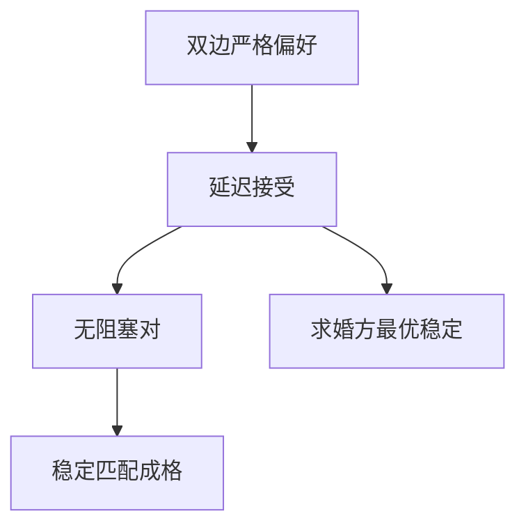

# Gale–Shapley 稳定匹配

稳定匹配存在，且可由延迟接受算法得到：一方按名单求婚，另一方暂持当前最好、拒绝其余，直到没有新的求婚。

<footer>—— Gale and Shapley, College Admissions and the Stability of Marriage, American Mathematical Monthly, 1962</footer>

[上一课](/econ/agv-mechanism)（AGV 期望外部性）。在共同价值拍卖里把「谁得到物品」写成叫价与信息。缺口是双边都有偏好、没有一件拍品、也不必有货币：住院医师与医院、学生与学校、婚姻市场。此时要问的不是期望收入，而是配对能否被一对人拆掉。本课钉稳定与延迟接受，不把策略操纵写成下一课，也不把早期签约写成柠檬逐级退出。

## 问题

两边有限集 $M,W$，每人有对另一边的严格偏好，允许宁可无人配对。匹配 $\mu$ 把一边映到另一边（或单身）。阻塞对：$(m,w)$ 互相宁可对方而不是 $\mu$ 给的对象（或单身）。稳定：没有阻塞对，也没有人宁可单身。不稳定的匹配在分散市场上站不住——那一对会私下跑掉。

Gale–Shapley 证明稳定匹配非空。算法（延迟接受，DA）：求婚方按偏好名单从上到下求婚；接收方在到手的求婚里暂持当前最好，拒绝其余；被拒者继续向下。有限步终止，结果稳定。求婚方得到所有稳定匹配中对自己最好的那个（求婚方最优稳定匹配）；接收方得到对自己最差的稳定匹配。

### 稳定不是帕累托的全部

稳定匹配在双方偏好下是帕累托有效的（没有全体都更满意的另一匹配），但两边的利益对立：求婚方最优稳定匹配对接收方是最差稳定匹配。存在性不给出「哪一边该求婚」。

原文用婚姻与大学录取两个故事。多对一录取里，学校有名额，稳定仍可定义；算法把学校当成接收方时，得到学校最优稳定匹配。Roth 后来把住院医师匹配写成同一算法。

偏好严格时算法路径唯一（给定哪一边求婚）。
无差异要加打破规则，稳定集可以变大，本课不写。
没有货币：不能用价格把阻塞对买走；稳定是无转移效用下的核。

## 方法

对象：有限双边、严格偏好、一对一（或多对一的名额版）。解概念：稳定匹配。构造：DA。证明稳定：若终止时还有阻塞对，则求婚方早应向那人求过、且被更差地拒绝，与接收方「只升不降」矛盾。非空由此构造给出，不必先写不动点。

## 机制

延迟接受把「试探性占有」写成单调过程：接收方手中的对象只换更好的，求婚方的名单只往下走。终止时，每个被拒的对象都曾比当时的暂持更差，因此不会在终点变成阻塞。稳定匹配全体在双边偏好下构成格：两边的利益相反地排序。核在无转移效用下恰好是稳定匹配集；有转移时核可以靠边付款撑住更多配置，那是赋值博弈，本课不写。

与拍卖的对照：IPV 二价用价格让最高估值拿走物品；匹配里没有公共价格，阻塞对代替了「另有买家愿出更高价」。共同价值诅咒在这里变成「我对你的评价取决于别人没选你吗」——那是匹配中的外部性，标准 GS 模型假定偏好不依赖别人的匹配，本课维持这个假设。延迟接受不是讨价还价：没有转移、没有折现，只有名单上的试探性占有。终止时的匹配落在核里，因为任何阻塞对都已在算法路径上被拒绝过。

求婚权选的是格的一端，不是把核做大。
无转移时稳定就是核；有货币则边付款可以撑住别的配置，那是赋值博弈，本课不写。

## 边界

偏好若依赖谁和谁配对（外部性、同伴），稳定可以空。同一边内部也有偏好（室友问题）时，稳定可以空——GS 的双边结构是关键。名额、夫妻捆绑、院系配额会破坏存在性或稳定性，那是 Roth 以后的市场设计，本课只钉经典双边。

后课默认：稳定匹配存在，DA 给出求婚方最优；下一课问报偏好是不是占优策略。

### 算法是核的构造，不是讨价还价

鲁宾斯坦轮流出价有折现与货币；DA 没有转移、没有时间折现，只有名单。把 DA 读成「谁先开口谁占便宜」在本模型里是对的：求婚权等于选出格的一端。市场设计里选哪一边求婚，就是选哪一端稳定匹配。

室友问题（同一边配对）可以没有稳定匹配。GS 用的是双边、无外部性地偏好，存在性不是随便一个匹配市场都有的。

## 小结

- 稳定 = 无阻塞对；分散市场要求稳定，否则一对人会跑掉。
- DA 终止于稳定匹配，且对求婚方是所有稳定里最好的。
- 稳定集成格，两边利益对立。
- 无货币、无共同价值叫价；策略能否诚实留给下一课。
- 出处：Gale and Shapley, *Amer. Math. Monthly* 1962。
