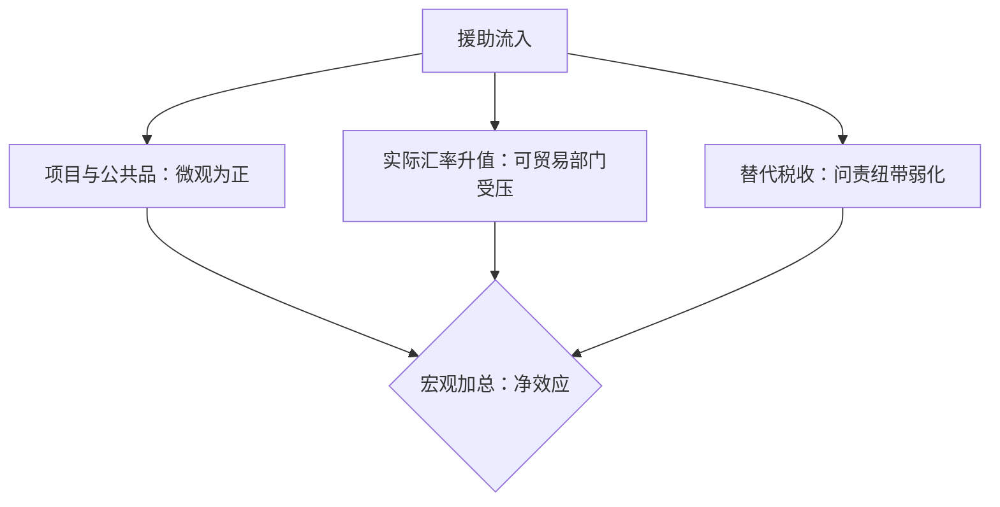

# 援助与制度

如果贫穷是资本缺口，援助就该加速收敛；如果贫穷是激励结构的缺口，援助买不来它想买的东西。

<footer>—— 据 Easterly, "Can Foreign Aid Buy Growth?", JEP 2003；Rajan and Subramanian, REStud 2008 整理</footer>

[上一课](/econ/gd-development-micro)把发展的微观证据钉在回报、外部性与三道门上——那是家庭与村庄尺度的干预。往上一级是国家尺度的干预：援助，它试图直接补上资本缺口。本课问两个问题：援助买得到增长吗；若收入由制度决定——主干课的 [制度与殖民起源](/econ/institutions-acemoglu) 已给出殖民起源的主通道——援助能否改变制度本身。

## 问题

索洛口径下低收入国资本稀缺、边际产出高，资本应当流入，援助应当加速收敛（[收敛与发展核算](/econ/convergence-accounting)）；[Lucas 悖论](/econ/lucas-paradox)问的正是资本为什么没有大规模流向穷国。现实更难堪：半个世纪的巨额援助流入与长期停滞并存，跨国收入差距还在扩大。缺口是把链条拆开：援助到增长的每一环——资金到位、项目落地、宏观加总——哪一环断了；以及微观项目有效与宏观净效应为零，能否同时为真。

## 方法

跨国证据走了一条迭代路线。Burnside 与 Dollar 2000 用「援助 × 政策」交互项找到条件有效：政策环境好的受援国，援助与增长正相关，这成为援助条件性的实证根基。Rajan 与 Subramanian 2008 换掉这套规格：不依赖交互项、系统检查样本与滞后选择、用不与政策联动的变量做工具，发现援助对增长的稳健正效应不存在——此前的条件有效经不起规格扫描。教训落在设计判别式上：交互项、样本窗口与工具选择的自由度足以制造结论，跨国的援助弹性本来就小到难以辨认。渠道分析补上机制：援助资金流入会推高实际汇率，可贸易部门被挤压，微观资金的直接收益被相对价格效应吃掉一部分；援助替代国内税收，则削弱政府与纳税人的问责纽带。识别工具自身的风险见 [工具变量与弱工具](/econ/iv-weak-instruments)。

## 机制

「缺什么补什么」在制度维度失效，因为制度不是可以购买的设备。AJR 2002 的财富反转补齐了论证：1500 年前后相对富裕的殖民地在今天反而更穷——若地理或人力资本直接决定收入，反转难以解释；若持久的制度变量在殖民时被锚定，反转恰是它的预测。制度是均衡的分布：援助作为外生收入改变统治者与被统治者的谈判结构，与资源诅咒同构，所以在增长维度上「买制度」近乎自我拆台。这也回答了上一课留下的问题：发疫苗、发驱虫药的项目成功与援助宏观无效同时为真——前者的产出不经过激励结构，后者的目标恰恰全部落在激励结构上。层次不同，并不矛盾。

条件性（conditionality）的实证处境比叙事弱得多：政策的可观察性、再谈判与「援助者无法可信地撤出」让条件常落空——Burnside–Dollar 的交互项后来在更大样本中不稳定，是条件性叙事的实证转折。

## 边界

「援助宏观无效」不推出「切断援助」：人道救援与公共卫生的微观收益真实存在，本课的结论只针对「援助买增长」这条通道。效应异质与时间尺度未合拢：小国、冲突后国家、长滞后下的效应可能不同，跨国平均把它们抹平。制度内生性的识别争议——殖民者死亡率的排除限制——主干课已经写下，本课不加码也不重审。最后，增长核算的残差仍把制度、[错配](/econ/misallocation-tfp)与结构缺口混在一起，援助效应若要被辨认，先要回答「对什么残差」。

## 小结

- 条件有效的交互项证据经不起规格扫描；Rajan–Subramanian 之后，援助对增长的稳健效应不被承认。
- 渠道拆解：微观项目为正、汇率渠道与问责渠道为负，净效应取决于三者的权重。
- 财富反转是制度解释的关键证据：地理直接解释吃力，持久制度变量上位。
- 制度是均衡分布不是设备；援助买制度与削弱问责同构。
- 微观项目成功与宏观无效同时为真：产出是否经过激励结构是分界。
- 出处：Burnside and Dollar, *AER* 2000；Rajan and Subramanian, *REStud* 2008；Acemoglu, Johnson and Robinson, *QJE* 2002；Easterly, *JEP* 2003。
