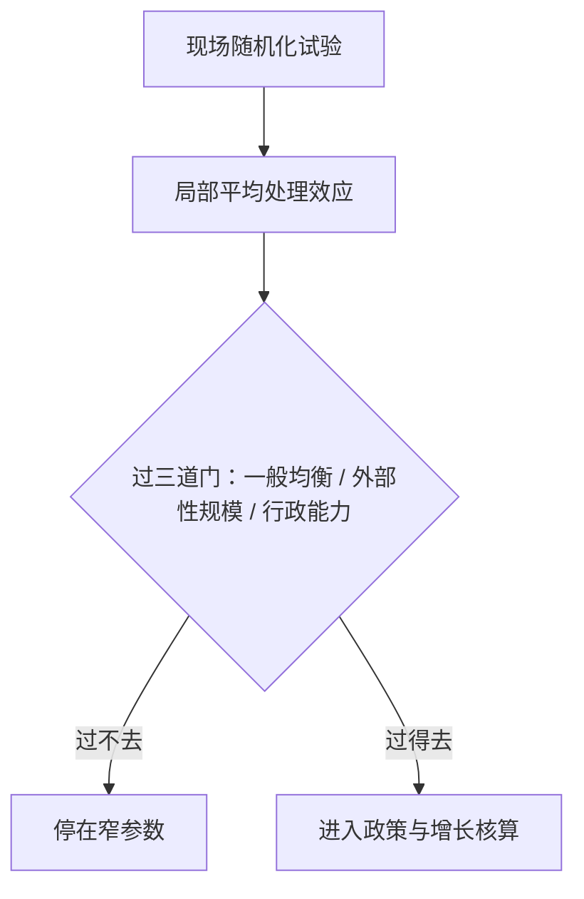
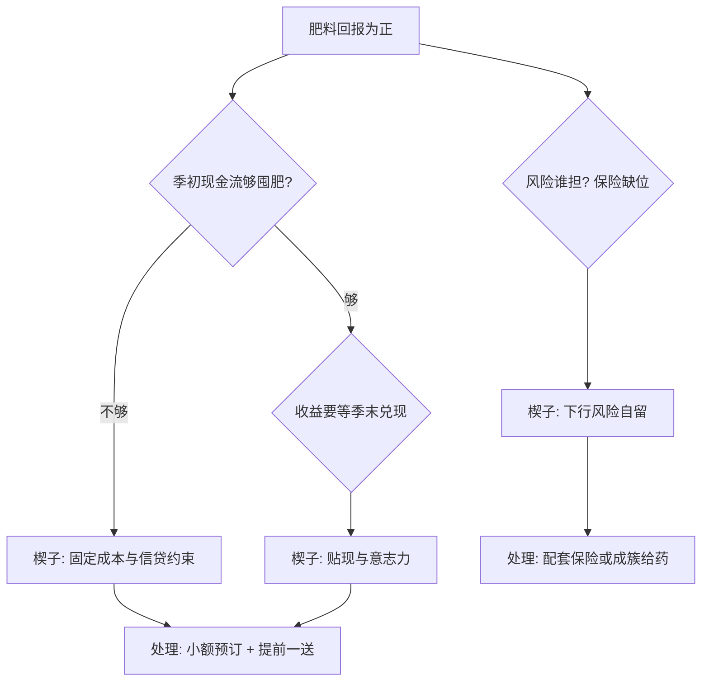

# 发展的微观证据

增长理论写下按钮，现场证据告诉你按钮上落着多少只手；许多看起来显然的按钮，按下去什么都没发生。

<footer>—— 据 Banerjee and Duflo, "Growth Theory through the Lens of Development Economics", 2005；Poor Economics, 2011 整理</footer>

[上一课](/econ/gd-structural-transformation)把份额迁移的引擎接进增长模型，总量路径有了部门结构。但「结构转型为什么慢」往下挖，会撞上微观：农户为什么不买每公顷回报为正的肥料，家庭为什么不为几块钱的健康防护掏钱。本课进入实证单元，读发展现场的第一手因果证据；试验方法本身已在 [RCT 的设计与分析](/econ/pe-rct-design-analysis) 讲清，本课谈发展域的实质发现，以及微观证据与增长核算怎么接。

## 问题

宏观与微观之间横着一道落差。发展核算把低收入国的落后拆给资本、人力与残差，大按钮在跨国账上常常不灵；而现场试验里微观回报高得惊人——肯尼亚肥料试验测得的边际回报可以到百分之几十。「边际回报百分之几十」代入数字：花 100 元买肥料，一季多收 40 元的粮食，年化收益率远超任何银行存款。但前提是季初拿得出这 100 元，而且旱灾不会让收成归零——高回报自带这两个附加条款。缺口因此有两面：回报为什么不被穷人抓取（行为、贴现、固定成本，还是外部性）；以及证据如何在现场被可信地拿到——把这些高回报当真并外推成增速，错在哪一步。

## 方法

两枚锚点各钉一个设计要点。Miguel 与 Kremer 2004 的驱虫试验：蠕虫靠接触传染，服药的收益溢出到未服药的邻居，个人层面的效应估不出来，随机化必须按学校成簇、把溢出写进对照的定义——对照组并不干净，估计的是项目总效应。「按学校成簇随机化」翻译成大白话：不是一枚硬币分一个孩子，而是整所学校整所地抽签。因为蠕虫靠接触传染，没吃药的孩子也被邻居的药保护着——只有整簇抽签比较，才能把这种「顺便的好处」算进总效应。Duflo、Kremer 与 Robinson 2011 的肥料试验：回报高，但收益分散在整个生长季，季初一次性囤肥意味着与现金流和意志力对赌；把「种植时点的小额预订」提前一送，比农民学校便宜且抬升采用率。两条要点的分工：外部性决定随机化的层级，贴现与固定成本决定处理的形式——发展现场的设计不是把教科书方案搬下去，而是先测摩擦，再定处理。

## 机制

微观回报与宏观增速之间是范畴差距，不是比例差距：试验测的是局部平均处理效应，把它乘上人口外推成 GDP 增速，要经过一般均衡、外部性规模与行政能力三道门（外推的判据见 [外部有效性](/econ/pe-external-validity)，多项证据的合成见 [Meta 分析](/econ/pe-meta-analysis)）。Banerjee 与 Duflo 把落差定位成「给定资源用好没有」：穷国缺的常常不是前沿技术，而是把既有技术与资源接通的安排——保险缺位让农民不买肥料，信贷配给让小生意停在无效率规模，这是 [错配](/econ/misallocation-tfp) 的楔子在家庭层面的对应物；微观试验的作用是把楔子的位置与尺寸一个个量出来。证据于是按 [案例收束](/econ/pe-case-map) 的口径组合：单个试验回答窄问题，窄参数进入结构模型或政策设计，才够得到增长。

初学者容易把「不买高回报肥料」读成穷人不理性。把时间轴拉长看：收益在季末才到，旱灾可能让它归零，季初的 100 元可能要挪去买口粮——先解决现金流与保险，「理性」才有用武之地。试验的价值正是分清楔子是钱的事还是心的事。

驱虫试验的后续争论是范例：单试验的效度、再分析与多年随访、成本收益的重算各有结论——「驱动全部基础教育」与「低成本健康干预」是两个命题，读文献要把它们分开。

## 边界

随机化试验的问题窄，结构转型的变量慢：没有一个驱虫级的干预能顶替农业到工业的迁移，微观证据能给政策的方向与参数，给不了增速的答案。试验地与推广地在市场密度、行政能力上的差距把外部效度压窄；对照村的溢出把效应压低的方向也真实存在。伦理与分层是硬约束：谁先进对照组，不是统计问题。最后，把「微观回报高」读成「穷人不理性」同样错——肥料回报在雨天与干旱年不同，保险与现金流约束解释了大部分「不抓取」，行为只是余项。

## 小结

- 发展微观证据的两大设计要点：外部性决定随机化层级，贴现与固定成本决定处理形式。
- 驱虫与肥料试验分别钉住溢出与季初摩擦；摩擦先测，处理后定。
- 微观到宏观要过一般均衡、外部性、行政能力三道门，外推不是乘法。
- 家庭楔子是错配的微观对应物，试验的价值在量出楔子的位置与尺寸。
- 微观证据给参数与方向，不替代增长核算与结构转型。
- 出处：Miguel and Kremer, *Econometrica* 2004；Duflo, Kremer and Robinson, *AER* 2011；Banerjee and Duflo 2005/2011。
