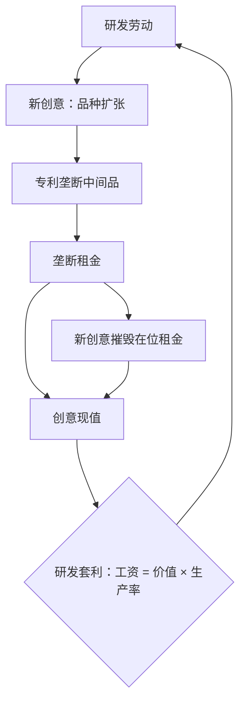

# 内生技术的增长模型

技术不是天上掉下来的残差，而是有人花真金白银买来的产出；创意之所以能定价，是因为它附带一份垄断权。

<footer>—— 据 Romer, "Endogenous Technological Change", JPE 1990 整理</footer>

[上一课](/econ/ur-map)把城市与区域收束：Rosen–Roback 三价拉平效用、价差就是宜居性的价格，聚集增益被住房约束截断即是空间错配。空间差距之外，是增长理论的老问题——人均收入几十倍的差距从哪来，为什么不闭合。本课程进入增长与发展的深钻层，第一课把技术的来源内生化。主干课的[内生增长](/econ/endogenous-growth)给出了「知识非竞争时增长可内生」的直觉，[AK、种类与熊彼特](/econ/ak-variety-schumpeter)把机制分成三分；本课不再分类，而是把其中两支完整解出，把「均衡增长率」变成一个能写公式、能被数据打脸的对象。后课默认读完本课。

## 问题

[索洛模型](/econ/solow-growth)把长期增长率 $g$ 留在外生参数里：政策只能动水平线，动不了斜率。要回答「补贴研发能否永久加速增长」，必须把 $A$ 的生产写成家庭与企业的最优化结果。难点在市场结构：创意若按完全竞争定价，复制的边际成本近乎零，发明者拿不到回报，没有研发；若禁止一切复制，又丢掉创意最要紧的非竞争性。缺口因此不是再加一层直觉，而是回答「创意的报酬从哪来」——Romer 的答案是让带专利的创意进垄断部门。

## 方法

模型分三层：最终品完全竞争；每种中间品由持专利的垄断者独家生产，垄断租金是创意的报酬；研发部门完全竞争，一份新创意的价格等于它未来租金的现值。创意生产写 $\dot{A}=\delta L_A A$：投入是研究劳动，存量 $A$ 全额溢出，这是「站在肩膀上」的第一代设定。均衡由一个套利条件钉住：一个工人进工厂挣工资、还是进研发挣创意销售份额，二者无差异，$w=v\,\delta A$，而创意价值 $v$ 是利润流按 $r-g_A$ 贴现的现值。垄断定价把价格钉在边际成本之上：$p=mc/\alpha\gt mc$，毛利率给出每期利润 $\pi$。解出的平衡增长路径上 $g_A=g_C=g_Y$，且 $g$ 随研发劳动占比上升：增长被压进了激励结构里。

## 机制

垄断是特性而非缺陷。定价高于边际成本造成品种偏少的扭曲，但扭曲出来的租金正是研发的燃料；没有租金，套利条件右侧为零，$L_A$ 为零，增长也归零。均衡与最优之间隔着两个方向相反的外部性：站在肩膀上让私人研发低估 $A$ 的溢出，投入偏少；Aghion-Howitt 的创造性破坏给出反方向的机制——创新者的私人收益里没有算「我的新产品毁掉的是在位者的租金」，激励可以过高。主干课「熊彼特下私人研发不必然不足」的断言，生成机制就在这里：均衡增长率由肩膀效应与商业窃取效应的净额决定。政策含义随之改变：研发补贴改的是套利条件右侧，效果是永久动 $g$ 而不是抬一段水平——这是与[索洛](/econ/solow-growth)口径的根本区别，也是值得完整解一遍的原因。

Romer 1990 的中间品定价 $p=mc/\alpha$：$\alpha$ 越小加成越大，扭曲与研发激励是同一个参数的两面。判断补贴规模要解套利条件，不是看预算占比。

## 边界

第一代设定 $\phi=1$ 隐含规模效应：$g$ 与研究人数成比例。美国半个世纪的研发投入涨了数倍而生产率增速平稳，这个预言下一课处理，本课只把靶子立起来。模型里制度没有位置：被征收的风险只能压低 $\delta$ 或抬高贴现率，[制度](/econ/institutions-acemoglu)与[错配](/econ/misallocation-tfp)留给后面的课。也不要把「增长率由激励决定」读成跨国差距的解释：[Lucas 悖论](/econ/lucas-paradox)指向的水平差距主要是资本深化与错配的账，不是各国 $g$ 的差异——增长模型解释趋势线的斜率，不直接解释几十倍的水平比。

## 小结

- 创意的报酬由专利垄断的租金给出；三层市场结构把 $A$ 的生产写进最优化。
- 均衡增长率由研发套利条件钉住，研发补贴动的是长期 $g$，不是水平。
- 肩膀效应压低私人研发，商业窃取抬高它；净额决定补贴方向，研发不足不是定理。
- 垄断加成既是扭曲也是激励，评价政策要落在套利条件上。
- 第一代模型的规模效应与制度的缺席是留给后课的两个缺口。
- 出处：Romer, "Endogenous Technological Change", *JPE* 1990；Aghion and Howitt, "A Model of Growth through Creative Destruction", *Econometrica* 1992。
