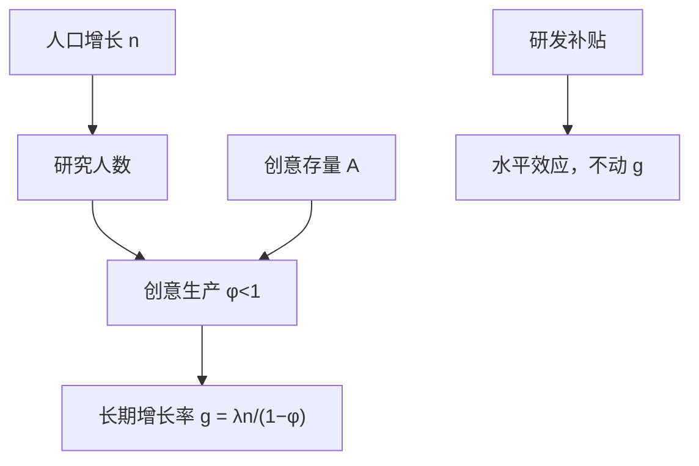
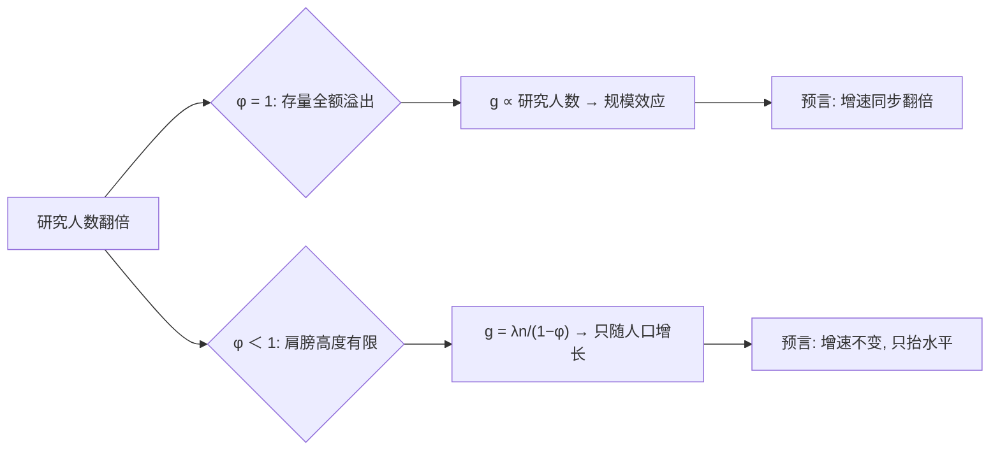

# 创意与规模效应

创意一次发现、处处使用——非竞争性把「多少人在想」变成增长的输入；但输入翻倍，不等于产出翻倍。

<footer>—— 据 Romer, JPE 1990；Jones, "R&amp;D-Based Models of Economic Growth", JPE 1995 整理</footer>

[上一课](/econ/gd-endogenous-growth-deep)把品种扩张与创造性破坏解出均衡增长率：$g$ 是研发劳动占比的增函数。这句话隐含规模效应——把更多人投入研究，就永久加速增长。缺口在数据：这个预言经不起时间序列。本课把创意的非竞争性本身当作对象，看它如何既生成规模效应、又如何在证据面前要求改写模型。

## 问题

美国从事研发的科学家与工程师人数，从二十世纪中叶到世纪末涨了数倍，联邦研发支出占 GDP 的份额也在六十年代见顶前翻倍；而[索洛残差](/econ/solow-residual)的增速没有相应翻倍，反而走平。『$g\propto L_A$』代入数字：研究人数涨 4 倍，第一代模型预言增速也涨 4 倍——从年均 1% 变 4%，人均收入不到二十年翻一番。现实里增速几乎没动，这就是数据把模型打脸的分量。若 $g\propto L_A$，研究人数涨几倍，增长就该涨几倍——没有发生。缺口不在「研发重不重要」，在创意生产函数的形状：产出对存量 $A$ 的弹性、对研究人数的弹性，哪一个被第一代模型写到了 1。

## 方法

把上一课的 $\dot{A}=\delta L_A A$ 改成 $\dot{A}=\delta L_A^\lambda A^\phi$，关键在 $\phi\lt1$：存量只部分溢出，站在肩膀上的高度有限，「找下一个创意」随存量变难。$\phi$ 可以想象成「站上巨人肩膀后还能看到多远」：$\phi=1$ 是全额继承前辈的高度；$\phi=0.5$ 是每代只继承一半，剩下的要自己爬。$\phi$ 越小，旧创意对新创意的推力衰减越快，人海战术的回报越差。平衡增长路径上解出 $g=\lambda n/(1-\phi)$：长期增长率由人口增长 $n$ 驱动，研发补贴与人口规模只抬水平、不动斜率——这叫半内生增长。质量阶梯版本由 Young 1998 给出同族修正：新产品挤压旧产品，固定研究力量被摊薄在更多品种上，总加成不随人数线性放大。产业证据由 Bloom、Jones、Van Reenen 与 Webb 2020 汇齐：芯片、农业、医药三个域，维持同样的生产率增速，所需研究投入大约每十几年翻一倍——创意没有变容易找。Weitzman 1998 的组合视角把机制说穿：创意是旧创意的重组，搜索空间指数扩张与好组合越来越难找是同一件事的两面。

## 机制

规模效应的根源是非竞争性：创意不因使用而折旧，全世界的存量对每个研究者都是公共输入，人口越多存量越大——这正是 $\phi=1$ 写下的世界。$\phi\lt1$ 把存量推动力衰减到只剩 $n$：不是「人越多创意越多」失效，而是每份新增创意的平均难度同步上升。

Weitzman 的组合直觉像做菜：创意是把旧食材（已有知识）重新搭配。食材种类翻倍，可能的搭配按平方级膨胀——搜索空间指数扩张，但好菜占比同步被稀释，找下一道好菜未必更容易。指数的机会与指数的难度是同一枚硬币。政策对照随之改变：拿第一代模型去论证「补贴研发等于永久加速增长」，会被时间序列打脸；在半内生口径里补贴是水平效应，评价标准要换成折现的水平收益。能动斜率的按钮在别处：提高 $n$ 之外的通道是让更多人接受前沿训练（[人力资本](/econ/human-capital-becker)）与让市场更大、方向更偏（[贸易与增长](/econ/trade-growth)、[有向技术变化](/econ/directed-technical-change)）——它们通过 $\lambda$ 与市场规模改写激励，而不是套用「人数乘数」。

Bloom 等 2020 的读数不是「创新停滞」：摩尔定律仍在兑现，只是兑现同样增量所需的研究人数每十几年翻一倍。「变难」与「变慢」是两个命题。

## 边界

半内生模型把长期 $g$ 钉在外生 $n$ 上，也有反例：若干前沿经济体生育率长期下行，生产率增速未见同比例塌陷，说明 $n$ 的传导并非机械。跨国比较不适用本课：追赶国的增长由技术扩散与赶超主导，不在前沿找创意，规模效应的公式套不上。初学者容易把「补贴研发不动长期增速」套到所有国家。这条结论只适用于在技术前沿找创意的经济体；追赶国靠引进与扩散，人均增速可以长期高于前沿——把美国的公式套到后发国家，会把「追赶」误读成「创新」。Bloom 等的证据限于产业层面，把它外推成全经济的「创意耗尽」是外推；Weitzman 的组合框架是组织直觉的透镜，不是可估的结构模型。上一课的两条政策结论里，「补贴动 $g$」被本课削掉，「套利条件决定激励」保留。

## 小结

- 规模效应是 $\phi=1$ 的产物；美国研发投入数倍增长而生产率增速平稳证伪了它。
- $\phi\lt1$ 给出半内生增长：$g=\lambda n/(1-\phi)$，长期增长由人口增长驱动。
- 研发补贴在此口径下是水平效应；动斜率的是人力资本、市场规模与创新方向。
- 「创意越来越难找」与「创新停滞」不是一回事，证据以产业层面为准。
- 追赶国靠扩散不在前沿找创意，本课公式不直接适用。
- 出处：Jones, *JPE* 1995；Young, *JPE* 1998；Weitzman, "Recombinant Growth", *QJE* 1998；Bloom, Jones, Van Reenen and Webb, "Are Ideas Getting Harder to Find?", *AER* 2020。
