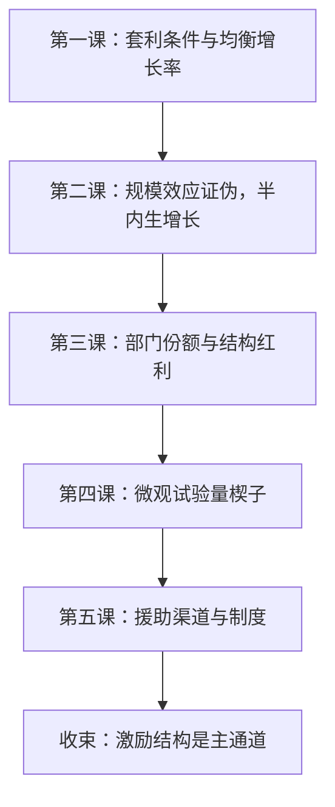

# 增长深化收束

理论负责列出增长的按钮，证据负责说明哪些按钮连着线；收束就是把六课的按钮与连线钉在同一张图上。

<footer>—— 据本课程六课整理</footer>

[上一课](/econ/gd-aid-institutions)把援助与制度的辩论收在「资本缺口买不来激励结构」上。本课收束增长与发展的深钻层：把理论单元的三个模型与实证单元的两类证据合成一张图，按读序重排六课，交代每课留下的按钮。本课程到此收束。

## 问题

收束要回答的不是新模型，而是编排。主干课的 [内生增长](/econ/endogenous-growth) 与 [AK、种类与熊彼特](/econ/ak-variety-schumpeter) 给了机制分类与直觉；深钻层五课各自补了哪块缺口，互相依赖什么，哪里被数据修正——这些问题不钉下来，五课就只是五篇独立文字。缺口的形状很清楚：理论侧从完整解到部门维度，证据侧从家庭楔子到国家通道，两端在「激励结构」汇合。

## 方法

按读序重排，每课一句「它做了什么」。第一课 [内生技术的增长模型](/econ/gd-endogenous-growth-deep) 把创意的生产写进最优化：专利垄断给创意定价，研发套利条件钉住均衡增长率，肩膀效应与商业窃取决定补贴方向；留下的缺口是规模效应。第二课 [创意与规模效应](/econ/gd-ideas-rivalry) 用时间序列证伪 $\phi=1$，改写成 $g=\lambda n/(1-\phi)$ 的半内生增长：研发补贴降级为水平效应，按钮换成人力资本与市场规模；留下的缺口是单部门。第三课 [结构转型](/econ/gd-structural-transformation) 把部门接进来：恩格尔定律与成本病推着份额迁移，结构红利进了发展核算的残差；留下的缺口是微观为什么慢。第四课 [发展的微观证据](/econ/gd-development-micro) 用现场试验量楔子：外部性定随机化层级，摩擦定处理形式，外推要过三道门；留下的缺口是国家尺度。第五课 [援助与制度](/econ/gd-aid-institutions) 在国家尺度拆渠道：微观项目为正、汇率与问责渠道为负，制度解释以财富反转压过地理。

## 机制

三条贯穿线把六课钉成一张图。其一是增长来源的三次改写：$g$ 外生，到创意是研发的产出，再到创意越来越难找——每改一次，政策按钮就换一批，从「补贴研发」到「人力资本与市场规模」，再到「先测摩擦再定处理」。其二是残差的分解：[发展核算](/econ/convergence-accounting) 的 $A$ 到此拆成技术、结构红利、[错配](/econ/misallocation-tfp) 的楔子与制度四块；跨国几十倍的差距主要是水平账——资本深化、错配与结构缺口——不是各国增速的差异，读任何增长模型都要先问它解释的是斜率还是水平。其三是证据的分层：试验管内部效度，外推管三道门，宏观证据管规格扫描；三段各管一段，组合的口径与 [政策评估案例与收束](/econ/pe-case-map) 同源。

六课共用的错法只有一个原型：把局部结论当全局参数。第一代的规模效应、肥料的边际回报、援助的条件有效，都是同一类外推错误在不同尺度上的重演。

## 边界

没有统一模型把六课装进去：创意模型与结构模型互补而非嵌套，微观参数不进结构模型就只是参数，宏观识别到「渠道为负」为止、给不出权重的精确值。制度如何被改变——深钻层只论证了援助买不来它，没有给出改变它的可信路径，这是留下的问题而不是结论。本课程到此收束，深钻层之后进入附录：论文与前沿不再有后续课接续。

## 小结

- 理论单元的依赖链：套利条件 → 规模效应证伪 → 部门维度；每步修正都换掉一批政策按钮。
- 残差四分：技术、结构红利、错配、制度；跨国差距主要是水平账，不是增速账。
- 证据分层：试验、外推、宏观规格扫描各管一段，单一证据不单独定结论。
- 激励结构是两条证据链的汇合点：微观楔子与宏观渠道都指向它。
- 制度的可改变性是留下的问题，不是本课程的结论。
- 出处：本课程六课所引文献；编排口径与各主干课的链接见正文。
