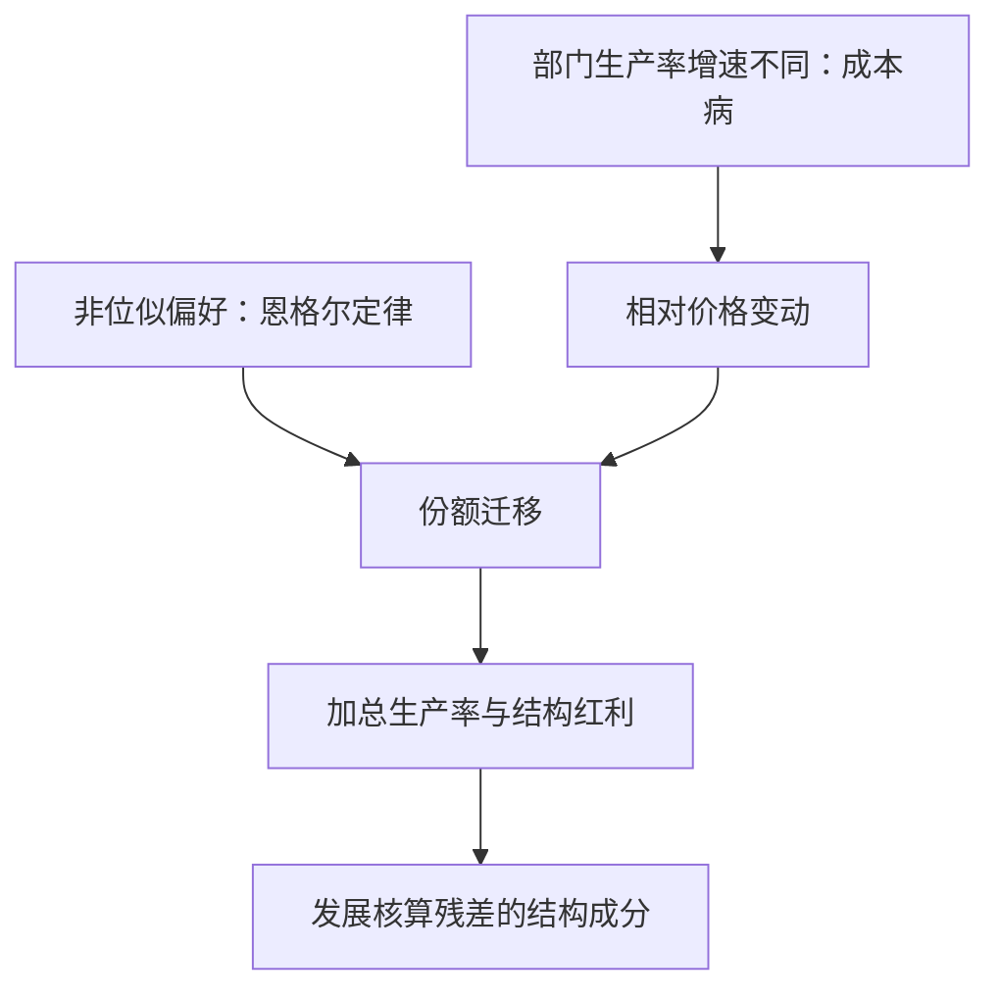

# 结构转型

增长不只是每个部门一起变大，而是农民变成工人、工人变成职员；总量路径是份额迁移的影子。

<footer>—— 据 Kuznets；Kongsamut, Rebelo and Xie, "Beyond Balanced Growth", REStud 2001 整理</footer>

[上一课](/econ/gd-ideas-rivalry)把规模效应证伪，把长期增长改写成由人口增长驱动的半内生增长——但那仍是一个单部门世界：技术只有一条 $A$，经济只生产一种产品。增长的事实却带着结构：就业与产出份额沿发展路径大幅迁移，农业让位给制造业，制造业再让位给服务业。本课把部门维度接进增长模型。

## 问题

库兹涅茨事实：人均收入上升时，农业就业份额持续下降，服务业份额持续上升，制造业份额先升后降。单部门模型把这一切平均掉：它说不出谁在离开农业，也把服务业份额的上升当成噪声。缺口有两层：份额为什么会迁移（引擎是什么）；迁移如何污染加总——发展核算把低收入国的落后拆成资本、人力与残差，[发展核算](/econ/convergence-accounting)的残差里有多少其实是「人还挤在低生产率部门」的结构账。

## 方法

两个引擎。收入效应：偏好非位似，食品的收入弹性小于一、服务的弹性大于一，恩格尔定律随收入上升把份额从农业推向服务业。价格效应：部门间生产率增速不同，Baumol 1967 的成本病——停滞部门的相对价格持续上涨，名义份额被价格推着走。多部门建模把两个引擎装进增长框架：Kongsamut、Rebelo 与 Xie 2001 用带最低消费的 Stone-Geary 偏好，在服务业份额上升、农业份额下降的同时保住总量的卡尔多事实，称为广义平衡增长路径；Ngai 与 Pissarides 2007 证明，当部门产品以单位替代弹性加总时，生产率差异主要走相对价格而不拖累总量——制造业份额下降不是因为变得不重要，恰恰因为它生产率涨得最快、价格跌得最狠。低收入端另有一条农业约束：Gollin、Parente 与 Rogerson 2002 指出，农业生产率低时，喂饱全国必须困住大部分劳动力，食品约束解除是起飞的前提，这是[从马尔萨斯到现代增长](/econ/malthus-to-modern)在部门口径上的续篇；剩余劳动的转移由 Lewis 1954 的双经济给出最早的表达。

## 机制

结构红利是本课对核算的修正：当劳动从低边际产出的农业流向高生产率部门，加总生产率的上涨快于任何单一部门的自身进步——同一个人换个部门，产出就变了，没有新技术发生。低收入国发展核算残差里相当一块是这笔结构账：把它全读成「本国技术落后」会高估技术差距，把它全读成[错配](/econ/misallocation-tfp)的楔子也会错——份额迁移可以是发展路径的自然形状，不必对应任何扭曲。价格口径同样重要：服务业名义份额上升有相当部分是成本病推高的相对价格，实际份额涨得慢得多；用名义值读结构，会高估去工业化与「服务业化」的程度。

Ngai–Pissarides 的条件是替代弹性接近一：若产品间替代弹性高，生产率停滞部门会被替代萎缩而非靠涨价守住名义份额，加总结果随之不同——参数决定引擎权重。

## 边界

两个引擎的相对权重对偏好与替代弹性的设定敏感，同样的份额路径可以由不同参数组合生成，机制识别要靠份额之外的数据（价格、家庭支出结构）。本课不产生内生增长：各部门的技术增速仍是外生参数，与前两课的创意生产是互补而非替代——结构模型回答「谁在增长」，创意模型回答「为什么有增长」。当代的新事实是「过早去工业化」：不少低收入国的制造业就业份额峰值低于历史对照国的同期水平，服务业接棒的路径是否还能复制老牌经济体的生产率赶超，证据与机制都还在积累，本课的框架给出读法，不给出结论。

## 小结

- 结构转型的两个引擎：恩格尔定律的收入效应与 Baumol 成本病的价格效应。
- 广义平衡增长路径同时容纳卡尔多事实与库兹涅茨事实；部门加总对替代弹性敏感。
- 结构红利是发展核算残差的真实成分，既不是技术也不是错配。
- 名义份额被相对价格污染，读结构要用实际口径。
- 农业生产率决定起飞前夜：食品约束不解除，剩余劳动出不了农业。
- 出处：Kongsamut, Rebelo and Xie, *REStud* 2001；Ngai and Pissarides, *REStud* 2007；Baumol, *AER* 1967；Gollin, Parente and Rogerson 2002；Lewis 1954。
