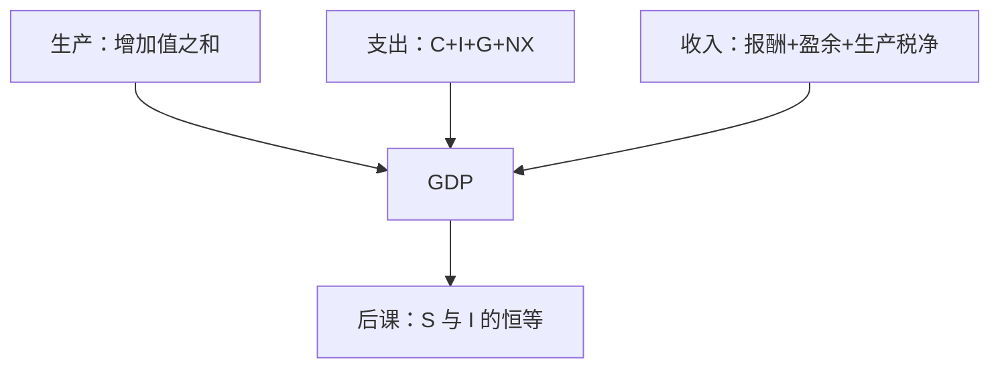

# GDP 三种算法

国民账户不是把「幸福」加总，而是把同一年的生产、支出与收入写成三条必须对得上的账。

<footer>—— 据联合国《国民账户体系》（SNA）；Kuznets 对国民收入的早期测算整理</footer>

[上一课](/econ/revelation-principle)把机制设计收在显示原理：私人类型可以变成激励相容的直接显示。本课换尺度。宏观要的不是某一次配置的信息约束，而是已经发生的交易如何加总成「这一年的产出」。显示原理不给出总量；[SNA](https://unstats.un.org/unsd/nationalaccount/) 给出三条必须相等的算法。后课的储蓄恒等式、价格指数和增长，都默认你会这三条账，不再从「GDP 是不是福利」讲起。

## 问题

微观均衡给出的是配置与价格，不是统计局发布的那个数。若直接把所有厂商的销售收入相加，中间品会被重复计算：铁矿、钢、汽车会把同一块价值加三遍。若只加最终销售，政府服务、自有住房、存货变化又对不上企业账。缺口因此不是「要不要衡量国力」，而是：用哪一套边界，使**生产、支出、收入**三条路走到同一个国内生产净值概念。

SNA 把生产边界钉在市场产出，并有限度地计入政府非市场服务与部分自产。家庭内部劳动大多仍在边界外。本课只钉国内生产：常住单位在经济领土上的生产。国民总收入还要加要素的跨境净收入，那是后课经常账户才会用到的差，这里不提前展开。

GDP 是增加值之和，不是销售额之和。增加值 = 产出 − 中间消耗。存货与固定资本形成是最终支出的一部分，不是「没卖掉所以不算」。

## 方法

三条算法对应三本账，定义上相等，统计上用残差对平。

生产法：按产业把增加值加总，再加产品税净额。支出法：最终消费 $C$、资本形成 $I$（含存货）、政府消费 $G$、净出口 $NX$。收入法：雇员报酬、营业盈余与混合收入、生产税净额。记

$$
Y \equiv C+I+G+NX,
$$

这里的等号是恒等，不是均衡条件。存货使「生产出来但未售出」仍计入 $I$，从而生产法与支出法在概念上对齐。收入法把同一增加值按要素份额切开；资本消耗（折旧）决定总额与净额之差。本课用总额 GDP，净额（NDP）留给资本账户。

名义值按当期价格；实际值要用后课的指数去缩减。本课禁止把名义 GDP 的上升直接叫「增长」。

### 常住与领土

国内与国民的差，是要素收入的跨境净额。一家外资企业在境内的增加值计入 GDP；利润汇出进入 GNI 的扣减。后课开放经济会计会用到这一条；封闭核算课序里先把 $Y$ 当成国内生产。

## 机制

三条路相等，是因为每一笔增加值同时是某人的收入、并对应最终需求或存货。中间品在产业间抵消：钢厂的产出是车厂的中间消耗，加总时只留下车的最终值。政府按成本计入，不是因为公共服务有市场价格，而是 SNA 选择用投入近似非市场产出——这是约定，不是福利定理。

地下经济、质量变化、免费数字服务会让边界抖动。那是测量误差，不否定恒等结构。本栏也不把 GDP 读成帕累托改进：福利定理谈的是配置，SNA 谈的是加总口径。显示原理处理的是私人信息；SNA 处理的是已经实现的市场交易。两套语言不要混：激励相容的机制可以改变未来的 $Y$，但不能让三条算法在定义上分叉。

存货投资使「没卖掉」仍进入支出法。若把存货从 $I$ 里拿掉，生产法与支出法立刻对不上。后课把非自愿存货当成数量调整，前提是本课已经把它算进 $Y$。

## 边界

GDP 不含闲暇、环境耗损、分配。Kuznets 本人就警告过把国民收入当成福利。本课仍用 GDP，因为后课的索洛、IS–LM、经常账户都建立在这本账上；福利度量是对照，不是把第一课宏观改成幸福指数综述。量化栏的成交与报价是微观结构，不在 SNA 里；本栏加总到限价簿之前停住，见最后的接到[限价簿](/quant/lob-structure)。

也不要把资本市场的市值涨跌计入生产：持有利得是重估价，不是增加值。公司金融课的股利与自由现金流从企业账出发，加总后进入收入法的盈余，但本课不把单家报表当成 GDP。

后课默认：写下 $Y$ 时，它同时是增加值、最终支出和要素收入。下一课的缺口是：支出里的 $I$ 与收入里没被消费的部分，如何写成恒等式。

## 小结

- 宏观的原始对象是 SNA 口径的国内生产，不是福利数字。
- 生产、支出、收入三条算法概念上相等；重复计算靠增加值消除。
- $Y=C+I+G+NX$ 是会计恒等，不是需求决定论。
- 存货属于资本形成；持有利得不属于生产。
- 名义与实际、储蓄与投资、跨境要素收入，都是后课缺口。
- 出处：联合国 SNA；Kuznets 的国民收入核算传统。
