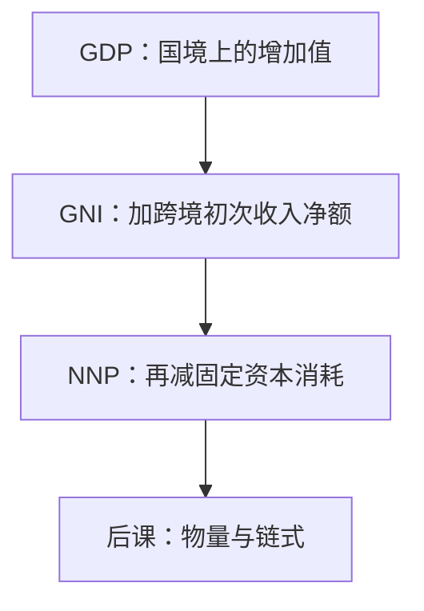

# GDP、GNI 与 NNP

国内生产钉的是国境上的增加值；国民收入还要问这些增加值最终记在谁的常住单位名下；净额再把固定资本消耗抠掉。

<footer>—— 据联合国《国民账户体系》（SNA）；Mankiw 宏观教材对 GDP / GNP / NNP 的口径整理</footer>

[上一课](/econ/gdp-accounts)把三条算法钉在**国内**生产总额 $Y$。它已经声明：外资企业的境内增加值进 GDP，利润汇出要等到国民口径才扣；折旧决定总额与净额之差，当时用总额、把净额留给后课。本课的缺口就是这两条差：国境对国民，总额对净额。链式物量是下一课；本课仍在名义账户上把名字分清。后课默认：写下 GNI、NNP 时不再把它们与 GDP 混用。

## 问题

三条算法对齐的是常住单位在经济领土上的生产。若要素可以跨境，境内产出不必等于本国居民挣到的初次收入。一家外企在境内的增加值计入 GDP；利润、利息汇出是对国外的初次收入分配，要从国民总收入里扣。本国居民在海外的工资与利润则加回来。缺口不是再问「要不要算福利」，而是：同一套 SNA 边界下，**生产**与**收入**何时分叉。

总额还含固定资本消耗。机器在生产中被用掉的价值不是新创造的净产品。把折旧留在 $Y$ 里，增长账会把「重置报废设备」写成产出。NNP（或国民净收入）把这一块拿掉。本课一次钉定义，不把开放经济的整本经常账户搬进来。

GNI 旧称 GNP。SNA 强调「收入」而非「产品」：国民总收入是初次分配后的账户，不是把 GDP 换了个国籍形容词。

## 方法

记对国外的初次收入净额为 $NPI$（雇员报酬与财产收入的贷方减借方）。则

$$
\mathrm{GNI} \equiv \mathrm{GDP} + NPI.
$$

再记固定资本消耗为 $\delta K$ 一类的核算折旧（不是索洛里外生的 $\delta$ 参数本身）。国民生产净值

$$
\mathrm{NNP} \equiv \mathrm{GNI} - \text{固定资本消耗}.
$$

国内一侧也可写 NDP $=\mathrm{GDP}-$ 固定资本消耗。Mankiw 的教学链是 GDP $\to$ GNP/GNI $\to$ NNP $\to$ 国民收入（再扣间接税等），本课停在前三步：后课储蓄恒等用的仍可以是 GDP 口径的 $Y$，但谈到「一国居民的收入」必须改口 GNI。

经常转移（侨汇等）还不在 GNI 里，要到国民可支配总收入。完整经常账户在[开放经济会计](/econ/open-ca)；本课只把生产与初次收入分开。

### 不要把汇出利润写成「GDP 减项」

生产法不因利润汇出而改境内增加值。扣减发生在收入分配账户。把「外企把钱拿走了所以不算产出」，会把生产法与收入法重新打乱——上一课刚对齐的三条路会分叉。

## 机制

国境口径问：东西在哪里生产。国民口径问：初次收入记在哪个常住单位。两者在封闭经济重合，一开放就分叉。折旧则是时间上的分叉：总额把重置投资算进产出，净额才接近「还能消费或净积累」的流量。资本形成 $I$ 仍是总额概念（含重置）；与 NNP 对照时要声明用的是总投资还是净投资。

统计上 $NPI$ 来自国际收支的初次收入，与 GDP 的残差对平不是同一本账。小型开放经济的 GDP 与 GNI 可以差一截：资源出口国的利润若记在外国母公司，GNI 小于 GDP。这是口径，不是「真实国力被低估」的规范判断。

核算折旧按重置成本与资产寿命，不是公司账的加速折旧，更不是索洛 $\delta$ 的校准值。后课增长模型里的 $\delta$ 是参数；本课的消耗是 SNA 账户。

## 边界

本课不把 GNI 写成福利，也不把 NNP 当成已经扣掉环境耗损。SNA 的固定资本消耗不包括自然资源耗减与外部成本。持有利得仍是重估价，进出金融资产账户，不进 GDP，也不进 GNI 的生产来源。量化栏的跨境套利与[利率平价](/quant/irp)是资产价格，不是 $NPI$ 的定义。

后课默认：国内生产用 GDP，居民初次收入用 GNI，净产品用 NNP/NDP，三者不再互换。下一课的缺口是：这些名义序列如何变成可加的物量——固定篮子会锁死替代，链式逐年换权。

## 小结

- GDP 钉国境上的生产；GNI 再加跨境初次收入净额。
- NNP 从 GNI 中扣除固定资本消耗；总额与净额不是同一流量。
- 利润汇出不改境内增加值，只改国民收入账户。
- 经常转移、完整 $CA$ 留给开放账户，本课只分生产与初次收入。
- 名义还没有变成增长：物量指数是下一课。
- 出处：联合国 SNA；Mankiw 对 GDP、GNP/GNI、NNP 的口径链。
