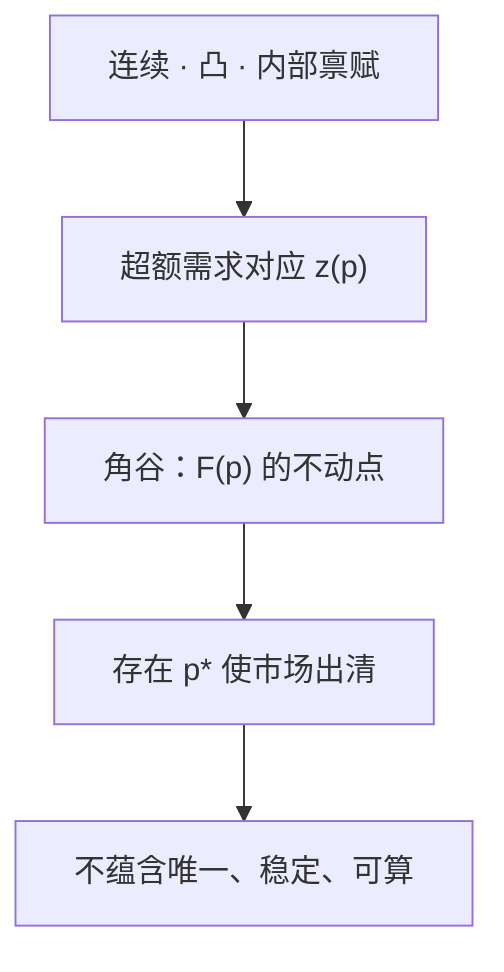

# 存在性与不动点

我们证明：在凸性与连续性的标准假设下，竞争经济存在均衡价格。

<footer>—— Arrow and Debreu, Existence of an Equilibrium for a Competitive Economy, Econometrica, 1954</footer>

[上一课](/econ/welfare-theorems)把均衡与帕累托集接好了，但句子都以「若均衡存在」为前提。超额需求 $z(p)=0$ 是 $L-1$ 个方程，连续函数不必有零点——除非定义域紧、映射指向自己。缺口是存在性：给哪些假设，拍卖人一定能找到 $p^*$。本课用不动点，不重写需求理论。

## 问题

把价格规范到单纯形 $\Delta=\{p\in\mathbb{R}^L_+:\sum_\ell p_\ell=1\}$。瓦尔拉斯定律说 $p\cdot z(p)=0$，齐次性说只相对价格有意义。要找 $p^*\in\Delta$ 使 $z(p^*)\le 0$。若 $z$ 连续，一个候选是布劳威尔：构造从 $\Delta$ 到自身的连续映射，其不动点对应出清。

难处在 $z$ 往往不是函数。偏好凸但不严格凸时，需求是对应；价格为零时需求可能无界。需要把「函数的零点」升级成「上半连续、凸值对应的不动点」——角谷静夫（Kakutani）不动点。Arrow–Debreu 的路线是：先把消费集切成紧集（避免无穷需求），再对「价格 → 最优计划对应」用角谷。

### 不要把存在当成唯一或可计算

存在定理不给算法，也不给唯一。多个均衡时，比较静态可以跳到另一个盆地。也不要把不动点证明读成「市场会收敛」：证明是一次性映射的不动点，不是试错动态的稳定性。动态是另一套假设。

布劳威尔：连续 $f:\Delta\to\Delta$ 有不动点。角谷： $\Delta$ 紧凸，$F:\Delta\rightrightarrows\Delta$ 上半连续、非空紧凸值，则存在 $p\in F(p)$。超额需求对应的标准技巧是 $F(p)=\arg\max_{q\in\Delta} q\cdot z(p)$，不动点满足瓦尔拉斯出清。

## 方法

交换经济的一套充分条件：消费集闭凸下有界；偏好连续、凸、局部非饱和；禀赋在消费集内部（保证即使某价格为零，也买得起附近的点）。则存在瓦尔拉斯均衡。生产端加：生产集闭凸、包含 $0$、不能免费生产、不可逆；厂商利润最大的供给对应与消费者需求对应一齐进入广义超额需求。

证明骨架。把可能用到的消费切到一个足够大的立方体，使最优解不会顶到人为边界。需求对应在 $\Delta$ 上非空、紧凸值、上半连续。构造

$$
F(p)=\bigl\{q\in\Delta: q\cdot z(p)\ge q'\cdot z(p)\ \forall q'\in\Delta\bigr\}.
$$

$F$ 满足角谷条件。不动点 $p^*\in F(p^*)$ 加上瓦尔拉斯定律推出 $z(p^*)\le 0$，正价格市场出清。

McKenzie、Gale 等人有平行证明。Debreu《价值理论》把商品空间做成有限维欧氏空间，或有商品的日期–状态指标；本课只钉有限 $L$。无限维要另用分离与properness，不在主干。

## 机制

凸性保证需求对应凸值：两点都最优，平均也最优，角谷才吃得下。连续性（偏好的闭图）保证对应上半连续：价格微动，需求不会跳到远处而不把中间点带上。内部禀赋挡住「某商品价格为零时，持有量为零的人需求爆炸」这种边界病。

计价物单纯形是紧凸的，这才有不动点定理的定义域。若允许 $p=0$，人人把所有商品当免费，需求无界，对应甚至没有值。故存在性证明必须先选正规化。

存在性与[福利定理](/econ/welfare-theorems)的假设几乎同一套，但逻辑方向相反：福利定理假定均衡已在，推有效；存在性假定偏好与技术，推均衡非空。两者合在一起，才谈得上「竞争是一个解」。

### 超额需求要满足的三条

标准证明其实在用超额需求的三条性质，而不直接盯着每个人的效用。齐次性：$z(\lambda p)=z(p)$。瓦尔拉斯定律：$p\cdot z(p)=0$。连续性或对应的上半连续。再加上有界（切立方体之后）和边界行为：某商品价格趋于零时，其超额需求不会掉到负无穷——内部禀赋帮的就是这个忙。满足这几条的 $z$，不必问它从哪套偏好来，都有零点。Sonnenschein–Mantel–Debreu 后话是：这几条几乎也是 $z$ 的全部限制，所以总体需求可以很任意，唯一性没有免费午餐。

切立方体是权宜：先在大盒子里找均衡，再证明最优解不会顶到盒子壁，否则扩大盒子。无限维商品（Arrow–Debreu 的日期–状态）不能这么切，要用 properness 一类条件，主干不走。

试错动态收敛是更强的性质，需要总替代等，本课不假设。宏观代表性主体把 $I=1$，存在性退化成一个人的需求在资源约束上有解，凸连续仍然在，只是角谷用不上那么重。

## 边界

规模报酬递增、不可分商品、非凸偏好，都会让对应失去凸值，角谷用不上；均衡可能不存在。外部性使「商品」列表不完整，存在的是错误商品空间上的均衡。不对称信息把状态依存商品变成不可观察的合约，Arrow–Debreu 商品不再能列全。

不动点证明不是计算程序。斯卡夫算法、近似均衡是计算一般均衡的后话。宏观里「代表性主体加市场出清」常常直接假定存在，用的仍是本课这套凸连续，只是人变成了一个。

后课默认：谈到竞争经济时，在标准凸连续假设下均衡集非空。核与复制经济要在这个非空集上谈收敛。

## 小结

- 福利定理需要均衡；存在性用超额需求在价格单纯形上的不动点。
- 函数用布劳威尔，对应用角谷；凸与连续是对应性质的来源。
- 存在不是唯一，不是稳定，不是算法。
- 非凸、缺市场、不对称信息会拆掉这套假设。
- 出处：Arrow and Debreu, *Econometrica* 1954；Debreu, *Theory of Value*。
