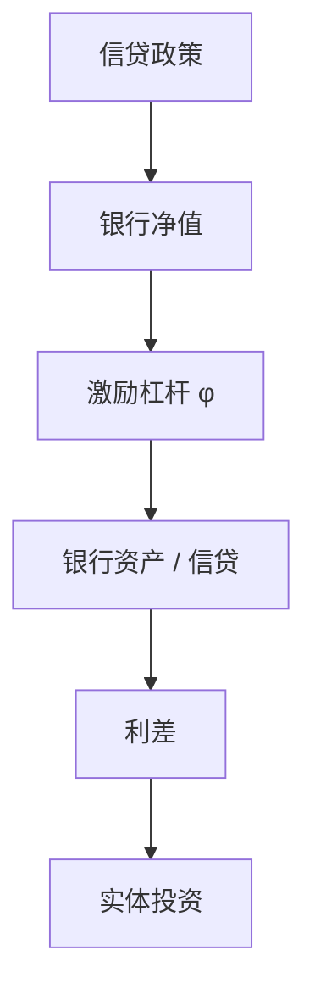

# Gertler–Kiyotaki 银行中介

银行用净值吸收激励约束；净值被冲掉时，信贷供给收缩，即使借款企业的土地还在。

<footer>—— Gertler and Kiyotaki, Financial Intermediation and Credit Policy in Business Cycle Analysis, Handbook of Monetary Economics 2010；Gertler and Karadi, JME 2011</footer>

[上一课](/econ/kiyotaki-moore)的约束在最终借款人身上。危机里更刺眼的是中介。本课缺口是 **GK**：银行净值、激励约束、信贷政策。不重推土地抵押的代数，不把央行资产负债表工具写完。

## 问题

KM 可以没有银行。现实信贷经中介。Gertler–Kiyotaki / Gertler–Karadi：银行家能转移资产，存款人只愿在净值足够时提供资金，形成对银行杠杆的激励约束。冲击打净资产（贷款损失、资产价格），杠杆上限收紧，利差升，实体投资降。央行买私人资产或给资本，等于补充中介净值。缺口是把加速器从「企业土地」挪到「银行资本」。

Gertler and Karadi, *JME* 2011。Gertler and Kiyotaki, *Handbook* 2010；后续 GK 流动性风险与银行挤兑扩展。He and Krishnamurthy 的中介定价是连续时间姐妹。

## 方法

银行最大化特许权价值，约束：转移激励 $\Rightarrow$ 资产 $\le \phi\times$ 净值。$\phi$ 可随价值内生。家庭持存款，不能直接持企业资本（或只能付更高成本）。冲击：资本质量、银行股票、挤兑。政策：信贷政策改变谁持有风险资产。线性化在约束平均松时低估危机；偶尔绑定或非线性必要。

与 KM：可以两层约束都在——企业抵押加银行激励。定量危机模型常两层一起开。

## 机制

机制是净值稀缺。中介的专门性意味着家庭不能无摩擦取代银行持有资本，故银行净值有总量价格。利差是影子价格。宏观审慎（后课）针对 $\phi$ 或资本，非常规货币针对资产需求与净值。HANK：信贷收缩打劳动收入与房价，高 MPC 家庭放大——可叠，本课先代表或企业家侧。

识别：利差脉冲要用信用冲击的识别（叙事、符号），不是把每一个利差升都叫 GK。

Diamond–Dybvig 挤兑在主干已有。GK 扩展把挤兑接到总量净值。影子银行课再换主体。

## 边界

本课不写巴塞尔每一条风险权重。不把回购市场微观结构写完（后课 repo）。主权债持有使银行–主权回路，后课违约。不估计银行股票 alpha。

后课默认：中介净值是宏观状态；信贷政策与利率政策分工。下一课：住房作为抵押的专门化。

## 小结

- GK：银行激励约束把净值接到信贷供给与利差。
- 信贷政策补净值或替中介持有风险。
- 可与 KM 企业抵押叠加。
- 出处：Gertler and Kiyotaki, *Handbook* 2010；Gertler and Karadi, *JME* 2011。
