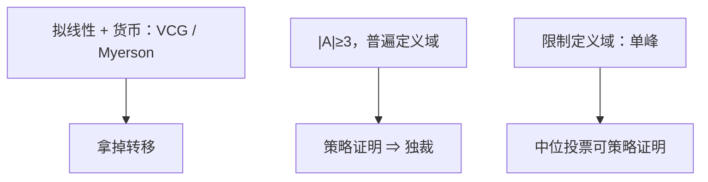

# Gibbard–Satterthwaite

若备选方案不少于三个、偏好定义域不受限，则非独裁的社会选择无法在占优策略下实施。

<footer>—— Gibbard, Manipulation of Voting Schemes, Econometrica, 1973；Satterthwaite, Strategy-proofness and Arrow’s Conditions, JET, 1975</footer>

[上一课](/econ/myerson-virtual-value)在拟线性货币里把最优拍卖写成虚拟价值铁钟；再往前，VCG 还能占优策略实施有效配置。缺口是把货币拿掉：只对方案排序投票。此时占优策略 IC 几乎只留下独裁。本课钉这条不可能，作为信息课序在「没有转移」一端的收束，不重写拍卖公式，也不把单峰定义域的中位投票写成解。

## 问题

有限方案集 $A$，$|A|\ge 3$。每人报一个严格排序，社会选择函数 $f$ 吐出一个方案。策略证明：报真排序是占优策略。到上（onto）或帕累托：每个方案都可能被选，或一致同意的方案必被选。Gibbard–Satterthwaite：满足这些的 $f$ 必是独裁——存在 $i$，使 $f$ 永远等于 $i$ 的最爱。

与 Arrow 的对照：Arrow 在社会排序上要帕累托、无关方案独立性、非独裁，结论是不可能。GS 在社会选择（只吐一个点）上要策略证明，结论同样是独裁。两条定理可互推（在适当技术条件下）：策略证明大约相当于 IIA 加帕累托。显示原理在这里已经用过：只需看直接报排序的规则。

### 不可能的是占优策略，不是贝叶斯

允许先验、只要求贝叶斯 IC，能实施的更多，但依赖共同先验，投票场合往往没有。Myerson 拍卖走贝叶斯层，并且有货币把偏好收成数字；GS 两者都没有。

独裁不是「有人说了算就效率低」。独裁策略证明、也帕累托（对独裁者）。定理说的是：要想非独裁，就必须放弃占优策略或限制定义域。VCG 逃出去，是因为拟线性加转移把定义域收成另一类偏好。

$|A|=2$ 时多数规则策略证明，定理从三个方案起算。
无差异、随机化（随机独裁、随机中位）可以放松，本课只钉确定性 SCF。
操纵就是谎报排序使 $f$ 对自己更好；定理说非独裁规则总有人能这样。

## 方法

对象：有限 $A$，普遍定义域（所有严格排序都可报），确定性 $f$。结论：策略证明 + 到上 $\Rightarrow$ 独裁。证明策略不在此重写；课堂上认两点：VCG 用的货币不在工具箱里；[DA](/econ/matching-strategy-proof) 能单边策略证明，是因为匹配的结果空间与定义域都不是「任意 $A$ 上的任意排序」。

## 机制

没有转移时，无法用「付你造成的外部性」对齐私人目标与社会目标。占优策略要求：无论别人报什么，单个人不能靠谎报把结果扳向自己更爱的方案。三个以上方案提供足够空间让非独裁规则在某对偏好轮廓上被扳动——这是操纵的几何。独裁把空间缩成一个人的最爱，谎报无益。

匹配 DA 不违反 GS：方案集是匹配，偏好被限制成「只关心自己的对象」，不是 $A$ 上的任意排序；而且 DA 只对一边策略证明。拍卖 VCG 不违反 GS：偏好是拟线性的，结果含货币。GS 钉的是无限制序数偏好、无货币、确定性选择。三个方案已经够造出「循环」：非独裁规则必须在某对轮廓上让某人的第二选择压过第一，于是他有谎报动机。这是操纵的最小几何，与 Arrow 的 IIA 失败同源。

$|A|=2$ 时多数规则策略证明，定理从三个方案起算。
随机独裁、单峰中位是后继放松，不是对本定理的否定。
显示原理已经用过：只需看直接报排序的规则，弯程序救不了。

## 边界

单峰偏好（Black、Moulin）：中位投票策略证明，定义域限制救了实施。可分物品、拟线性，VCG 再救一次。随机社会选择、近似策略证明、大规模匿名，都是后继放松。不要把 GS 写成「投票无用」：它说占优策略 + 普遍定义域太强；制度靠的是定义域、议程、货币或重复博弈。

后课若进入核算与宏观，不再把 GDP 当成某个策略证明的社会选择。信息课序在此收束：有货币则包络与虚值，无货币则 GS。

### 显示原理没有取消不可能

任何间接投票规则的占优策略均衡结果，都能收成直接策略证明的 $f$。因此「设计更弯的投票程序」救不了：若直接的 $f$ 只能是独裁，间接的也只能实施独裁结果。这与 Myerson–Satterthwaite、竞争筛选无均衡同一逻辑——可行 IC 集太小。

Gibbard 1973 用博弈形式；Satterthwaite 1975 连到 Arrow。课堂上记：三个方案、普遍定义域、占优策略、非随机 ⇒ 独裁。

## 小结

- 无转移、普遍定义域、$|A|\ge 3$：策略证明的 SCF 必独裁。
- VCG / Myerson 靠拟线性货币逃出；DA 靠受限偏好与单边。
- 显示原理表明弯程序救不了。
- 要非独裁，必须限定义域、加随机、加货币或放弃占优策略。
- 出处：Gibbard, *Econometrica* 1973；Satterthwaite, *JET* 1975。
