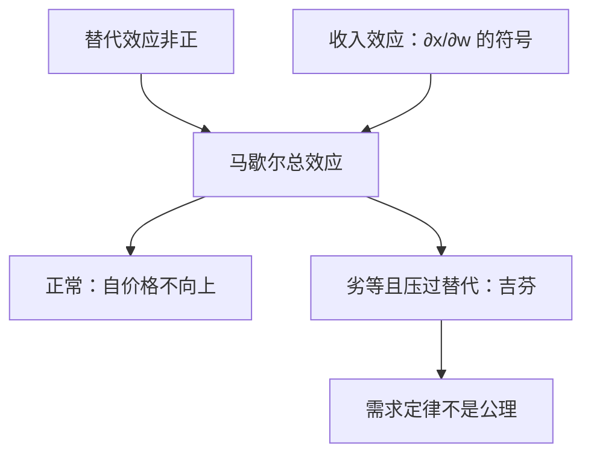

# 吉芬与劣等

收入效应的符号不由凸性决定。劣等使马歇尔自价格弹性可以翻号；吉芬是收入效应压过替代效应的情形。

<footer>—— 据 Varian, Microeconomic Analysis；Mas-Colell, Whinston and Green 第 3 章整理</footer>

[上一课](/econ/slutsky-symmetry)（斯勒茨基对称与负半定）。把 $\partial x_i/\partial p_j$ 拆成替代项与收入项，并读出 $S$ 对称、负半定。本课不重推那条恒等式，也不再证明 $Sp=0$。缺口是：收入效应的符号，以及何时马歇尔需求向上倾斜。上一课声明「正常或劣等不是百科」；本课只把这两个符号钉成比较静态的分支。

## 问题

替代项 $\partial h_i/\partial p_i\le 0$ 已经有保护。总效应

$$
\frac{\partial x_i}{\partial p_i}=\frac{\partial h_i}{\partial p_i}-\frac{\partial x_i}{\partial w}\,x_i
$$

的第二项可正可负。$\partial x_i/\partial w\gt 0$ 称正常，$\partial x_i/\partial w\lt 0$ 称劣等。劣等时收入项为正（涨价等于变穷，劣等品反而多买），有可能压过非正的替代项，使 $\partial x_i/\partial p_i\gt 0$。这样的商品叫吉芬。缺口不是再拆一次，而是承认：向下倾斜的需求定律不是定理，只是替代压过收入时的正则情形。

吉芬必须先劣等，且该商品占预算足够大，收入项才撑得起。正常商品不可能吉芬：两项同号（都非正）。交叉价格上，替代可正可负（净替代 / 净互补），再叠加收入项，马歇尔交叉弹性更没有先验符号。

### 吉芬是马歇尔现象

希克斯自价格仍非正。补偿过的需求不向上倾斜。吉芬只活在未补偿的 $x(p,w)$ 上。不要说「偏好向上倾斜」——偏好的凸性管的是 $S$，不是 $D_p x$。

教科书里的土豆故事是直觉，不是本栏的数据。经验上吉芬罕见，逻辑上合法。主干保留它，以免把需求定律写成公理。

## 方法

从斯勒茨基方程读符号表。固定 $S_{ii}\le 0$、$x_i\gt 0$：

- 正常：收入项为负，总效应必非正。
- 劣等但 $|S_{ii}|$ 更大：马歇尔仍向下。
- 劣等且收入项压过替代：吉芬，马歇尔向上。

两商品时，瓦尔拉斯定律限制更死：一种吉芬则另一种必须正常，且交叉项被加总约束绑住。本课不把两商品图画成唯一世界；$n$ 种商品时，几种同时劣等完全可以。

位似使所有收入弹性为 $1$，排除劣等，因而排除吉芬。拟线性把收入效应赶到计价物，非计价物不能吉芬。这两刀上一课序已经有；本课只指出它们把吉芬关在门外。

## 机制

涨 $p_i$ 有两件事。相对变贵：沿无差异集离开 $i$（替代）。真实变穷：沿财富轴移动——穷了少买正常品、多买劣等品。总效应是矢量和。吉芬是「穷了更依赖这件劣等品」，超过了「相对变贵该少买」。

交叉效应同理。净替代由 $S_{ij}$ 的符号说；毛替代还要加 $-x_j\partial x_i/\partial w$。两种商品可以净替代却毛互补，只要收入项够大。后课税收归宿若只看马歇尔弹性，会把收入效应算进「替代」里；要分离，仍回斯勒茨基。

劣等不是「质量差」。定义只是财富导数为负。公交、低档主食可以劣等；吉芬还要它够大、替代够弱。

## 边界

角点上 $x_i=0$，谈不上吉芬：已经不买。可微公式在内点正则处用。加总需求更不必继承个人的劣等：市场弹性是收入分布与个别弹性的混合物。

也不要把吉芬写成限价簿里的向上倾斜报价。量化栏的冲击与这里的 $\partial x/\partial p$ 不是同一对象。本课仍是一个人的马歇尔比较静态。经验拒绝「常见吉芬」并不拒绝理论：理论只说它可以发生，并且一旦发生，需求定律不能当公理用。

后课默认：谈到自价格弹性，先问正常还是劣等；只有劣等才打开吉芬分支。$S$ 的符号保护不自动传给 $x$。

## 小结

- 正常：$\partial x_i/\partial w\gt 0$，马歇尔自价格非正。
- 劣等：财富导数为负；再压过替代才是吉芬。
- 吉芬是未补偿需求的现象；希克斯需求仍向下。
- 位似、拟线性（非计价物）关上门；一般 $u$ 门开着。
- 出处：Varian, *Microeconomic Analysis*；Mas-Colell, Whinston and Green 第 3 章。
