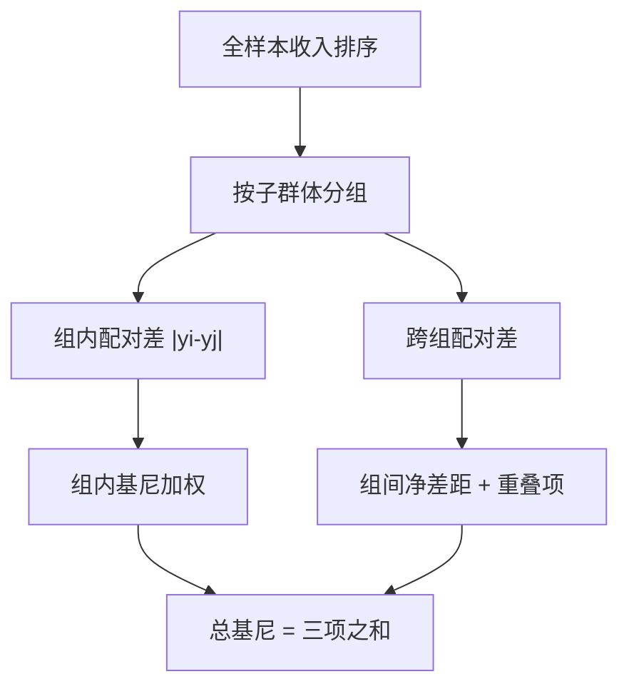
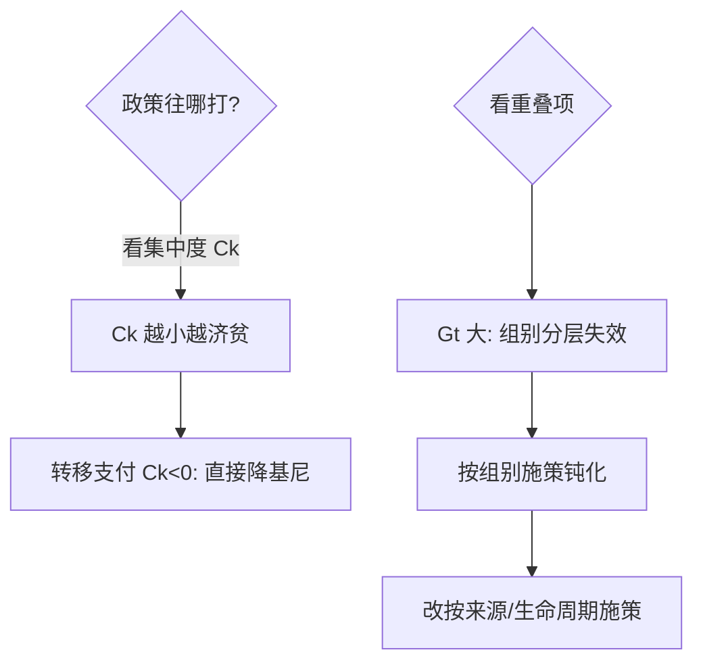

# gini-decomposition

基尼系数是一个数，不是一个诊断：拆成组间、组内与重叠三块，才知道不平等长在哪个关节上。

<footer>—— 据 Gini (1912)；Dagum 基尼分解 (1997)；Pyatt 三方分解 (1976)</footer>

[拥堵定价](/econ/congestion-pricing)的公平账要算清分配，本课给分配测量的解剖刀。基尼系数人人会算、少人会拆。缺口是**基尼分解**：把总不平等按子群体（组间/组内）或按收入来源（要素分解）切开，回答「政策该往哪打」。本课只讲基尼族的分解，不进泰尔熵族。

## 问题

全国基尼 0.47，城乡拆开后城镇 0.42、农村 0.45、组间 0.18——三个数什么关系？为什么各组基尼之和远小于全国？拆解要回答两件事：各子群体贡献几何；分解是否可加、是否唯一。基尼的分解不完美（有重叠项），这正是要讲清的地方。

术语翻译：组间不平等 = 用各组均值算出的基尼（把组内抹平后剩下的差距）；组内 = 各组内部的基尼按人口加权；重叠（overlap/residual）= 富组里的穷人与穷组里的富人「交错」产生的项——它是基尼分解不为零的根源。

数字实例：城镇均值 4 万、农村 2 万，各自基尼 0.42/0.45。组间项（把每组都换成均值）约 0.14，人口加权组内项约 0.30，重叠项约 0.03——三项加总才是 0.47。重叠小（城乡几乎不交叉）时组间项才是主矛盾。

## 方法

Dagum 三步：把全体按子群体分组，各 group 内排序；两两计算 $G_{jh}$——同组配对（组内贡献）与跨组配对（净差距 = 富组赢的配对减穷组赢的配对）；剩下一块就是跨组重叠强度。要素分解（另一条路）：按工资、经营、转移支付等收入来源分别算集中度 $C_k$，加权求和即总基尼——**集中度**与**份额**是两个独立的政策旋钮。

直觉类比：基尼像「全班身高差的平均值翻倍」。按班级拆：班与班的平均身高差（组间）+ 各班内部身高差（组内）+ 高个班里的矮个与矮个班里的高个交叠的部分（重叠）。三块都量出来，才知道是「班与班差太多」还是「班内太参差」。

## 机制

基尼可分解性弱于泰尔熵：$G = G_w + G_b + G_t$，重叠项 $G_t\ge 0$ 且只在子群体收入分布交错时存在——城乡几乎分层时 $G_t\to 0$，分解近乎完美；教育扩张让城乡分布交叠加大时 $G_t$ 膨胀，同样总基尼背后结构可以完全不同。要素分解的机制刀更锋利：转移支付的集中度若为负（偏向穷人），它对总基尼是**减项**；某来源集中度上升推高总基尼当且仅当其份额乘（$C_k-G$）为正。政策诊断力全在这两个乘积符号上。

常见误区：把「各组基尼的加权平均」当总基尼——漏掉组间与重叠项会系统性低估；另一误区是把要素分解与人群分解混着报——前者按收入来源切，后者按人口特征切，切法不同政策含义完全不同。

## 边界

基尼对分布中部敏感、尾部钝感——顶端 1% 的变化常被低估，配套要报 top-income 份额或帕累托尾部。分组数越细，组内项越大、组间项越小，跨研究比较必须固定分组口径。转移支付与税收的「再分配效应」要用**市场收入基尼 vs 可支配收入基尼**之差来量，混用总人口与劳动人口口径是文献常见硬伤。与[可行能力方法](/econ/capability-approach)的接口：基尼测收入维度，能力法主张多维（教育、健康、发言权）——收入基尼低而能力剥夺高的社会并不罕见。

直觉类比：总基尼像「体检综合分」，分解是分科检查——组间项是「科室之间的差异」，组内项是「科室内部的参差」，重叠项是「两科室病人你中有我」；只看综合分开不出处方。

## 小结

- 基尼分解 = 组内 + 组间 + 重叠；重叠项源于跨组收入交错。
- 要素分解看集中度与份额：$C_k$ 的符号决定某来源是加剧还是缓解。
- 基尼钝感尾部、依赖分组口径，配套报 top 份额与再分配两口径。
- 出处：Gini 1912；Pyatt 1976；Dagum 1997；World Bank Inequality Database 口径说明。
