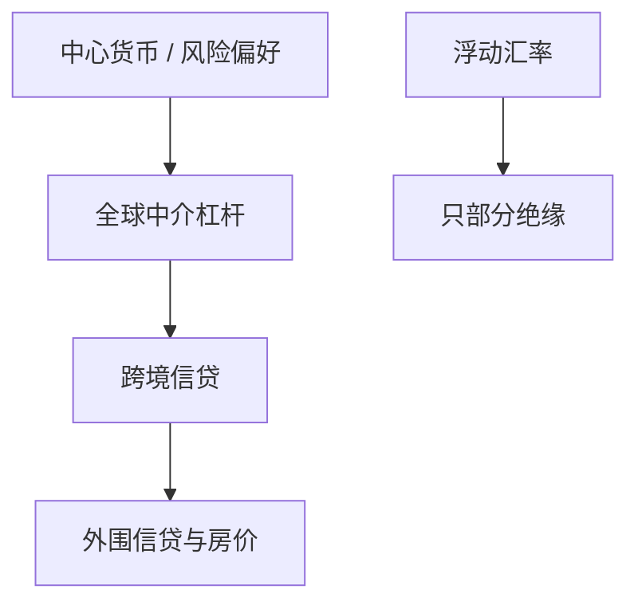

# 全球金融周期

中心国家的货币与风险偏好，经跨境信贷与资产价格共动，把外围的金融条件焊在一起——三元悖论变成两难。

<footer>—— Rey, Dilemma not Trilemma, 2013/2015；Miranda-Agrippino and Rey；Bruno and Shin 的跨境银行</footer>

[上一课](/econ/macroprudential)的杠杆外部性写在一国。资本流动把周期变成全球。本课缺口是 **Rey 的全球金融周期**：VIX、美元、跨境信贷共动。不重写最优 LTV 公式，不把国际货币史提前写到美元主导课。

## 问题

开放宏观的三元：汇率稳定、独立货币、资本流动三者不可兼得。Rey：即使汇率浮动，全球风险因子仍驱动国内信贷与资产价格，货币政策独立性被打折。Bruno–Shin：全球银行杠杆、美元融资。缺口是把 GK 的中介从封闭经济接到跨境批发融资，而不是重写 UIP 实证（量化栏）。

Rey, Jackson Hole 2013。Miranda-Agrippino and Rey。Bruno and Shin, *ReStud* 2015。Cetorelli and Goldberg 的全球银行内部市场。

## 方法

因子：从各国风险资产、信贷、资本流抽一个全球因子，与 VIX、美元指数相关。结构：中心国利率与风险偏好进全球银行的杠杆约束，外围信贷供给外生松紧。政策：资本流动管理作为宏观审慎的跨境工具；外汇干预；本地货币 vs 美元债（原罪）。识别：中心国货币冲击的外溢用高频或叙事，外围是接收者。

与 HANK：外围家庭若有外汇债，全球周期直接进实际负担（债务通缩的外汇版）。

## 机制

机制是全球净值与以美元计价的约束。美元升值恶化新兴市场企业与银行的外汇债净值，收紧 GK 约束，即使本地政策利率不动。浮动汇率缓冲贸易，不自动缓冲金融。这与 KM 的 $q$ 循环同构，价格换成全球风险资产与汇率。

诊断性与不确定性：全球 $\sigma$ 冲击（Bloom 的国际版）同时收紧所有杠杆。新闻：中心国前瞻指引是全球新闻冲击。

Obstfeld 对三元的辩护：浮动仍给部分货币空间。本课记录争论，不假装已有唯一计量结论。

## 边界

本课不估计 carry trade 策略。不把每一国的资本管制写成最优税率表。美元为何是中心货币，留到本单元最后一课。主权违约下一课换对象：政府而不是银行。

后课默认：浮动汇率不自动买来金融独立；全球因子经中介杠杆传导。下一课：主权不能抵押时如何借。

## 小结

- 全球金融周期：中心风险偏好与美元驱动跨境信贷共动。
- 浮动汇率对金融条件只部分绝缘。
- 资本流动管理是跨境宏观审慎。
- 出处：Rey, Dilemma not Trilemma；Bruno and Shin；Miranda-Agrippino and Rey。
