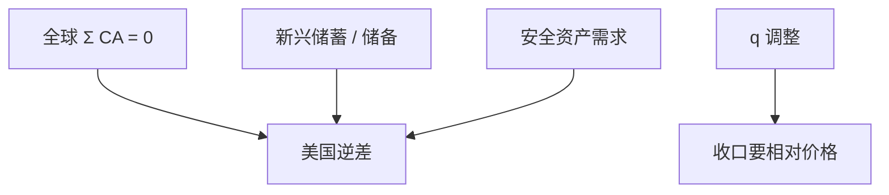

# 全球失衡

资本在 2000 年代净流向已经资本丰裕的美国，而不是 Lucas 的穷国；要把这句话写成储蓄过剩、储备需求与安全资产供给，而不是再骂一次双赤字会计。

<footer>—— Bernanke, The Global Saving Glut, 2005；Obstfeld and Rogoff 全球失衡与汇率；Caballero, Farhi and Gourinchas 安全资产</footer>

[上一课](/econ/lucas-paradox)问为何资本不南流。本课缺口是方向反了：新兴亚洲与石油出口国的顺差对着美英逆差，「上流」。外汇干预与储备下一课把官方流量拆出来。本课钉失衡的宏观叙事，不重写[双赤字](/econ/twin-deficits)恒等。

## 问题

$CA\equiv S-I$ 对每一国成立。全球加总 $\sum CA=0$（忽略统计误差）。美国 $CA<0$ 必有别处 $CA>0$。Bernanke 储蓄过剩：新兴市场储蓄升、投资未同步，资本流出。另一侧：美国投资（住房）与财政。Obstfeld–Rogoff：要有相对价格（$q$、可贸易）调整才能收口，软着陆 vs 美元骤贬。Caballero–Farhi–Gourinchas：世界缺安全资产，美国生产国债与 AAA，资本为保险而上流。缺口是：三条叙事对象不同（储蓄、相对价格、资产供给），不要合成一句「美国挥霍」。

Gourinchas–Rey 的「过分特权」：美国对外资产负债的组成使它赚取稳定费。失衡不只是货物，也是风险分担——后课国际风险分担会接。

## 方法

分解：私人 $S-I$ vs 官方储备积累。2000 年代亚洲储备猛增，使「私人 Lucas」与「官方上流」分叉——下一课干预。跨期：逆差可以是最优（生产率预期、人口），也可以是泡沫（住房）。计量：不能把美国 $CA$ 对财政做因果而不管全球 $S$。本课机制，不报新弹性。

与贸易课：中国冲击是劳动市场；中国顺差是账户。两者相关不必同一识别。价值链使双边货物顺差夸大 VA，但美国总 $CA$ 仍是国民账户。

## 机制

机制候选。储蓄过剩：预防性储蓄、人口、金融压抑使新兴 $S$ 高。投资不足：危机后亚洲 $I$ 谨慎。安全资产：本地债市场浅（原罪），官方与私人都买美债。美国供给：财政赤字与住房证券化增加安全（或看似安全）资产。2008 年证明部分 AAA 不是安全，失衡的资产侧改写——后课危机。

条款：美元实际汇率在收口时要贬（Obstfeld–Rogoff）。若工资粘、原罪，贬值路径不是免费，主干已有。本课不重推超调。

「失衡」不是会计错误。它是可持续性判断：净外资产路径、估值效应、突然停止风险。可持续可以伴随大额逆差（高增长债务人）。

## 边界

本课不预测某一年美元崩溃。不把储蓄过剩写成对 Bernanke 的人格评价。下一课官方储备与冲销，把「亚洲储蓄」里的央行部分拆开。不要用量化栏的外汇微观结构解释全球 $CA$。Lucas 悖论仍在：私人资本可以怕制度，官方可以买美债——两层流。

后课默认：全球加总为零；上流需要储蓄、安全资产或泡沫叙事之一；收口要 $q$ 与吸收。双赤字是部门展开，不是全球格局的充分统计。储备下一课。

## 小结

- 全球 $\sum CA=0$；美国逆差对应别处顺差。
- 储蓄过剩、条款调整、安全资产三条叙事要分开。
- 官方储备使「私人南流缺失」与「官方上流」并存。
- 可持续性是 NFA 路径，不是道德评分。
- 出处：Bernanke 2005；Obstfeld and Rogoff；Caballero, Farhi and Gourinchas；Gourinchas and Rey。
