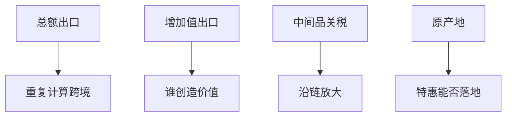

# 全球价值链

出口里嵌着进口中间品；按总额记账会重复计算跨境次数，按增加值记账才会看见谁真正创造了价值、关税如何沿链放大。

<footer>—— Hummels, Ishii and Yi, JIE 2001；Koopman, Wang and Wei, AER 2014；Antràs 价值链综述</footer>

[上一课](/econ/trade-agreements)把壁垒写成最终品关税合约。本课缺口是生产被切开：全球价值链（GVC）。China shock 下一课把进口竞争落到地区劳动市场；本课先钉增加值贸易与有效保护。

## 问题

Hummels–Ishii–Yi 的垂直专业化：出口中的进口投入份额上升。总额出口 $X$ 可以很大，国内增加值 $VA$ 小（加工贸易）。Koopman–Wang–Wei：把双边总额拆成国内 VA、返回的 VA、外国 VA、纯重复计算。缺口不是否定引力——总额仍服从引力——而是：福利、关税、顺差的含义要换口径。对美「中国顺差」用总额夸大中国 VA，用增加值会把东亚中间品供应算进来。

有效保护率：对最终品关税高、对中间品关税低，则国内加工的有效保护高于名义税率。价值链上，中间品税沿链叠加（Yi 的放大）。

## 方法

投入产出：世界 ICIO 表（WIOD、OECD TiVA）做增加值分解。理论：Antràs–Chor 把任务排序与合约摩擦写成谁做哪一段。贸易协定的原产地规则在 FTA 里决定能否用特惠——价值链越碎，原产地越苛刻，特惠越空。计量：不要用总额进口当「中国冲击」而不看投入产出（后课 ADH 用的是通勤区对进口的暴露，已是行业，不是 VA 全拆，但机制要意识中间品）。

与 Melitz：企业不仅选择是否出口最终品，还选择离岸哪些任务——下一课 Grossman–Rossi-Hansberg。本课先给会计。

## 机制

机制是任务的可分与合约。运输与协调成本下降使切片变细（Yi）。产权与 hold-up 决定是企业内 FDI 还是臂长外包（Antràs）。关税按总额课征时，同一增加值被多次征税，保护与惩罚都放大。这改变最优关税与协定设计：中间品自由化往往比最终品更「顺价值链」。

与经常账户：VA 口径改的是谁对谁的双边顺差叙事，不改一国总 CA 的国民账户——[开放会计](/econ/open-ca)仍是 $S-I$。双边「附加值顺差」是分解，不是第三个恒等。

不要用 GVC 取消比较优势：切片之后，比较优势用在任务上，而不是整辆汽车上。李嘉图仍在，对象变细。

## 边界

本课不把某年版 TiVA 表抄成结论。不写具体公司供应链管理。China shock 下一课是劳动市场设计，会用到行业进口，但输家故事要允许「出口商用了进口中间品而扩张」。离岸任务课把理论写全。不要用总额顺差当贸易战的充分统计。

后课默认：总额与增加值分叉；关税沿链放大；原产地约束特惠。国民账户 $CA$ 仍是总储蓄投资。任务层面的比较优势下一课。

## 小结

- 垂直专业化：出口含进口投入；总额重复计算。
- 增加值分解才看见价值来源与双边叙事。
- 中间品关税沿链放大；有效保护 ≠ 名义税率。
- 原产地规则决定 FTA 在碎链上是否空转。
- 出处：Hummels, Ishii and Yi, *JIE* 2001；Koopman, Wang and Wei, *AER* 2014；Antràs。
