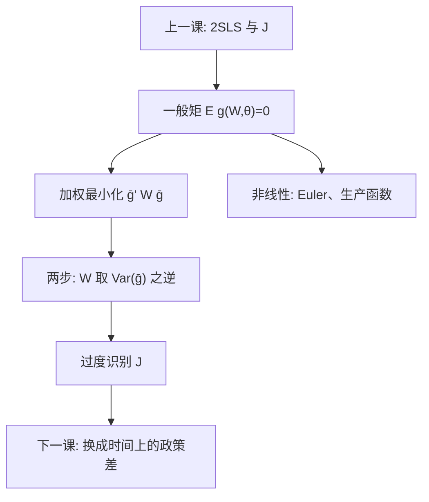

# GMM

矩条件 $\mathbb{E}[g(W,\theta)]=0$ 把 IV、Euler 方程和过度识别检验写成同一套加权距离；最优权重是样本矩的协方差之逆，不是把识别变成自动的。

<footer>—— Hansen, Large Sample Properties of Generalized Method of Moments Estimators, Econometrica 1982；对照 Theil 的 2SLS；Wooldridge 的 GMM 章节</footer>

[上一课](/econ/2sls-overid)在线性 IV 里写出 2SLS 与 Hansen–Sargan $J$。本课不重推第一阶段投影，也不把弱工具诊断再列一遍。缺口是：同一套矩语言如何容纳非线性、异方差最优权重，以及「$J$ 不拒绝」在一般 GMM 里仍然只是工具彼此一致。后课[双重差分](/econ/difference-in-differences)换识别设计，不再堆矩；本课把 2SLS 收进母框架，并分清一步与两步。

## 问题

总体 $\mathbb{E}[g(W_i,\theta_0)]=0$，$g$ 为 $L\times 1$，$\theta$ 为 $k\times 1$，$L\ge k$。样本矩 $\bar g(\theta)$。恰好识别：$L=k$，解 $\bar g(\hat\theta)=0$，IV 的 Wald 比是特例。过度识别：方程多于未知数，一般无精确零点，最小化 $\bar g(\theta)'W\bar g(\theta)$。缺口是 $W$ 怎么选、非线性 $g$ 时 2SLS 公式不再够用。消费 Euler、生产函数矩、动态面板差分矩，都是「不是 $Z'(Y-X\beta)$」的 $g$。

若各矩对应不同的局部效应，最优 GMM 仍会交出一个加权点；$J$ 拒绝可以是异质，不一定是「矩全错」——这与上一课 LATE 混权是同一警告，只是现在不限于线性 IV。

### 有效 GMM 不是识别已证实

两步最优 $W$ 给出的是：矩正确时的渐近效率。矩错误时，它有效地估错参数。$J$ 有自由度只因为过度识别；恰好识别时 $J$ 恒为零，排除约束仍不可检验。不要把「用了 GMM」写成论文的识别段落。

同方差线性 IV 下，2SLS 即最优 GMM。异方差时，最优权重换成 $\mathrm{Var}(Z_i u_i)$ 之逆，点估计可以不同于 2SLS。软件里「IV GMM」与 2SLS 不必相同。

## 方法

一步：预先固定 $W$（常用 $I$ 或 $Z'Z$ 类）。两步：用第一步 $\hat\theta$ 估 $\widehat{\mathrm{Var}}(\bar g)$，再代入最优 $W$。连续更新 GMM 把两步迭代到不动点，小样本有时更稳。过度识别统计量 $J=n\bar g(\hat\theta)'\widehat{V}^{-1}\bar g(\hat\theta)\xrightarrow{d}\chi^2_{L-k}$，与上一课 $J$ 同一逻辑。聚类或 HAC 出现在 $V$ 的估计里：上一课与[聚类](/econ/clustered-se)的协方差，在此变成矩的协方差。

弱矩与弱 IV 同源：第一阶段弱，GMM 有限样本偏向差、名义 $J$ 水平也会坏。先强度，再谈最优权重。Arellano–Bond 是差分矩上的 GMM，装置留给动态面板课，本课只指出它不是另一套哲学。

## 机制

机制是把「正交条件」变成可计算的距离。$W$ 最优时，估计量在这组矩的半参数类里达到效率界。直觉：相关更强、噪声更小的矩，应得到更大权重。非线性时没有封闭的两阶段投影，牛顿法在 $\bar g$ 上找加权零点——识别靠的仍是总体矩为真，不是优化器收敛。

Hansen 把 Sargan 的过度识别从同方差 IV 推到一般异方差。因此本课不是 2SLS 的重复：它回答「若 $g$ 不是 $Zu$，权重与 $J$ 从哪来」。

小样本里第二步的 $\widehat{V}$ 很吵，两步 GMM 可以比一步更散。许多应用报告一步、两步和 Hansen $J$ 一起，避免只展示最漂亮的那一列。

## 边界

本课不重推 Hansen 的全部渐近定理，也不把三阶段、控制函数菜单写完。不把 GMM 当成因果识别的替代品：矩来自排除、Euler 或模型，对错仍要领域约束。量化栏资产定价的 Hansen–Jagannathan 与 SDF 矩是另一条应用，本课不搬过去，以免金融微观结构吞并。下一课起，识别更多来自处理组与对照组在时间上的差，而不是再加一个 $Z$。

后课默认：线性 IV 先 2SLS / LIML；需要非线性或异方差最优权重时升到 GMM，并解释 $J$（排除失败对异质）。不要用 $J$ 的 $p$ 值替代恰好识别时不可检验的那条排除。

## 小结

- GMM 用 $\mathbb{E}[g]=0$ 统一线性 IV 与非线性矩。
- 2SLS 是同方差 IV 下的最优 GMM 特例。
- 两步 $W$ 管效率，不管矩是否为真。
- $J$ 检验过度约束彼此是否一致，不证实单条排除。
- 出处：Hansen, *Econometrica* 1982；Theil 2SLS；Wooldridge；Angrist and Pischke。
