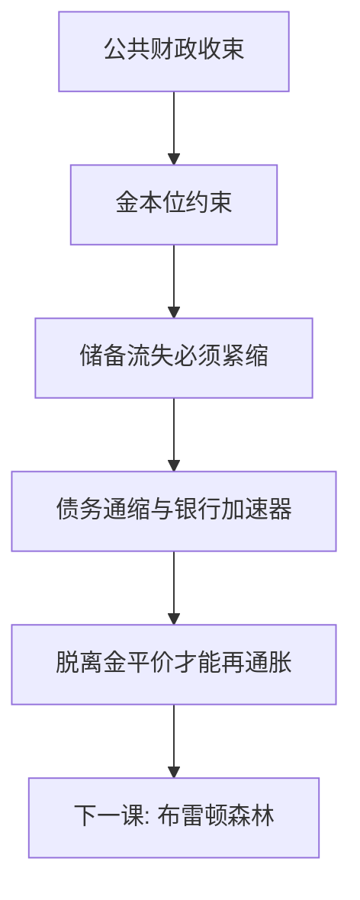

# 金本位与大萧条

金本位把汇率钉死、把货币政策绑在黄金，于是一国的紧缩经储备流失变成多国的通缩。早脱离金平价的经济更早再通胀——制度比编年更能解释为何萧条是全球的。

<footer>—— Friedman and Schwartz, A Monetary History of the United States, 1963；Eichengreen, Golden Fetters, 1992；Bernanke, Essays on the Great Depression, 2000</footer>

[上一课](/econ/local-fiscal-transfers)收束公共财政。本课是**经济史**对照课的第一课；后课默认已经读完：危机用机制对照，不背年份表。缺口是：1929 年的美国股价与银行恐慌，如何变成十年的全球萧条。Friedman–Schwartz 钉住美联储让货币崩溃；Bernanke 补上金融加速器；Eichengreen 把金本位写成国际传导的枷锁。三句话要叠在一起，不能只留一句「股市崩了」。

## 问题

钉住黄金：外部流失必须紧缩国内信用，否则平价不保。1920 年代末各国以扭曲的平价回到金本位，储备集中，规则不对称——盈余国不必膨胀，赤字国必须收缩。1929 年后美国信用收缩、银行倒闭，黄金与资本流动把通缩输出。名义工资与债务粘住，实际负担上升，破产与挤兑互相加强。缺口不是列出哪一年谁破产，而是：**在浮动下可以各自再通胀的政策，在金本位下是「不负责任」**；于是对称紧缩。英国 1931、美国 1933 脱离金本位后，工业与价格更早拐头——这是截面对照，不是故事高潮。

### 大萧条不是「股市跌了所以十年」

股价是资产价格；十年萧条要货币、银行、债务通缩与国际制度。只讲 1929 年 10 月，会把因果收成市场情绪，并解释不了为何脱离金本位的时点预测复苏时点。银行倒闭摧毁的是信用中介，Bernanke 的加速器把这层从货币总量里拆出来：同样的 $M$ 下降，金融摩擦让 $Y$ 掉得更深。

Bernanke 后来对 Friedman–Schwartz 的致敬，影响了 2008 年对银行与流动性的反应。史课对照的是机制是否可迁移，不是把 1930 年代当剧本重演。

## 方法

三层对照。(1) 货币：Friedman–Schwartz 的 $M$ 崩溃与银行恐慌。(2) 金融加速器：净值下降 → 抵押与惜贷 → 投资消费再下降。(3) 金本位：固定汇率加黄金约束 = 输出通缩、禁止单独再通胀。政策实验是「何时脱离」：早脱离者更早 reflate。财政在金本位下也被「保卫平价」绑住，乘数课的工具集当时是空的。

不要用战争赔款年表替代黄金约束；赔款是冲击，金本位是传导。银行倒闭的截面：更多依赖批发与房地产抵押的体系，加速器更陡——Bernanke 用各国银行结构解释深度差异，与「都是金本位」不矛盾：枷锁管广度，加速器管深度。

## 机制

机制是开放经济的三角在金本位下的极限：资本流动 + 固定平价 ⇒ 没有独立 $M$。通缩提高实际利率与实际债务，净值蒸发，银行挤兑——国内加速器与国际枷锁相乘。浮动后，$M$ 可以扩张，价格预期扭转，加速器反号。这与后课布雷顿森林的「金汇兑」是同一金约束的不同松紧：那里美元居中，这里多国直接钉金。

与地方财政对照：地方不能印金（或印储备货币）；金本位下的主权也近似不能。层级不同，约束形状同族。金汇兑（部分储备）比纯金本位松一截，但仍把外部流失写成国内紧缩。后课布雷顿是把这一松一截制度化到美元身上。

Eichengreen, *Golden Fetters*：金本位不仅传导冲击，还通过信誉政治阻止国内稳定政策。早脱钩是政策选择，不是自然康复。

## 边界

本课不写交易策略，不进限价簿，不把每场银行倒闭列成编年。下一课：战后用美元–黄金重建固定汇率，松的是直接金本位，紧的是美元兑换承诺——Triffin 会把它拆掉。后课默认：大萧条的国际部分用金本位枷锁读；国内部分用货币崩溃加金融加速器读。不要只留股市。金平价若一开始就定错，枷锁在繁荣期已经在积压力，危机只是把约束写进价格。

## 小结

- 本课是经济史第一课；后课用制度对照，不堆编年。
- 金本位迫使对称紧缩，把一国通缩输出为全球萧条。
- 早脱离金平价者更早再通胀，是机制证据。
- 货币崩溃与银行加速器解释深度，金本位解释广度。
- 出处：Friedman and Schwartz 1963；Eichengreen 1992；Bernanke 2000。
