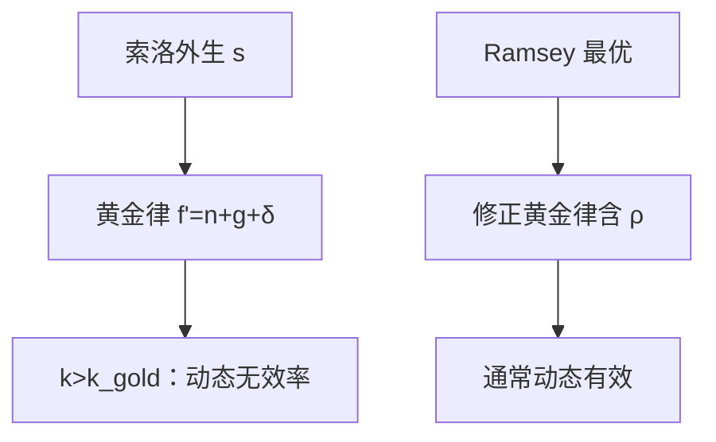

# 黄金律与动态无效率

使稳态消费最大的资本密度，要求净边际产出等于人口与技术的增长率；再多的资本是养活机器，不是养活人。

<footer>—— Phelps, The Golden Rule of Accumulation, AER 1961；对照 Ramsey 1928 的最优储蓄</footer>

[上一课](/econ/solow-residual)（索洛残差）。在此之上，储蓄率 $s$ 当成外生参数，并指出稳态消费不必对 $s$ 单调。本课的缺口就是这条比较静态：哪个 $s$（或哪个 $k^*$）使 $c^*$ 最大，以及「资本太多」在什么意义上是无效率。Ramsey 的最优增长给出修正黄金律；叠代模型里还可能真正过度积累。内生 $g$ 仍留到下一课。

## 问题

索洛稳态 $c^*=(1-s)f(k^*(s))$。提高 $s$ 一边抬 $k^*$ 与产出，一边压消费份额。极大化 $c^*$ 的一阶条件是

$$
f'(k_{\mathrm{gold}})=n+g+\delta,
$$

即净边际产出等于有效摊薄。这是 Phelps 的黄金律：稳态像一个被黄金规则约束的计划者，「对自己的后代做自己希望上一代做过的事」。它还不是家庭欧拉方程——那里会出现时间偏好 $\rho$。

若 $k^*\gt k_{\mathrm{gold}}$，少储蓄可以在每一期稳态都吃得更多：这是动态无效率。索洛模型里 $s$ 外生，可以落在无效率区。无限寿命的 Ramsey 家庭通常不会自愿走过去，因为资本回报会低于时间偏好所要求的。叠代（Diamond）可以，因为当代人并不内部化后代。

黄金律最大化的是稳态消费，不是过渡路径的贴现效用。Ramsey 的修正黄金律是 $f'(k)=\rho+\theta g+\delta$（符号随效用写法而定），$k$ 低于黄金律，为的是提前消费。

## 方法

在索洛图上，$c^*$ 是 $f(k)$ 与 $(n+g+\delta)k$ 的垂直距离。距离最大处切线平行，即 $f'=n+g+\delta$。对应的储蓄率 $s_{\mathrm{gold}}=(n+g+\delta)k_{\mathrm{gold}}/f(k_{\mathrm{gold}})$。比较：$s\gt s_{\mathrm{gold}}$ 则过度积累。

Ramsey–Cass–Koopmans 把 $s$ 换成欧拉

$$
\frac{\dot{c}}{c}=\frac{1}{\theta}\bigl(f'(k)-\delta-\rho-\theta g\bigr),
$$

稳态回到修正黄金律。Hall 的随机欧拉是后课消费，本课只借用确定性计划者。判断动态无效率的可观察代理常是：资本净回报是否低于增长率（$r\lt n$ 一类），经验上有争议，本课只给判据。

### 黄金律不是政策按钮

把 $s$ 降到 $s_{\mathrm{gold}}$ 在索洛里立刻提高稳态 $c^*$，但过渡期若资本已经过多，减少投资会先改变 $I$ 与短期 $y$。账户上 $S=I$ 仍是恒等。本课不谈如何用税收逼近黄金律，那是公共财政。

## 机制

过度积累的直觉：机器的边际产出已经不够弥补把资源锁进 $K$ 的机会成本（以消费计）。每一代若能协议少留一点 $K$，稳态消费全面上升——帕累托改进发生在时间之间。无限寿命主体会自己贴现，停在修正黄金律；有限寿命加遗产不完全，才可能停在黄金律另一侧。

外生 $g$ 仍然决定人均消费的长期增长率。黄金律只选水平。若 $g$ 本身依赖资本或知识，黄金律的切线条件要重写——那是内生增长的计划者问题，本课不预先做。

可观察代理常拿资本净回报是否低于增长率（$r\lt n$ 一类）来猜动态无效率。经验有争议，本课只给判据：索洛可以落在无效率区，因为 $s$ 外生；Ramsey 通常不会。

叠代（Diamond）里当代人不必内部化后代，过度积累可以是均衡。无限寿命加利他遗产会把模型推回 Ramsey。本课不把 OLG 整章搬进来。

## 边界

黄金律不管风险、人力资本与环境资本。也不回答「谁的消费」：代表性主体藏掉分配。公司资本结构与 MM 无关本课的 $K$。把 $s$ 降到黄金律在过渡期会改变 $I$ 与短期 $y$，账户上 $S=I$ 仍是恒等——又一次禁止把恒等当政策工具。

后课默认：索洛可以动态无效率；Ramsey 通常有效但 $k$ 低于黄金律。下一课打开 $g$。

## 小结

- $c^*$ 最大要求 $f'(k)=n+g+\delta$；更高的 $s$ 可能动态无效率。
- Ramsey 用 $\rho$ 修正黄金律，稳态增长仍靠外生 $g$。
- 叠代可以过度积累；无限寿命通常不会。
- 黄金律是稳态消费，不是过渡路径的贴现效用最大。
- $g$ 从哪来，是内生增长的缺口。
- 出处：Phelps, AER 1961；Ramsey, Economic Journal 1928。
