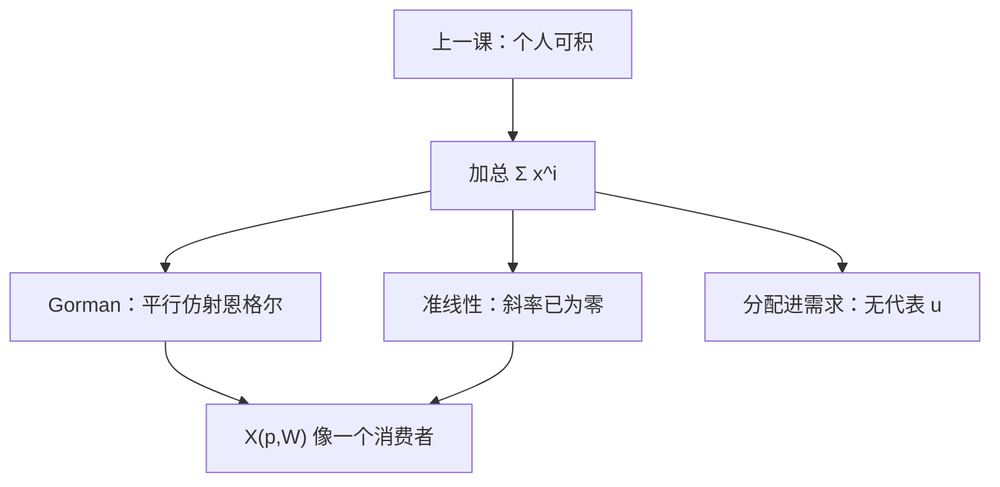

# Gorman 加总

把个人需求加总，一般得不到「一个」消费者。能这样做的，是准线性，或恩格尔互相平行的 Gorman 极化形式。

<footer>—— 据 Gorman, Community Preference Fields, Econometrica, 1953；On a Class of Preference Fields, Metroeconomica, 1961 整理</footer>

[上一课](/econ/integrability)把个人需求与偏好收成闭环：光滑则 $S$ 对称负半定，有限观测则 GARP。本课不重写 Afriat，也不再积向量场。缺口是：市场上看到的是 $\sum_i x^i(p,w^i)$。个人可积，加总不必可积——市场需求可以违背任何单人 $S$ 的性质。后课局部均衡、代表消费者、宏观份额，都默认加总「像一个人」。准线性与 Gorman 极化是这条许可证，不是可积性的推论。

## 问题

个人 $x^i$ 各自来自偏好，和市场 $X(p,(w^i)_i)=\sum_i x^i(p,w^i)$。财富分配一变，即使总财富 $W=\sum w^i$ 不变，$X$ 也可以变。此时不存在只依赖 $(p,W)$ 的代表需求，更谈不上代表 $u$。缺口不是再恢复一个人的 $u$，而是问何时 $X$ 只通过 $W$ 进入，并且本身是某一偏好的马歇尔需求。

Gorman 的答案：支出函数取极化形式

$$
e^i(p,u^i)=\alpha^i(p)+u^i\,\beta(p),
$$

$\beta(p)$ 对所有人相同。等价地，间接效用对财富仿射且斜率相同：$v^i=(w-\alpha^i(p))/\beta(p)$。此时恩格尔曲线仿射且互相平行，加总后仍是同一形式，$\alpha=\sum\alpha^i$，代表财富即 $W$。准线性是特例：非计价物的恩格尔水平，斜率已经对齐（都是零）。

### 位似相同只是另一条刀刃

每人同位似且**同一**偏好，需求对各自 $w^i$ 一次齐次且同比例，加总也像一个人。Gorman 更宽：允许 $\alpha^i$ 不同（固定项可异质），只要财富导数 $\partial x^i/\partial w$ 跨人相同。不要把「都能加总」读成「必须 Cobb–Douglas」。

极化名称来自支出函数对 $u$ 仿射：无差异图可以沿一条与价格有关的方向平移。$\beta(p)$ 公共，平移方向才一致。

## 方法

检验两条路。路一：准线性且计价物内点——上一课序已经有，收入效应全在计价物，非计价物的市场曲线没有分配效应。路二：估计或假定恩格尔仿射、斜率与 $i$ 无关。通过则 $X(p,W)$ 可积回一个代表 $v(p,W)=(W-\alpha(p))/\beta(p)$。失败则分配进需求，代表消费者是会计假象。

不要从加总 $X$ 直接查对称：即使每人 $S^i$ 对称，$X$ 对总财富的斯勒茨基一般不是各 $S^i$ 之和，除非 Gorman 把收入项对齐。这是可积性课没有问的分配维度。

本课不估计收入分配。宏观若写代表家庭，是在选这条许可证，不是本课的计量结论。也不把 $X$ 写成限价簿上的总深度。

## 机制

为什么平行就能加总：财富从 $A$ 转到 $B$，若两人的 $\partial x/\partial w$ 相同，一个人多买的正好是另一个人少买的，$X$ 不变。$\alpha^i$ 不同只移动各人的截距，加总后变成一个 $\alpha(p)$。准线性把斜率设成零，转移更不会改非计价物。位似且同偏好则斜率与 $x/w$ 成比例且相同，也对齐。

失败的机制：奢侈品与必需品因人而异，或恩格尔弯曲且不同步。总财富不变的再分配改变市场结构，市场需求可以向上倾斜、交叉项不对称，尽管每个人都理性。可积性通过、加总失败，模型在个人层成立、在市场层被拒绝。

Gorman 1953 问的是「社区无差异图」何时存在。1961 的极化形式把充分条件写成支出函数。引用不要把它当成宏观完整理论。

## 边界

角点、异质 $\beta^i(p)$、劳动供给进入财富，都会咬断平行。正的加总有时在「平均斜率」附近近似成立，那是经验，不是定理。福利上，即使数量能加总，EV 相加仍要人际可比；代表 $u$ 只复制需求，不自动复制社会福利。

也不要把 Gorman 写成风险下的 Wilson 辛迪加。那里加总的是风险容忍，对象是或有消费；本课是确定需求的财富加总。两条许可证形状相近，课序不同。

后课默认：市场需求当作单人需求，仅当准线性或 Gorman 极化（含同偏好位似）成立；否则分配是独立的状态变量。劳动–闲暇与两期消费若要加总，同样先问恩格尔是否平行。

## 小结

- 个人可积不蕴含市场需求可积；分配可以破坏代表消费者。
- Gorman 极化：$e^i=\alpha^i(p)+u^i\beta(p)$，$\beta$ 公共，恩格尔平行仿射。
- 准线性是斜率全为零的特例；同偏好位似是另一刀刃。
- 代表 $u$ 复制需求，不自动给出福利权重。
- 出处：Gorman, *Econometrica*, 1953；*Metroeconomica*, 1961。
