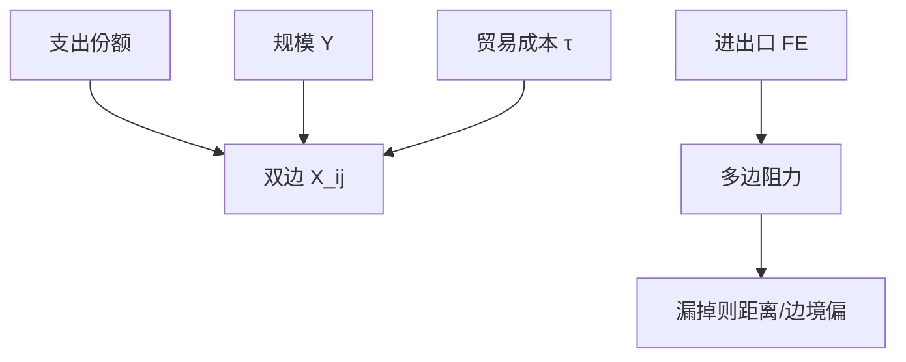

# 引力模型

双边贸易随经济规模升、随距离与边界降；这不是天体力学的比喻课，而是支出份额与市场进入成本加总之后的会计。

<footer>—— Tinbergen 经验引力；Anderson and van Wincoop, Gravity with Gravitas, AER 2003</footer>

[上一课](/econ/melitz-heterogeneous-firms)在企业层给出选择。本课把双边流量写成可估计的引力。Eaton–Kortum 下一课给李嘉图微观基础的另一种加总。本课钉：结构引力与多边阻力，禁止把距离弹性当因果魔法。

## 问题

经验上 $X_{ij}\propto Y_i Y_j/\mathrm{dist}_{ij}^\zeta$。Tinbergen 当描述。Anderson–van Wincoop：CES 需求下，双边出口还依赖**多边阻力**——$i$ 进入所有市场的成本、$j$ 从所有来源购买的成本。漏掉它们，距离与边界的系数有偏（边境之谜被夸大）。缺口不是再讲 Melitz 门槛，而是：加总之后，任何产生 CES 或类似支出份额的模型都会长出引力；估计必须处理多边阻力（固定效应或显式价格指数）。

Head–Mayer 综述：引力是贸易经验的骨干。PPML（Santos Silva–Tenreyro）处理零贸易与异方差，OLS 对数会扔零、且 Jensen 不等式偏误。

## 方法

结构：$\ln X_{ij}=\ln S_i+\ln M_j+\ln \tau_{ij}^{1-\sigma}+\varepsilon_{ij}$，$S_i,M_j$ 用进出口固定效应吸收。$\tau_{ij}$ 含距离、边界、语言、关税、协定。因果：关税与协定仍要识别（后课 WTO、China shock），引力方程本身先是均衡加总。一般均衡反事实：改 $\tau$，重解所有多边阻力（Dekle–Eaton–Kortum 精确帽子代数），不是只看双边偏效应。

与计量：国家–产品–时间面板上的政策可以用 DiD，但必须与多边阻力共存（三元固定效应）。本课不重写交错 DiD。

## 机制

机制是份额。$j$ 的支出在来源 $i$ 上的份额随相对 $\tau_{ij}$ 与相对价格变。距离进入 $\tau$，所以流量随距离降。规模进入支出与供给能力。零贸易：Melitz 选择使部分 $ij$ 对为零，引力在广延边际也成立（Helpman–Melitz–Rubinstein）。EK 下一课用极值生产率抽签给出另一套闭式份额。

边境效应大：可以是真实政策壁垒、可以是可加贸易成本在短距离上更显眼、可以是多边阻力误设。Anderson–van Wincoop 显示：正确计入阻力后，美加边境仍在，但小于朴素回归。

不要把引力写成牛顿定律。$\zeta$ 随 $\sigma$ 与 $\tau$ 的函数形式变。结构反事实要的是贸易弹性 $\sigma-1$，不是某一个距离系数的永恒值。

## 边界

本课不把所有 FTA 的系数当成福利。福利要进关税与条款课的一般均衡。下一课 Eaton–Kortum 把李嘉图随机化，引力从极值分布长出。不要用引力吞并量化栏的运费或提单微观结构。

后课默认：双边流量用带多边阻力的引力；对数 OLS 丢零是问题；政策反事实要重解阻力，不是读一个 $\tau$ 系数当充分统计。企业选择与引力加总兼容。

## 小结

- 引力：规模促进、距离与壁垒抑制；来自支出份额加总。
- 多边阻力必须进估计，否则边境与距离偏。
- PPML 与固定效应处理零与阻力。
- 反事实是一般均衡帽子代数，不是偏系数。
- 出处：Tinbergen；Anderson and van Wincoop, *AER* 2003；Santos Silva and Tenreyro；Head and Mayer。
