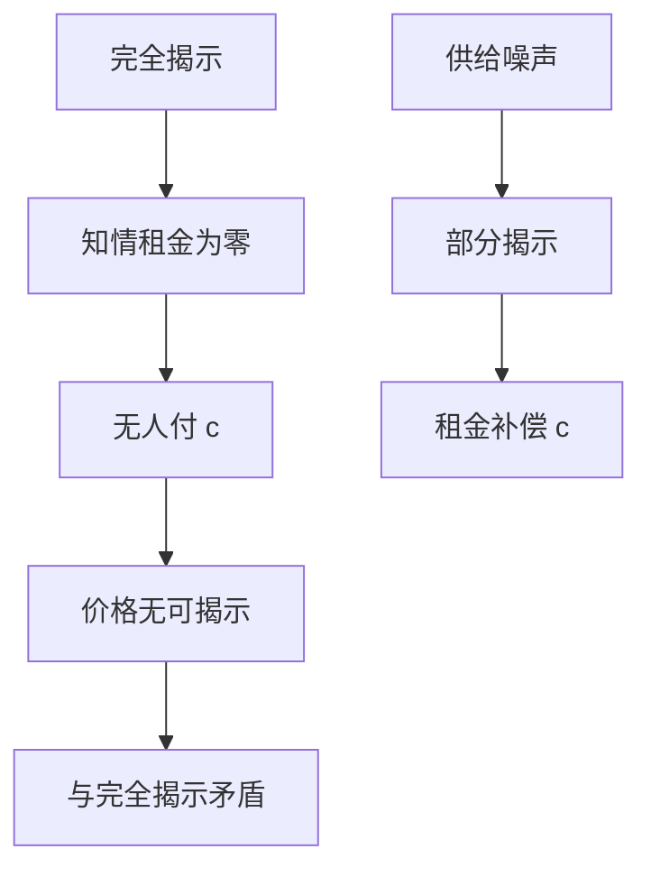

# Grossman–Stiglitz 悖论

若价格已经把昂贵信息完全写进去，就没有人愿意付费去生产它；于是价格不能完全揭示。

<footer>—— Grossman and Stiglitz, On the Impossibility of Informationally Efficient Markets, American Economic Review, 1980</footer>

[上一课](/econ/limited-attention-pead)把公告后的漂移写成注意力预算：公开信号已经在世上，只是没被读完。本课换一条缝，而且是理性均衡里的缝。缺口不是再写一遍处理成本，而是：**生产**信息要花固定成本时，完全揭示与正的采集激励不能同时成立。后课默认已经读完：信息有效的工作版本是「相对采集成本，利润被压到近零」，不是字面的充分统计价格。

## 问题

[有效市场](/econ/emh)已经点过这条悖论的名字，但没有把均衡写出来。设有一张风险资产，清算值 $\theta$ 未知。一部分人可以花成本 $c$ 看见关于 $\theta$ 的信号，其余人只看价格。若均衡价格 $p$ 是 $\theta$ 的充分统计，未知情者从 $p$ 里读到与知情者同样的东西，知情者的毛租金为零，付 $c$ 的人严格更差。于是没人买信号，$p$ 里没有私人信息可揭示——与「$p$ 已完全揭示」矛盾。

缺口是把这句话收成有噪声的理性预期均衡（REE），而不是用公告漂移当否证。有限注意力攻击的是处理；本课攻击的是激励。两条缝可以并存，对象不同。

Grossman and Stiglitz, *AER* 70(3), 1980。CARA 加正态信号、再加随机供给，是为了让价格部分揭示而仍有闭式需求。随机供给不是限价簿上的深度，是竞争性噪声。

## 方法

CARA 偏好、正态 $(\theta,s)$、外生随机供给 $z$。知情者用 $(s,p)$ 更新，未知情者只用 $p$。市场出清给出 $p$ 关于 $(s,z)$ 的线性函数。$z$ 使 $p$ 不是 $s$ 的一一映射：看见 $p$ 高，分不清是好信号还是供给少。于是价格**部分**揭示，知情者仍保有一块信息租金，刚好在均衡里补偿 $c$。知情者比例 $\lambda$ 由无差异条件钉住：买信号的期望效用等于不买。

$\lambda$ 升则 $p$ 更接近 $s$，$c$ 的净回报下降——采集是策略替代。$c\to 0$ 时 $\lambda$ 可以很大，揭示可以很深，但 $c=0$ 才允许完全揭示；任何严格正的 $c$ 都留下一层噪声。这就是「不可能」的精确含义：不是市场不能反映信息，而是不能在有成本时**完全**反映还让采集发生。

不要把 $z$ 写成做市商存货或买卖队列。[到限价簿](/econ/to-limit-order-book)已经声明：本栏的价格是出清对象，不是协议。这里的噪声是为了让竞争性 REE 存在，不是微观结构。

## 机制

机制是激励相容，不是集体智慧失灵。价格越干净，搭便车越便宜，采集越少，价格越脏——负反馈把均衡按在内点。社会最优采集通常多于这个内点：私人算的是相对 $p$ 的租金，社会算的是配置对 $\theta$ 的敏感；竞争性价格把信息泄漏给未付费的人，采集被供给不足。这与 EMH 的工作版本一致：相对 $c$，没有人能靠再买一份已经写进 $p$ 的信号赚经济利润。

上一课的注意力是另一层供给不足：即便 $c$ 已付、信号已公开，读的时间仍稀缺。本课假定读得完，只问买不买。后课 Hellwig 把「有限个知情者」换成连续统，竞争性假设才站稳。

完全揭示均衡在 $c>0$ 时不是均衡，不需要非理性。噪声交易、随机禀赋、生命期对冲需求，都可以扮演 $z$ 的角色；精神是残差不确定性，不是行为偏差。

## 边界

不要把悖论写成「市场无效」：部分揭示的 $p$ 对 $\mathcal{F}_p$（价格生成的信息）仍可以有效，只是 $\mathcal{F}_p$ 严格小于知情者的 $\mathcal{F}$。也不要把随机供给写成限价簿冲击——量化栏才给冲击一个队列。本课不估计知情者比例，不把 PEAD 的窗口拿来当 $c$ 的度量。

下一课把同一套 CARA–正态放到**连续统**竞争里：个人对价格无影响，Hellwig 的 REE 才是价格接受的版本。GS 原文的有限知情者已经近于竞争，但存在与揭示的数学要到连续统才干净。

后课默认：有成本的私人信息与完全揭示不能共存；工作均衡是部分揭示，采集比例内生。有效是相对价格信息集，不是相对全部私人信号。

## 小结

- 完全揭示使信息租金为零，无人付 $c$，故完全揭示不是有成本采集的均衡。
- 供给噪声给出部分揭示，租金补偿 $c$，知情者比例内生。
- 这是激励缝，不是注意力缝；也不改写限价簿。
- 出处：Grossman and Stiglitz, *AER* 1980。
